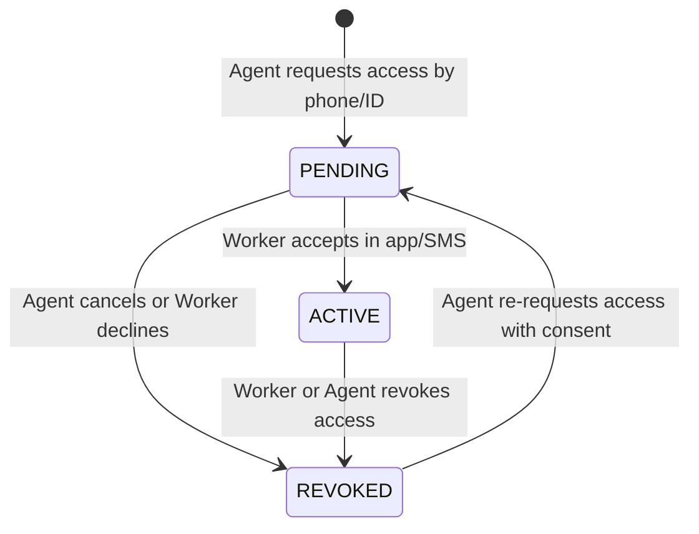

# NEARVIA — Phase 15: Agent-Assisted Marketplace Specification (v1.0)

## 1. Executive Summary & Core Principle

In emerging and semi-urban labor markets, many skilled tradespeople and manual workers experience limited digital literacy, lack modern smartphones, or face connectivity hurdles. 

NEARVIA introduces the **Agent-Assisted Marketplace** to bridge this digital divide using **trusted local Community Agents**.

> [!IMPORTANT]
> **Authoritative Invariant**:
> **"An Agent assists a Worker but does not become the Worker."**
> - The Agent is a **HUMAN ASSISTANT**, never an automated AI bot or script.
> - The Worker remains the **sole authoritative owner** of their account, identity, applications, work performance, and earnings.
> - Agents **cannot** receive, hold, or deduct worker payments. 100% of agreed wages are settled directly between provider and worker.
> - An application submitted with agent assistance strictly belongs to the worker (`applications.worker_id = workerProfile.id`). It is audited via `assisted_by_agent_id`.

---

## 2. Worker-Agent Relationship Lifecycle

Assistance is entirely permissioned and governed by explicit consent. No agent can act on behalf of a worker without mutual linking.



### States
1. **PENDING**:
   - Initialized when an Agent submits a connection request via `POST /api/v1/agents/workers/request` (by phone or worker ID).
   - The worker is notified immediately.
   - The Agent has **zero access** to worker applications, discovery, or details while in `PENDING`.
2. **ACTIVE**:
   - Worker accepts the request via `POST /api/v1/workers/me/agents/:id/accept`.
   - `accepted_at` timestamp is permanently recorded.
   - Agent is authorized to view worker profile, search nearby jobs, and submit applications with worker permission.
3. **REVOKED**:
   - Worker revokes assistance at any time via `POST /api/v1/workers/me/agents/:id/revoke` or `DELETE /api/v1/workers/me/agents/:id`.
   - `revoked_at` and `revoked_by` are recorded.
   - All agent access to that worker is immediately terminated (`403 Forbidden`).

---

## 3. Consent & Assistance Affirmation

Before an agent submits any work application on behalf of a linked worker:
- **Affirmation**: *"Worker has given permission to Agent to assist with NEARVIA."*
- **Audit Logging**: Every access request, view, search, and application is recorded in `audit_logs` with the agent's profile ID and the worker's ID.
- **Worker Notification**: The worker receives real-time notifications whenever an agent submits an application on their behalf.

---

## 4. Architectural Boundaries & Anti-Abuse Rules

| Area | Permitted for Agent | Prohibited for Agent |
|---|---|---|
| **Identity** | Assist registered workers, help update basic bio/skills | Impersonate worker, change worker credentials or account ownership |
| **Discovery** | Search verified jobs within worker's 5 km radius matching skills | View private provider contact info or unmasked exact coordinates |
| **Applications** | Submit application on behalf of worker (worker is applicant) | Become applicant, change other workers' applications |
| **Assignments** | View assignment schedule to help worker arrive on time | Accept, start, or confirm assignments on worker's behalf |
| **Payments** | View payment status in read-only assistance mode | Receive worker wages, deduct fees/commissions, hold cash |
| **Data Scope** | Access only workers with `ACTIVE` relationship | Access unlinked workers, revoked workers, or unrelated profiles |

---

## 5. Security & IDOR Mitigation

1. **Server-Authoritative Agent Verification**:
   - The caller's `agent_profiles.id` is derived strictly from JWT authentication (`req.user.id`). No client-supplied `agentId` is accepted.
2. **Active Consent Gate (`enforceActiveConsent`)**:
   - Every worker-scoped agent endpoint (`/workers/:workerId/*`) checks:
     ```sql
     SELECT status FROM agent_worker_relationships 
     WHERE agent_id = $agentId AND worker_id = $workerId
     ```
   - If not found or status is not `'ACTIVE'`, the request is rejected with `403 Forbidden`.
3. **Anti-Tamper Assignment Acceptance**:
   - Only the assigned worker (`assignments.worker_user_id === req.user.id`) can confirm or execute shifts. Agent tokens are rejected with `403 NOT_AUTHORIZED_FOR_ACTION`.
4. **Duplicate Link Prevention**:
   - Database unique constraint `UNIQUE(agent_id, worker_id)` prevents concurrent or duplicate relationship creation.

---

## 6. Provider & Worker Visibility

### Provider Visibility
- Providers viewing applicants at `/provider/work/:id/applicants` see the worker as the sole applicant.
- An informative badge `🤝 Agent-Assisted` is displayed when `applicant.isAgentAssisted` is true.
- No unnecessary agent personal information (such as personal address or private agent phone) is exposed.

### Worker Direct Access
- The worker retains 100% visibility over their dashboard, applications, and assignments.
- Applications submitted with assistance display the `🤝 Agent-Assisted` badge.
- Worker can inspect linked agents at `/worker/agents` and revoke permissions with a single click.

---

## 7. What Is Intentionally Excluded (Free-First Boundaries)

To keep the platform lightweight and free-first:
- Zero AI chatbots or autonomous automated agents.
- Zero SMS gateway fees or automated tele-calling bots.
- Zero WhatsApp Business API dependencies.
- Zero commission splits, agency cuts, or payment escrow.
- Zero complex CRM or marketing funnels.
