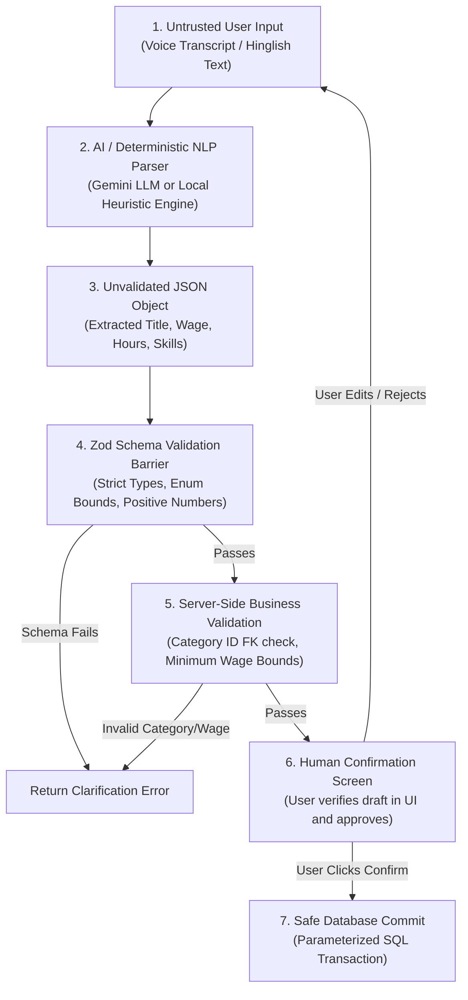

# NEARVIA — ARTIFICIAL INTELLIGENCE & COPILOT ARCHITECTURE

> **Document Version**: 2.0.0  
> **Core Architectural Rule**: AI is an **assistive parser and translator**, never an autonomous decision-maker or authoritative data modifier.

---

## 1. Safe AI Pipeline Architecture

NEARVIA implements a strict seven-stage pipeline ensuring that untrusted user input and non-deterministic LLM responses never bypass platform safety constraints:

---

## 2. Inviolable Security & Isolation Guardrails

1. **Zero Autonomous Database Mutation**:
   - The AI subsystem has **zero direct SQL connection** or database write privileges. It outputs transient draft schemas that must be explicitly reviewed and posted by authenticated users.
2. **Zero Authority to Bypass RBAC**:
   - All drafted jobs or applications must still pass standard Express auth middleware (`authenticateUser`, `requireRole(UserRole.PROVIDER)`).
3. **Zero Financial Authority**:
   - The AI cannot initiate, authorize, settle, or alter payments. Financial transactions are governed exclusively by server-side assignment records and verified payment gateway signatures.
4. **Zero Exposure to Private KYC Data**:
   - No government identity documents, phone numbers, or private user credentials are ever passed to LLM prompt contexts.
5. **Deterministic Fail-Safe Fallback**:
   - If the external Gemini API is unreachable, throttled, or returns malformed output, the system seamlessly falls back to the deterministic local keyword/regex parser (`nlParser.ts`). The user experience never fails.

---

## 3. Real vs Mock vs Future AI Inventory

| Capability | Module / Component | Implementation Mechanism | Classification |
| :--- | :--- | :--- | :---: |
| **Natural Language Job Drafting** | `nlParser.ts` | Multi-token regex & Hinglish keyword extraction | `IMPLEMENTED` (Deterministic) |
| **Generative Job Enhancement** | `geminiProvider.ts` | Google Gemini 1.5 Flash API with system prompts | `REAL AI` (Optional Copilot) |
| **Voice-First Intent Mapping** | `voiceAssistance.ts` | Deterministic intent classifier (`JOB_SEARCH`, `JOB_CREATE`) | `IMPLEMENTED` (Deterministic) |
| **Low-Literacy Audio Readout** | `apps/web/src/utils/speech.ts` | Web SpeechSynthesis API (Hindi/Kannada/English) | `IMPLEMENTED` (Browser Native) |
| **Pictorial Card Generation** | `voiceAssistance.ts` | Dynamic visual icon & badge mapper | `IMPLEMENTED` (Deterministic) |
| **Custom Indian Accent Speech-to-Text** | Reserved for Mobile | Fine-tuned Indic-Whisper / Bhashini API integration | `FUTURE` |
| **Dynamic Wage Elasticity Forecasting** | `marketIntelligence.ts` | Moving median & percentile aggregation | `IMPLEMENTED` (Statistical) |
