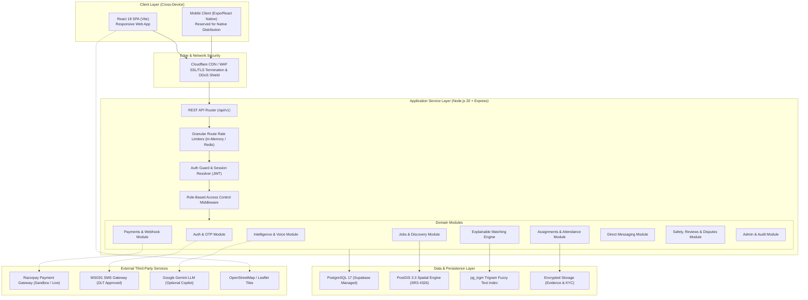
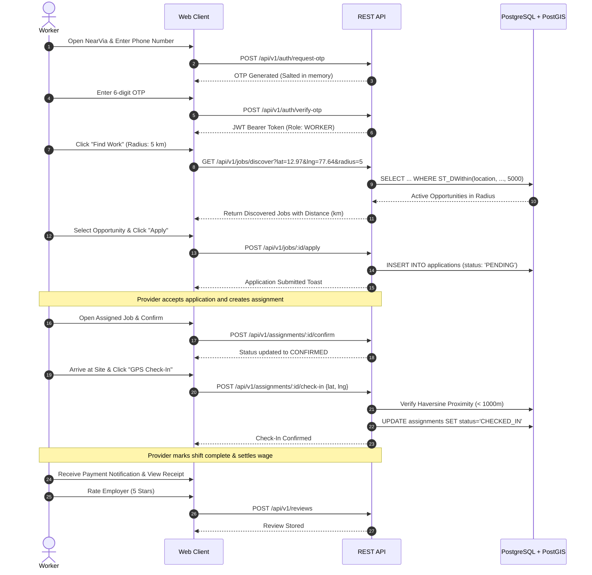
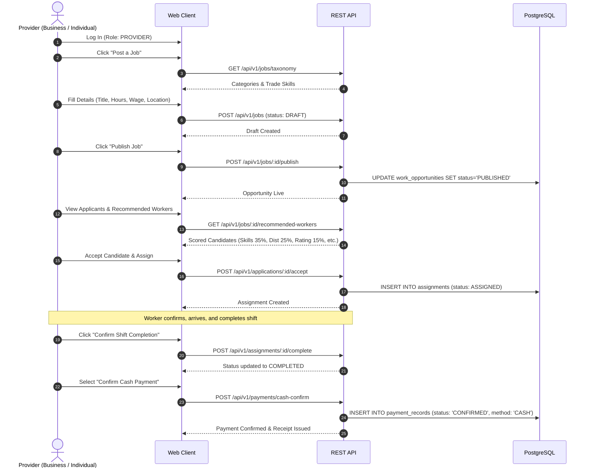
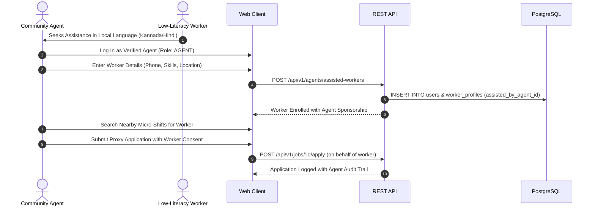
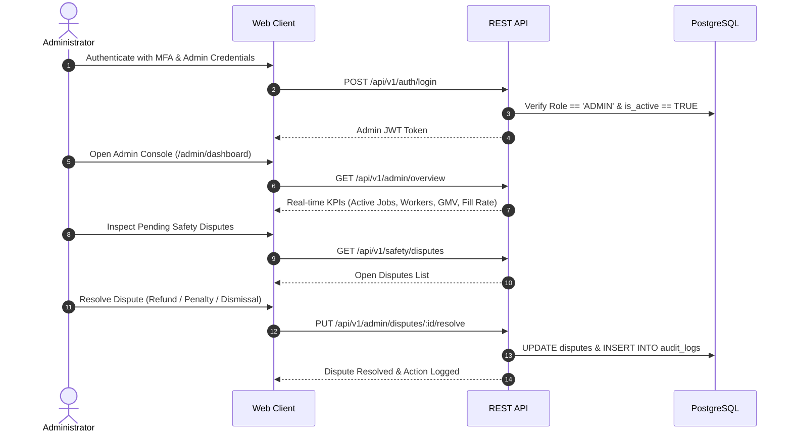

# NEARVIA — SYSTEM ARCHITECTURE SPECIFICATION

> **Document Version**: 2.0.0  
> **Academic Standard**: MCA Final Semester Technical Dissertation  
> **System**: NEARVIA Hyperlocal Quick-Work & Informal Labor Marketplace  
> **Core Architecture Formula**: *PostGIS + deterministic business rules → explainable matching → recommendations → feedback → future ML*

---

## 1. High-Level System Architecture

NEARVIA is built on a clean multi-tier client-server architecture designed for high availability, low latency spatial queries, and zero hard dependencies on external AI or closed APIs.

---

## 2. Multi-Tier Component Breakdown

### 2.1 Presentation Tier (`apps/web`)
- **Technology**: React 18, Vite 6, TypeScript 5, Tailwind CSS with custom CSS design tokens, Lucide icons, Leaflet / React-Leaflet for spatial maps.
- **State Management**: Lightweight Zustand store for auth session and notification badge counters; React Query / native hooks for server-cache synchronisation.
- **Security**: Strict client-side data minimization. Zero service-role keys or database credentials are bundled into the production JavaScript bundle (`apps/web/dist`).
- **Low-Literacy & Accessibility**: Visual iconography for all trades, color-coded urgency badges (Immediate/Urgent/Normal), multilingual audio speech synthesiser via browser SpeechSynthesis API, and pictorial action cards.

### 2.2 Application Service Tier (`services/api`)
- **Technology**: Node.js 20 LTS, Express 4, TypeScript 5, Zod 3 runtime schema validation.
- **Stateless Operation**: API nodes maintain zero session state in memory (JWT authentication); easily horizontally scalable across multiple cloud container replicas.
- **Database Connection Pooling**: High-performance `pg-pool` with parameterized query sanitisation, automatic reconnection, and transaction management (`withTransaction`).
- **Security Hardening**:
  - Raw request byte capture (`req.rawBody`) for timing-safe HMAC-SHA256 signature calculation.
  - Route-specific rate limiters: OTP (6/15m), AI (30/15m), Payments (30/15m), Messages (60/15m), Webhooks (120/1m).
  - Centralized error handler suppressing internal stack traces in production.

### 2.3 Spatial & Data Tier (`PostgreSQL 17` + `PostGIS 3.3`)
- **Spatial Geometry**: All locations are stored as `GEOGRAPHY(Point, 4326)` representing WGS84 geodesic coordinates on the ellipsoidal Earth model.
- **Spatial Indexing**: 2D GIST (Generalized Search Tree) indexes on `work_opportunities.location` and `worker_profiles.location` enable sub-10ms bounding-box and radius queries.
- **Idempotency**: Strict unique constraints (e.g. `UNIQUE(provider, event_id)` on `webhook_events`) prevent double processing of payment transactions.
- **Full Text Search**: PostgreSQL `pg_trgm` extension powers GIN (Generalized Inverted Index) trigram matching across categories, skills, and titles for instant typo-tolerant search.

---

## 3. End-to-End User Flow Diagrams

### 3.1 Worker Journey

### 3.2 Provider (Employer) Journey

### 3.3 Community Agent Journey (Assisted Access)

### 3.4 Platform Administrator Journey

---

## 4. Architectural Quality Attributes & Non-Functional Design

1. **High Concurrency & Low Latency**:
   - Geodesic spatial queries complete in $< 15\text{ ms}$ under 2D GIST indexes on PostgreSQL.
   - Stateless Express API response times average $< 35\text{ ms}$ for standard endpoints.
2. **Security & Data Isolation**:
   - Multi-tier defense prevents client-side identity spoofing, SQL injection, and horizontal IDOR.
   - Exact residential coordinates are masked from public APIs until assignment confirmation.
3. **Graceful Fault Tolerance**:
   - Core marketplace operations (job posting, browsing, applications, cash settlement) function 100% independently of third-party external services (AI, Maps, Payment Gateway, SMS).
