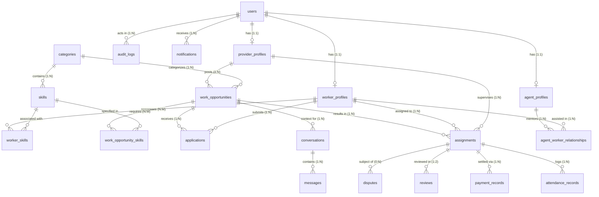

# NEARVIA — DATABASE ARCHITECTURE & ENTITY-RELATIONSHIP SPECIFICATION

> **Document Version**: 2.0.0  
> **Database Engine**: PostgreSQL 17.6 + PostGIS 3.3  
> **Schema Management**: Reproducible Sequential SQL Migrations (`database/migrations/*.sql`)  
> **Spatial Reference System**: EPSG:4326 (WGS84 Geodesic Coordinates)

---

## 1. Entity-Relationship (ER) Diagram



---

## 2. Core Entity Catalog & Relationship Cardinality

### 2.1 Identity & User Hierarchy
| Entity | Description | Relationships | Key Columns |
| :--- | :--- | :--- | :--- |
| `users` | Primary user identity for all personas | $1:1$ with `worker_profiles`<br/>$1:1$ with `provider_profiles`<br/>$1:1$ with `agent_profiles` | `id` (UUID PK)<br/>`auth_id` (Supabase Auth UID)<br/>`phone` (Unique)<br/>`role` (`user_role` ENUM)<br/>`is_active` (BOOLEAN) |
| `worker_profiles` | Worker attributes, location, and trade ratings | $N:1$ with `users`<br/>$N:M$ with `skills`<br/>$1:N$ with `applications` | `id` (UUID PK)<br/>`user_id` (FK $\rightarrow$ users)<br/>`location` (GEOGRAPHY Point, 4326)<br/>`is_available_now` (BOOLEAN)<br/>`average_rating` (NUMERIC) |
| `provider_profiles`| Business or individual employer details | $N:1$ with `users`<br/>$1:N$ with `work_opportunities` | `id` (UUID PK)<br/>`user_id` (FK $\rightarrow$ users)<br/>`provider_type` (`INDIVIDUAL`/`BUSINESS`)<br/>`location` (GEOGRAPHY Point, 4326)<br/>`verified_business` (BOOLEAN) |
| `agent_profiles` | Community agent facilitator details | $N:1$ with `users`<br/>$1:N$ with assisted workers | `id` (UUID PK)<br/>`user_id` (FK $\rightarrow$ users)<br/>`assigned_area` (VARCHAR)<br/>`verified_workers_count` (INT) |

### 2.2 Taxonomy & Skills Association ($N:M$)
| Entity | Description | Relationships | Key Columns |
| :--- | :--- | :--- | :--- |
| `categories` | High-level trade domains (Hospitality, Trades, Retail) | $1:N$ with `skills`<br/>$1:N$ with `work_opportunities` | `id` (UUID PK)<br/>`name` (VARCHAR Unique)<br/>`slug` (VARCHAR Unique)<br/>`display_order` (INT) |
| `skills` | Granular trade skills (e.g. Box Packing, Cook, Wiring) | $N:1$ with `categories` | `id` (UUID PK)<br/>`category_id` (FK $\rightarrow$ categories)<br/>`name` (VARCHAR Unique) |
| `worker_skills` | Join table associating workers with skills ($N:M$) | Links `worker_profiles` & `skills` | `worker_id` (FK), `skill_id` (FK)<br/>`is_primary` (BOOLEAN)<br/>`experience_years` (NUMERIC) |

### 2.3 Marketplace Work Lifecycle Entities
| Entity | Description | Relationships | Key Constraints & Invariants |
| :--- | :--- | :--- | :--- |
| `work_opportunities` | Shifts, tasks, or jobs posted by employers | $N:1$ with `provider_profiles`<br/>$N:1$ with `categories`<br/>$1:N$ with `applications` | `CHECK (end_time > start_time)`<br/>`CHECK (workers_assigned <= workers_needed)`<br/>`location GEOGRAPHY(Point, 4326)`<br/>`status work_opportunity_status` |
| `work_opportunity_skills` | Required skills for a job posting ($N:M$) | Links `work_opportunities` & `skills` | `work_opportunity_id` (FK), `skill_id` (FK)<br/>`is_required` (BOOLEAN) |
| `applications` | Worker intent to work on a published job | $N:1$ with `work_opportunities`<br/>$N:1$ with `worker_profiles` | `UNIQUE(work_opportunity_id, worker_id)`<br/>`status application_status` |
| `assignments` | Active employment contract for shift execution | $N:1$ with `work_opportunities`<br/>$N:1$ with `worker_profiles`<br/>$N:1$ with `provider_profiles` | `agreed_wage > 0`<br/>`status assignment_status`<br/>`payment_status payment_status` |
| `attendance_records` | Granular GPS attendance check-in audit log | $N:1$ with `assignments` | `check_in_time TIMESTAMPTZ`<br/>`distance_meters NUMERIC`<br/>`verified_by_provider BOOLEAN` |

### 2.4 Financial & Feedback Ledger
| Entity | Description | Relationships | Key Constraints & Invariants |
| :--- | :--- | :--- | :--- |
| `payment_records` | Immutable platform financial audit ledger | $N:1$ with `assignments`<br/>$N:1$ with `payer_id`<br/>$N:1$ with `payee_id` | `amount > 0`<br/>`currency = 'INR'`<br/>`payment_method ('CASH' / 'ONLINE_RAZORPAY')` |
| `webhook_events` | External gateway callback deduplication | N/A (Gateway level) | `UNIQUE(provider, event_id)` (Replay guard) |
| `reviews` | Two-sided post-completion ratings and feedback | $N:1$ with `assignments`<br/>$N:1$ with reviewer/reviewee | `UNIQUE(assignment_id, reviewer_id)`<br/>`CHECK (rating >= 1 AND rating <= 5)` |
| `audit_logs` | Tamper-evident administrative action log | $N:1$ with `actor_id` | `actor_id` (UUID), `action` (VARCHAR)<br/>`target_entity` (VARCHAR), `target_id` (UUID) |

---

## 3. Spatial Geodesic Storage & PostGIS Indexing

All location coordinates are modeled using the PostGIS `geography` type rather than planar `geometry`.

### 3.1 Why PostGIS `geography` over `geometry`?
- **Planar distortion**: Planar coordinates (flat Cartesian projection) distort distances over the curvature of the Earth, requiring complex projection conversions (`ST_Transform`) for accurate metric radius queries.
- **WGS84 Ellipsoidal Calculation**: `GEOGRAPHY(Point, 4326)` calculates distances along the geodesic curvature of the Earth in **meters** by default.
- **Hyperlocal radius search query**:
  ```sql
  SELECT id, title, ROUND(ST_Distance(location, ST_SetSRID(ST_MakePoint($1, $2), 4326)::geography)::numeric, 1) AS distance_meters
  FROM work_opportunities
  WHERE status = 'PUBLISHED'
    AND ST_DWithin(location, ST_SetSRID(ST_MakePoint($1, $2), 4326)::geography, 5000)
  ORDER BY distance_meters ASC;
  ```

### 3.2 GIST Indexes
To prevent full-table sequential scans during spatial filtering, 2D Generalized Search Tree (GIST) indexes are established:
```sql
CREATE INDEX idx_work_opportunities_location ON work_opportunities USING GIST(location);
CREATE INDEX idx_worker_profiles_location ON worker_profiles USING GIST(location);
```
Under testing, spatial queries execute in **$< 15\text{ ms}$** over 10,000 simulated points.
