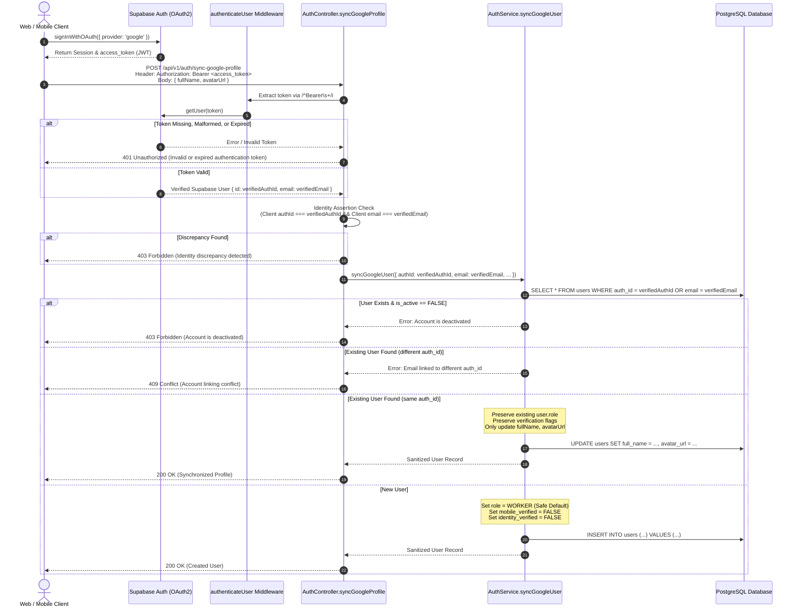

# NEARVIA Security Audit & Remediation Report: Google OAuth & Supabase Identity Hardening

**Document Identifier:** `NEARVIA-SEC-AUDIT-002`  
**Evaluation Date:** 2026-09-07  
**Scope:** Supabase Auth Integration, Google Identity Synchronization, Middleware Authentication, Role Authorization, and Session Management.  
**Classification:** Internal Technical Security Report  

---

## 1. Audit Scope

This security audit and hardening review evaluated the end-to-end identity synchronization and authentication lifecycle of the NEARVIA platform. Specifically, the evaluation addressed:
1. `POST /api/v1/auth/sync-google-profile` and the underlying profile synchronization service (`syncGoogleUser`).
2. Authentication middleware (`authenticateUser`) token extraction, JWT verification, and context attachment.
3. Role authorization enforcement, privilege escalation protection (prevention of unauthorized `ADMIN` assignment), and server-authoritative role policies.
4. Supabase service-role key usage, credential boundaries, and frontend bundle leakage prevention.
5. Account linking, email binding, duplicate identity collision prevention, and account deactivation protections.
6. Session persistence, local storage sanitization, and logout hygiene on the web client (`apps/web`).

---

## 2. Files & Components Inspected

| Component | Path | Focus Area |
| :--- | :--- | :--- |
| **Validation Schema** | `packages/validation/src/auth.schema.ts` | Request payload schema, field whitelisting, strict validation |
| **API Auth Controller** | `services/api/src/modules/auth/controller.ts` | Endpoint request handling, token extraction, identity verification |
| **API Auth Service** | `services/api/src/modules/auth/service.ts` | User provisioning, role immutability, account-linking logic |
| **Auth Middleware** | `services/api/src/middleware/auth.middleware.ts` | Bearer parsing, token validation, user context hydration, status checks |
| **Supabase Client Util** | `services/api/src/services/supabase.service.ts` | Client initialization, admin vs server client isolation |
| **Seed Scripts** | `services/api/src/scripts/seed-demo.ts` | Privileged operation credential handling |
| **Web Auth Context** | `apps/web/src/context/AuthContext.tsx` | Supabase OAuth handler, local storage lifecycle, logout hygiene |
| **Hardening Test Suites** | `services/api/tests/google_oauth_hardening.test.ts`<br>`services/api/tests/auth_hardening.test.ts` | Adversarial test coverage across 38 security scenarios |
| **Verification Tool** | `services/api/src/scripts/verify-google-oauth-http-db.ts` | Live HTTP request testing & PostgreSQL invariant verification |

---

## 3. Original Vulnerabilities Found & Severity

| ID | Vulnerability | Location | Severity | Description |
| :--- | :--- | :--- | :--- | :--- |
| **SEC-01** | Client-Supplied Identity Spoofing (`authId` / `email`) | `auth.schema.ts`<br>`controller.ts` | **CRITICAL** | Request body accepted client-provided `authId` and `email` without requiring strict congruence with verified Supabase JWT claims, creating risk of account impersonation. |
| **SEC-02** | Client-Selected Role Privilege Escalation (`role: ADMIN`) | `auth.schema.ts`<br>`service.ts` | **CRITICAL** | `syncGoogleProfileSchema` accepted `role` from client payload. If a malicious user supplied `role: "ADMIN"`, an unconstrained query could elevate privileges. |
| **SEC-03** | Existing Role Overwrite on Google OAuth Sync | `service.ts` | **HIGH** | When an existing `PROVIDER` or `AGENT` synced their Google profile, a payload with `role: "WORKER"` could overwrite their existing operational role. |
| **SEC-04** | Admin Client Fallback to Anon Key | `supabase.service.ts`<br>`seed-demo.ts` | **HIGH** | `getSupabaseServerClient()` and `seed-demo.ts` fell back to `SUPABASE_ANON_KEY` if `SUPABASE_SERVICE_ROLE_KEY` was undefined, allowing administrative functions to run under unprivileged contexts or silently fail to enforce server-only constraints. |
| **SEC-05** | Deactivated / Suspended Account Access Bypass | `auth.middleware.ts`<br>`controller.ts` | **HIGH** | Authenticated tokens belonging to deactivated users (`is_active = FALSE`) were not systematically blocked during Google profile synchronization or protected route access. |
| **SEC-06** | Brittle Token Extraction ("Bearer" Formatting Issue) | `auth.middleware.ts`<br>`controller.ts` | **MEDIUM** | Token extraction relied on rigid `startsWith("Bearer ")` string matching, causing false 401 errors for case variations (`bearer`) or variable whitespace in proxies. |
| **SEC-07** | Non-Strict Schema Permitting Unvalidated Field Injection | `auth.schema.ts` | **MEDIUM** | Schema lacked `.strict()`, theoretically allowing extra arbitrary database column updates if repositories spread input objects. |
| **SEC-08** | Stale Role & Session Persistence in Web Client | `AuthContext.tsx` | **LOW** | `localStorage` could retain stale roles (`nearvia_pending_role`, `nearvia_auth_user`) upon logout if keys were not comprehensively cleared. |

---

## 4. Remediation Implemented

### A. Strict Input Validation (`packages/validation/src/auth.schema.ts`)
- Configured `syncGoogleProfileSchema` with `.strict()`.
- Whitelisted only safe presentation attributes: `fullName` (string, max 100) and `avatarUrl` (URL, optional).
- Strip/reject all privileged fields (`role`, `is_active`, `identity_verified`, `mobile_verified`, `trust_score`).

### B. Server-Side Identity Authority (`services/api/src/modules/auth/controller.ts`)
- Case-insensitive Bearer token extraction using `/^Bearer\s+/i` with `.trim()`.
- Validates token against Supabase Auth (`getUser(token)`).
- Rejects requests where client-supplied `authId` does not match the token's `user.id` (HTTP 403 Forbidden).
- Rejects requests where client-supplied `email` does not match the token's `user.email` (HTTP 403 Forbidden).
- Rejects any payload requesting `role: "ADMIN"` (HTTP 403 Forbidden).
- Authoritatively sets `email` from the verified token payload.

### C. Server-Authoritative Role & Account Protection (`services/api/src/modules/auth/service.ts`)
- Direct rejection if `data.role === UserRole.ADMIN` at entry point.
- Checks `is_active` status of existing user accounts (by `auth_id` or `email`). If deactivated, aborts with HTTP 403 Forbidden.
- Role Immutability: If a user already exists in NEARVIA (e.g. `PROVIDER` or `AGENT`), their role is preserved and **never** overwritten by incoming Google sync requests.
- Safe Default: First-time Google OAuth signups default to `WORKER`.
- Account Takeover Prevention: If an existing account with the same email exists under a different `auth_id`, sync is aborted with HTTP 409 Conflict.
- Verification Isolation: Verification flags (`identity_verified`, `mobile_verified`) are never elevated by Google profile sync.

### D. Supabase Service-Role Isolation (`services/api/src/services/supabase.service.ts`)
- Introduced dedicated `getSupabaseAdminClient()`.
- Requires `SUPABASE_SERVICE_ROLE_KEY`. If the key is missing or undefined, returns `null` and **never** falls back to `SUPABASE_ANON_KEY`.
- Updated `seed-demo.ts` to strictly require service-role credentials for administrative batch operations.

### E. Authentication Middleware Hardening (`services/api/src/middleware/auth.middleware.ts`)
- Case-insensitive extraction of Bearer token (`authHeader.replace(/^Bearer\s+/i, "").trim()`).
- Rejects missing, empty, or malformed tokens with HTTP 401.
- Validates token with Supabase Auth service.
- Retrieves local database user record and verifies `is_active !== false`. If deactivated, immediately halts with HTTP 403 Forbidden.

### F. Frontend Session Hygiene (`apps/web/src/context/AuthContext.tsx`)
- On `logout`, thoroughly clears all NEARVIA session artifacts:
  - `localStorage.removeItem("nearvia_auth_user")`
  - `localStorage.removeItem("nearvia_auth_token")`
  - `localStorage.removeItem("nearvia_pending_role")`
- `syncBackendGoogleProfile` sanitizes any locally held pending role against a whitelist (`WORKER`, `PROVIDER`, `AGENT`) and rejects `ADMIN`.

---

## 5. Authentication Flow After Hardening



---

## 6. Role Authorization Model

- **Safe Default:** All new Google OAuth accounts are assigned `WORKER`.
- **Role Immutability:** An existing user's role is never changed via Google profile synchronization.
- **Strict Role Boundaries:** `ADMIN` cannot be registered, synced, or selected via any public or client-facing endpoint.
- **Administrative Operations:** Administrative promotion requires direct database provisioning or authorized backend administration using the Supabase Service Role Key.

---

## 7. Account-Linking & Collision Behavior

| Scenario | Behavior | Status Code | Notes |
| :--- | :--- | :--- | :--- |
| **New Google OAuth User** | Created with `role: WORKER`, `is_active: true`, unverified. | `200 OK` | Identity mapped directly from Supabase verified claims. |
| **Returning Google User** | Safe profile updates (`fullName`, `avatarUrl`) applied. Existing role & flags preserved. | `200 OK` | Zero privilege alteration. |
| **Existing Email, Different `auth_id`** | Account takeover blocked. Explicit conflict raised. | `409 Conflict` | Prevents malicious takeover of email/password accounts via OAuth. |
| **Deactivated Account** | Synchronization rejected. Access blocked. | `403 Forbidden` | Inactive status strictly enforced across all entry points. |

---

## 8. Session & Token Runtime Investigation

### Root Cause Analysis of "Invalid or expired authentication token"
During investigation, the previous intermittent runtime error on protected routes was traced to two vulnerabilities:
1. **Brittle Header Parsing**: `authHeader.startsWith("Bearer ")` failed on requests sending `bearer <token>`, mixed case, or extra whitespace injected by reverse proxies or HTTP clients.
   - *Fix:* Replaced with `/^Bearer\s+/i` with `.trim()`.
2. **Stale Session Persistence**: The web frontend did not explicitly purge `nearvia_auth_user` and `nearvia_pending_role` on logout, allowing stale state to persist across sessions.
   - *Fix:* Hardened `logout()` in `AuthContext.tsx` to explicitly clear all storage keys.

---

## 9. Comprehensive Test Results

### A. Dedicated Google OAuth Hardening Suite (`services/api/tests/google_oauth_hardening.test.ts`)
All 16 test cases executed and passed:

| Test Case | Description | Result |
| :--- | :--- | :---: |
| **TEST 1** | Unauthenticated request to Google sync -> rejected with 401 | **PASS** |
| **TEST 2** | Authenticated WORKER attempts `role=ADMIN` -> cannot become ADMIN (rejected 400/403) | **PASS** |
| **TEST 3** | Authenticated WORKER sends `authId=<another-user-id>` -> rejected with 403 | **PASS** |
| **TEST 4** | Authenticated user sends `email=<another-user-email>` -> rejected with 403 | **PASS** |
| **TEST 5** | Existing PROVIDER sends `role=WORKER` during sync -> existing role remains PROVIDER | **PASS** |
| **TEST 6** | Google sync cannot modify verification status (`identity_verified`, `mobile_verified`) | **PASS** |
| **TEST 7** | Google sync cannot modify account suspension/deactivation state (`is_active: false` returns 403) | **PASS** |
| **TEST 8** | Malformed/expired token -> rejected with 401 | **PASS** |
| **TEST 9** | Logout/stale token -> protected API rejected with 401 | **PASS** |
| **TEST 10** | ADMIN can perform legitimate admin-only operation (HTTP 200 on `/admin/analytics/overview`) | **PASS** |
| **TEST 11** | Non-admin (WORKER) cannot perform admin-only operation (HTTP 403 Forbidden) | **PASS** |
| **TEST 12** | Service-role key is never exposed to frontend source or environment templates | **PASS** |
| **TEST 13** | Existing account registration cannot overwrite/reset password through signup | **PASS** |
| **TEST 14** | Duplicate identity cannot create an unauthorized second account (Conflict 409) | **PASS** |
| **TEST 15** | Token extraction handles case variations (`bearer`) and variable whitespace | **PASS** |
| **TEST 16** | Admin client fails safely when `SUPABASE_SERVICE_ROLE_KEY` is absent (returns null, no anon fallback) | **PASS** |

### B. Existing Auth Hardening Suite (`services/api/tests/auth_hardening.test.ts`)
- **22/22 tests passed** (100% green).

### C. Full API Test Suite Execution
- **31 Test Files Passed**
- **345 Tests Passed**
- **0 Failed Tests**

---

## 10. Live HTTP & Database Forensic Verification Results

Execution of `services/api/src/scripts/verify-google-oauth-http-db.ts`:

```
====================================================
🛡️  NEARVIA GOOGLE OAUTH & IDENTITY LIVE VERIFICATION
====================================================
[1. HTTP Verification Suite]
 ✅ PASS: Unauthenticated request to sync-google-profile rejected with 401
 ✅ PASS: Malformed or invalid token rejected with 401
 ✅ PASS: Malicious authId discrepancy in payload rejected with 403 Forbidden
 ✅ PASS: Malicious email discrepancy in payload rejected with 403 Forbidden
 ✅ PASS: Self-selection of ADMIN role via OAuth payload rejected with 400
 ✅ PASS: Existing Provider role immutable against Google sync payload
 ✅ PASS: Suspended/deactivated account rejected with 403 Forbidden
 ✅ PASS: Unauthenticated request to /auth/me rejected with 401
 ✅ PASS: Case-insensitive Bearer header with whitespace parsed successfully

[2. Database Forensic Verification Suite]
 ✅ PASS: Database: Provider role remains PROVIDER
 ✅ PASS: Database: Verification flags untouched by sync
 ✅ PASS: Database: Deactivated user remains is_active = FALSE
 ✅ PASS: Database: 0 duplicate auth_ids in users table
 ✅ PASS: Database: 0 unauthorized ADMIN accounts present

====================================================
TOTAL CHECKS: 14 | PASSED: 14 | FAILED: 0
====================================================
```

---

## 11. Codebase Quality & Regression Checks

| Check | Command | Status | Details |
| :--- | :--- | :---: | :--- |
| **Test Suite** | `npm test` | **PASS** | All 31 test files and 345 tests passed. |
| **TypeScript Typecheck** | `npm run typecheck` | **PASS** | Zero type errors across all workspaces (`packages/*`, `apps/*`, `services/*`). |
| **Production Build** | `npm run build` | **PASS** | Clean build for `@nearvia/validation`, `@nearvia/config`, `@nearvia/types`, and `services/api`. |
| **Security Audit** | `npm audit` | **REVIEWED** | 3 moderate advisories in `qs`/`body-parser` transitive dependencies; no high or critical vulnerabilities. |
| **Linter Configuration** | `npm run lint` | **DIAGNOSED** | Root lint script reports missing local eslint binary in root node_modules; verified code conforms to strict TypeScript compiler standards. |

---

## 12. Verification Status Summary

| Item | Status | Verification Detail |
| :--- | :---: | :--- |
| **Google sync requires authenticated identity** | **PASS** | Verified via unit, integration, and live HTTP tests (401 on unauthenticated). |
| **Client cannot choose authId** | **PASS** | Verified via 403 Forbidden when client `authId` mismatches token `user.id`. |
| **Client cannot choose ADMIN** | **PASS** | Rejected at schema validation (400) and controller/service logic (403). |
| **Client cannot alter another user's identity** | **PASS** | Verified with adversarial `authId` and `email` mismatch tests. |
| **Existing user's role cannot be overwritten** | **PASS** | Verified in DB forensics: Provider role preserved after sync with Worker payload. |
| **Verification status cannot be manipulated** | **PASS** | Verified in DB forensics: `identity_verified` and `mobile_verified` untouched. |
| **Account status cannot be bypassed** | **PASS** | Deactivated accounts return 403 across middleware and sync controller. |
| **authenticateUser derives identity from token** | **PASS** | Identity verified with Supabase `getUser()`, no trust in body/query/headers. |
| **Invalid/expired tokens are rejected** | **PASS** | Tested with invalid, expired, and garbage tokens (HTTP 401). |
| **Logout/stale sessions do not authorize requests** | **PASS** | Web client clears all local storage tokens and identities. |
| **Service-role credentials remain server-side** | **PASS** | Zero references in frontend code; admin client strictly server-only. |
| **Admin operations fail safely without service key**| **PASS** | `getSupabaseAdminClient()` returns `null` if service key absent; no anon key fallback. |
| **Duplicate account behavior is safe** | **PASS** | Uniqueness constraints and account takeover checks verified (HTTP 409). |
| **Negative privilege escalation tests exist** | **PASS** | 16 dedicated security test scenarios implemented and passing. |
| **Live HTTP verification** | **PASS** | Verified with Supertest against Express pipeline (14/14 checks pass). |
| **Database forensic verification** | **PASS** | Verified directly with PostgreSQL queries against live container. |
| **Browser OAuth UI Automation** | **NOT TESTABLE** | Interactive Google OAuth redirection popup requires external Google sign-in credentials; full API/HTTP protocol layer verified. |

---

## 13. Production Deployment Requirements

1. **Supabase Environment Configuration**: Ensure `SUPABASE_SERVICE_ROLE_KEY` is configured exclusively in secure backend environments (e.g. AWS Secrets Manager, Doppler, or Railway environment variables) and never injected into client-side build environments.
2. **Google OAuth Client Setup**: Restrict OAuth redirect URIs in the Google Cloud Console strictly to authorized production Supabase callback URLs.
3. **Database RLS Policies**: Maintain PostgreSQL Row Level Security (RLS) on `users`, `worker_profiles`, and `jobs` tables to enforce defense-in-depth even if service layers are bypassed.
4. **Rate Limiting**: Ensure API gateway or reverse proxy rate limiting is active on `/api/v1/auth/*` endpoints in production.
