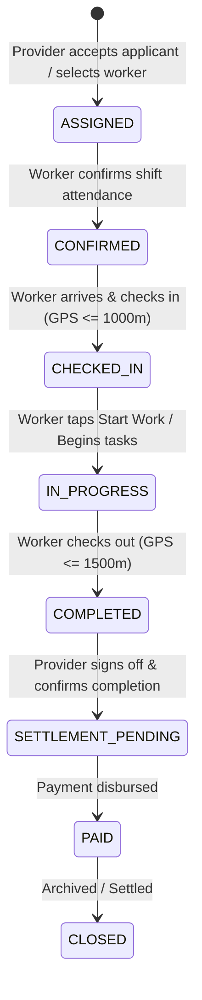

# NEARVIA: GPS Check-In/Out + Job PIN Verification (Phase 12)

## 1. Overview & Architecture Goals
The **NEARVIA GPS Check-In/Out + Job PIN Verification** subsystem provides lightweight, server-authoritative on-site attendance verification without continuous or background GPS tracking. It satisfies two core marketplace needs:
1. **Physical Presence Verification**: Confirms that an assigned worker physically arrived at the work site within a verified proximity threshold before transitioning to active execution.
2. **Mutual Verification (Job PIN)**: Provides a 4-digit code generated server-side for each assignment, accessible to the job provider, which the worker must enter on arrival to verify physical contact.
3. **Execution Sign-off & Duration**: Captures an exit location snapshot and server timestamp upon work completion to authoritatively compute worked duration and transition the assignment to `COMPLETED`.
4. **Privacy Data Minimization**: Strict privacy architecture ensuring worker device GPS coordinates are queried only on explicit user actions (check-in, check-out) and are **never** stored as continuous track-logs or leaked to providers.

---

## 2. Server-Authoritative Lifecycle & State Machine



### Transition Guardrails:
- **`CONFIRMED -> CHECKED_IN`**:
  - Enforces time window (`CHECK_IN_WINDOW_BEFORE_MINUTES = 60m`, `CHECK_IN_WINDOW_AFTER_MINUTES = 60m`).
  - Enforces proximity (`MAX_CHECK_IN_PROXIMITY_METERS = 1000m`) using PostGIS geography / Haversine distance.
  - Manual fallback available for low-signal or device geolocation errors (`manualFallback: true`).
  - Optional seamless Job PIN verification bundled directly with check-in.
- **`CHECKED_IN -> IN_PROGRESS`**:
  - Sets `started_at` timestamp.
  - Updates worker status to `BUSY`.
- **`IN_PROGRESS / CHECKED_IN -> COMPLETED` (Check-Out)**:
  - Enforces proximity check (`MAX_CHECK_OUT_PROXIMITY_METERS = 1500m`).
  - Computes authoritative duration in minutes (`worked_minutes = EXTRACT(EPOCH FROM (NOW() - checked_in_at)) / 60`).
  - Resets worker availability to `AVAILABLE_NOW` or `OFFLINE` based on schedule.
- **Out-of-Order Rejection**:
  - Attempting to check in while in `ASSIGNED` state returns `400 ASSIGNMENT_INVALID_STATE`.
  - Attempting to check out while in `CONFIRMED` state returns `400 CHECK_OUT_INVALID_STATE`.
  - Duplicate check-in returns `400 ALREADY_CHECKED_IN`.
  - Duplicate check-out returns `400 ALREADY_COMPLETED`.

---

## 3. GPS Verification Architecture

### Data Minimization & Privacy
- **Zero Background Tracking**: The web frontend initiates `navigator.geolocation.getCurrentPosition` **only** upon explicit user tap of the "Check In On-Site", "Check Out", or "Get Directions" buttons.
- **Provider View Cloaking**: The API endpoints (`GET /api/v1/assignments/:id`) map internal records to `AssignmentDetail`, exposing:
  - `checkedInAt` / `checkedOutAt` (Timestamps)
  - `checkInDistanceMeters` / `checkOutDistanceMeters` (Offset scalars, e.g., "52m away")
  - **Device latitude and longitude coordinates are stripped and never returned to the provider.**

### Proximity Calculation
Proximity is calculated against the work opportunity site coordinates using PostGIS geography ST_Distance:
$$\text{Distance} = \text{ST\_Distance}(worker\_location, opportunity\_location)$$
In fallbacks, the Haversine formula is evaluated server-side.

| Action | Allowed Radius | Error Code if Exceeded |
| :--- | :--- | :--- |
| **Check-In** | 1,000 meters (1.0 km) | `CHECK_IN_PROXIMITY_EXCEEDED` |
| **Check-Out** | 1,500 meters (1.5 km) | `CHECK_OUT_PROXIMITY_EXCEEDED` |

---

## 4. Job PIN Verification & Rate-Limiting

### PIN Mechanics
- **Generation**: At the time an assignment is created (application accepted), a secure 4-digit numeric code is generated:
  - Format: `LPAD((FLOOR(RANDOM() * 9000) + 1000)::TEXT, 4, '0')` (e.g. `4821`).
  - Stored in `assignments.job_pin`.
- **Visibility**:
  - **Provider**: Always visible on the provider assignment detail card.
  - **Worker**: Hidden from worker until verified, preventing bypass.
- **Rate-Limiting & Security**:
  - `job_pin_attempts` counter is tracked in the database.
  - Failed attempt increments `job_pin_attempts` outside rollback boundaries so attackers cannot evade lockout.
  - **Lockout Threshold**: 5 failed attempts (`MAX_JOB_PIN_ATTEMPTS = 5`).
  - On reaching 5 attempts, the endpoint locks the assignment and returns `429 JOB_PIN_MAX_ATTEMPTS_EXCEEDED`.
  - Successful verification sets `job_pin_verified_at = NOW()`, resets `job_pin_attempts = 0`, and flags `attendance_records.verified_by_provider = TRUE`.

---

## 5. Database Schema Extensions (Migration 00017)

```sql
-- Migration 00017: attendance_checkout_fields.sql

-- 1. Extend attendance_records with checkout tracking
ALTER TABLE attendance_records
  ADD COLUMN IF NOT EXISTS check_out_time TIMESTAMPTZ,
  ADD COLUMN IF NOT EXISTS check_out_location GEOGRAPHY(Point, 4326),
  ADD COLUMN IF NOT EXISTS check_out_distance_meters NUMERIC(10, 2);

-- 2. Extend assignments table with checkout proximity
ALTER TABLE assignments
  ADD COLUMN IF NOT EXISTS check_out_distance_meters NUMERIC(10, 2);

-- 3. Default job_pin generator
ALTER TABLE assignments
  ALTER COLUMN job_pin SET DEFAULT LPAD((FLOOR(RANDOM() * 9000) + 1000)::TEXT, 4, '0');

-- 4. Indexes for attendance queries
CREATE INDEX IF NOT EXISTS idx_attendance_assignment_id ON attendance_records(assignment_id);
CREATE INDEX IF NOT EXISTS idx_attendance_check_out_time ON attendance_records(check_out_time);
```

---

## 6. Verification & Test Evidence

A dedicated integration test suite `services/api/tests/gps_attendance_pin.test.ts` exercises all 21 verification vectors:

```bash
npm run vitest run tests/gps_attendance_pin.test.ts
```

### Test Results Summary:
```text
 ✓ tests/gps_attendance_pin.test.ts (21 tests) 14385ms
   ✓ 1. Authentication and Authorization Guardrails (5 tests)
     ✓ 1.1: Unauthenticated request to check-in returns 401
     ✓ 1.2: Unauthenticated request to check-out returns 401
     ✓ 1.3: Unauthenticated request to verify-pin returns 401
     ✓ 1.4: Other worker cannot check in to another worker's assignment (403)
     ✓ 1.5: Rival provider cannot verify PIN on another provider's assignment (403)
   ✓ 2. State Machine Pre-conditions (3 tests)
     ✓ 2.1: Check-in rejected when assignment is in ASSIGNED state (400)
     ✓ 2.2: Worker confirms assignment (ASSIGNED -> CONFIRMED)
     ✓ 2.3: Check-out rejected when assignment is in CONFIRMED state (400)
   ✓ 3. GPS Check-In Proximity and Verification (4 tests)
     ✓ 3.1: Invalid coordinates (lat > 90) rejected by schema validator
     ✓ 3.2: Worker outside 1000m radius rejected (CHECK_IN_PROXIMITY_EXCEEDED)
     ✓ 3.3: Worker inside 1000m radius checks in successfully without PIN
     ✓ 3.4: Duplicate check-in rejected with ALREADY_CHECKED_IN (400)
   ✓ 4. Job PIN Verification and Lockout Protection (3 tests)
     ✓ 4.1: Check-in with incorrect PIN fails with INVALID_JOB_PIN
     ✓ 4.2: Dedicated verify-pin endpoint increments failed attempts until lockout (5 max -> 429)
     ✓ 4.3: Correct PIN verification on primary assignment succeeds
   ✓ 5. GPS Check-Out Proximity, Completion and Attendance (3 tests)
     ✓ 5.1: Worker outside 1500m radius rejected for check-out (CHECK_OUT_PROXIMITY_EXCEEDED)
     ✓ 5.2: Worker inside 1500m radius checks out successfully (IN_PROGRESS -> COMPLETED)
     ✓ 5.3: Duplicate check-out rejected with ALREADY_COMPLETED (400)
   ✓ 6. Provider View and Worker Privacy Protection (1 test)
     ✓ 6.1: Provider views assignment: sees timestamps & distance, NEVER worker GPS coordinates
   ✓ 7. Authoritative Database State & Event Auditing (2 tests)
     ✓ 7.1: attendance_records table stores check_in, check_out and proximity accurately
     ✓ 7.2: platform_events records WORKER_CHECKED_IN, JOB_PIN_VERIFIED, and WORKER_CHECKED_OUT

Test Files: 1 passed (1)
Tests:      21 passed (21)
```

### Full Regression Suite:
- `tests/attendance.test.ts`: 15 passed (100%)
- `tests/job_lifecycle.test.ts`: 17 passed (100%)
- `npm run typecheck`: Passed cleanly across all 6 workspaces.
- `npm run build`: Production bundle built cleanly with zero compilation errors.
