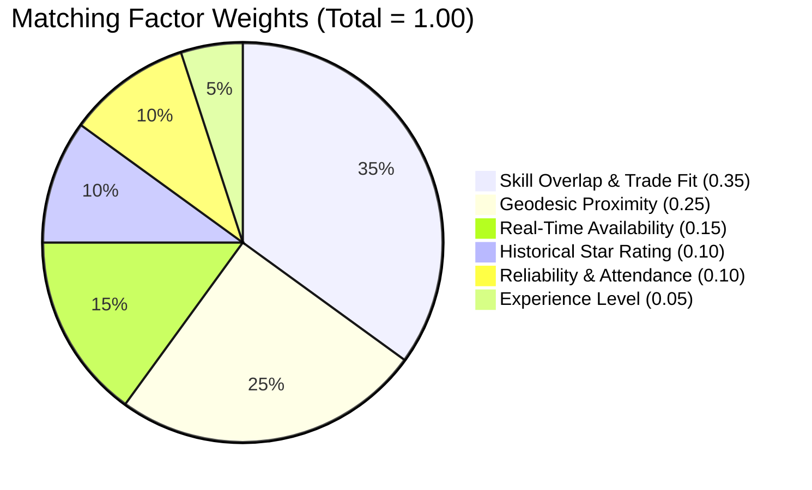

# NEARVIA — INTELLIGENCE LAYER & EXPLAINABLE MATCHING SPECIFICATION

> **Document Version**: 2.0.0  
> **Core Principle**: *PostGIS + deterministic business rules → explainable matching → recommendations → feedback → future ML*  
> **Evaluation Honesty**: NEARVIA V1 uses **deterministic multi-factor heuristics**. No claims of proprietary machine learning or deep neural networks are made for V1.

---

## 1. Why Deterministic Matching Over Premature Machine Learning?

In informal micro-work marketplaces, jumping directly to deep learning or black-box LLM ranking introduces critical structural failures:

1. **The Cold-Start Data Scarcity Problem**:
   - Machine learning algorithms (e.g. LambdaMART, Two-Tower Embeddings) require tens of thousands of historical impression-to-hire training tuples to learn feature interactions. In a new local pilot, such data does not exist; an ML model would output noise or hallucinated rankings.
2. **Algorithmic Explainability & Worker Trust**:
   - Gig workers and small business owners distrust arbitrary "AI scores." Explaining *"Top Match: 400m away, Box Packing certified, 4.9 star rating, Available Now"* establishes immediate accountability and trust.
3. **Execution Speed & Deterministic Guarantees**:
   - Deterministic PostGIS bounding-box filtering followed by weighted scoring executes in **$< 15\text{ ms}$** in-process, compared to $300\text{--}1200\text{ ms}$ for external LLM inference.
4. **Data Engine for Future ML**:
   - V1 systematically logs impression, application, assignment, completion, and rating data, building the clean training dataset required to train future ML models in V2.

---

## 2. Multi-Factor Explainable Matching Algorithm (V1)

When an employer views recommended workers for a shift, or a worker views recommended jobs, candidates are scored using an explainable, linear-weighted multi-factor formula:

$$\text{CompositeScore} = \sum_{i=1}^{6} w_i \cdot S_i$$



### 2.1 Factor Definitions & Normalization Formulas

#### 1. Skill Overlap ($S_{\text{skill}}$, Weight = $0.35$)
Evaluates exact and category-level trade overlap between the required skills of the posting and the verified skills of the worker:
$$S_{\text{skill}} = \frac{|\text{RequiredSkills} \cap \text{WorkerSkills}|}{|\text{RequiredSkills}|}$$
- If no skills are required for a general labor task, $S_{\text{skill}} = 1.0$.

#### 2. Geodesic Proximity ($S_{\text{dist}}$, Weight = $0.25$)
Inverted normalized Haversine distance along the Earth's geodesic surface:
$$S_{\text{dist}} = \max\left(0, 1 - \frac{\text{DistanceKm}}{\text{MaxRadiusKm}}\right)$$
- Example: A worker 1 km away with a 5 km search radius achieves $S_{\text{dist}} = 1 - (1/5) = 0.80$.

#### 3. Real-Time Availability ($S_{\text{avail}}$, Weight = $0.15$)
- $S_{\text{avail}} = 1.0$ if the worker has toggled the active **Available-Now** switch within the current time window.
- $S_{\text{avail}} = 0.5$ if the worker has an open schedule for the date but is not actively broadcasting online.
- $S_{\text{avail}} = 0.0$ if the worker has an existing confirmed overlapping assignment.

#### 4. Historical Star Rating ($S_{\text{rating}}$, Weight = $0.10$)
Normalizes the cumulative average star rating from completed assignments to $[0, 1]$:
$$S_{\text{rating}} = \frac{\text{AverageRating} - 1.0}{4.0}$$
- New workers with 0 reviews receive a neutral baseline score of $0.75$ ($3.75$ stars) to prevent cold-start exclusion.

#### 5. Reliability & Attendance ($S_{\text{rel}}$, Weight = $0.10$)
Measures shift commitment based on completion and cancellation history:
$$S_{\text{rel}} = \frac{\text{CompletedShifts}}{\text{AssignedShifts}} - (0.15 \times \text{NoShowCount})$$
- Capped between $[0.0, 1.0]$.

#### 6. Experience Level ($S_{\text{exp}}$, Weight = $0.05$)
$$S_{\text{exp}} = \min\left(1.0, \frac{\text{YearsOfExperience}}{5.0}\right)$$

---

## 3. Intelligence Evolution Roadmap (V1 to V5)

```
┌─────────────────────────────────────────────────────────────────────────────────────────────────┐
│                               NEARVIA INTELLIGENCE ROADMAP                                      │
├──────────────┬───────────────────────────────┬──────────────────────────────────────────────────┤
│ VERSION      │ METHODOLOGY                   │ OPERATIONAL STATUS                               │
├──────────────┼───────────────────────────────┼──────────────────────────────────────────────────┤
│ **V1**       │ PostGIS + Weighted Rules      │ `IMPLEMENTED & TESTED` (Active Baseline)         │
│ **V2**       │ Learning-to-Rank (LightGBM)   │ `FUTURE` (Requires 10,000+ logged conversions)  │
│ **V3**       │ Personalized Worker Vectors   │ `FUTURE` (Behavioral preference clustering)      │
│ **V4**       │ Spatiotemporal Demand Forecast│ `FUTURE` (Hyperlocal peak-shift prediction)      │
│ **V5**       │ Graph-Based Fraud Detection   │ `FUTURE` (Collusive review & GPS spoofing ring)  │
└──────────────┴───────────────────────────────┴──────────────────────────────────────────────────┘
```
