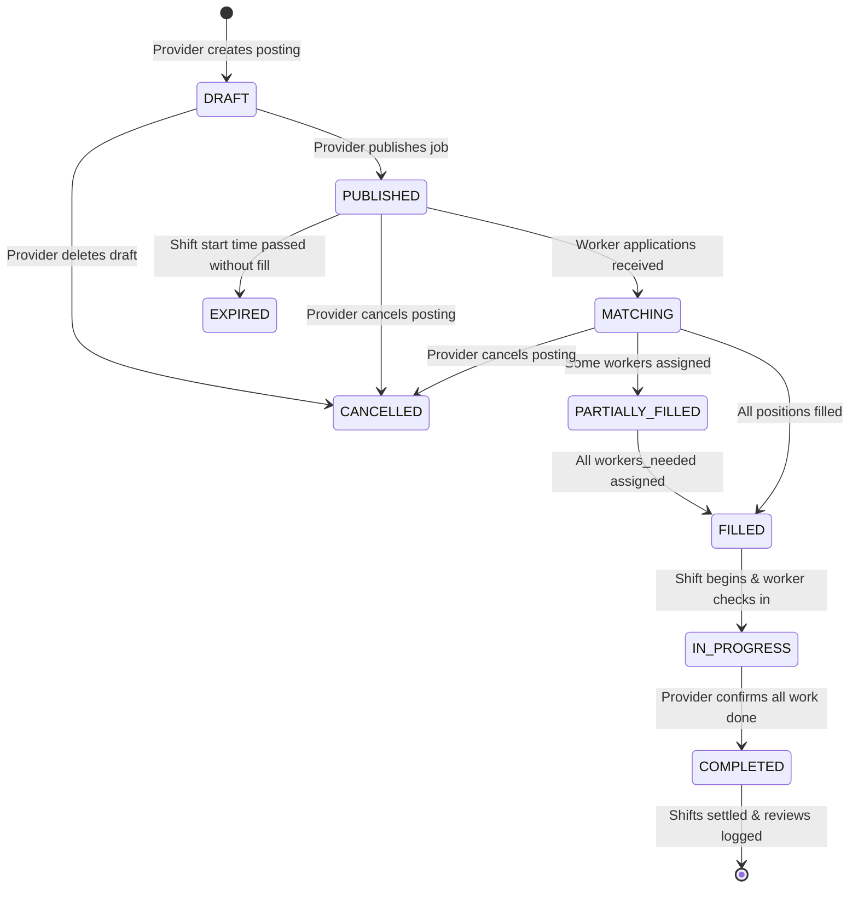
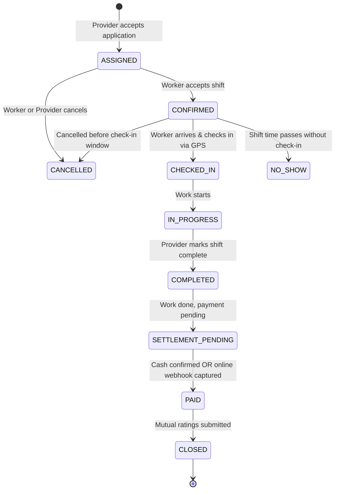

# NEARVIA — WORK OPPORTUNITY & ASSIGNMENT LIFECYCLE SPECIFICATION

> **Document Version**: 2.0.0  
> **Target Audience**: Backend Engineers, QA Testers, System Evaluators  
> **Core Concept**: Deterministic Finite State Machines (FSM) with strict role authorization, transaction boundaries, and timestamp auditing.

---

## 1. Work Opportunity Lifecycle State Machine

### 1.1 Transition Rules & Validation Barriers
| Current State | Next State | Permitted Actor | Validation Rules & Preconditions |
| :--- | :--- | :--- | :--- |
| *None* | `DRAFT` | **PROVIDER** | Validates required fields (title, category, hours, location, positive wage). |
| `DRAFT` | `PUBLISHED` | **PROVIDER** | Must be owner (`opp.provider_id === caller.provider_id`); requires at least 1 worker needed. |
| `PUBLISHED` | `CANCELLED` | **PROVIDER / ADMIN** | Cannot cancel if any worker has already `CHECKED_IN` or shift is `COMPLETED`. |
| `PUBLISHED` | `FILLED` | **SYSTEM** | Automatically triggered when `workers_assigned === workers_needed`. |
| `IN_PROGRESS` | `COMPLETED` | **PROVIDER** | Triggered when all assignments reach `COMPLETED` status. |

---

## 2. Worker Assignment Lifecycle State Machine

The assignment represents the active micro-contract between a specific worker and the employer for shift execution.

### 2.1 Transition Details & State Guards

#### 1. `ASSIGNED` $\rightarrow$ `CONFIRMED`
- **Trigger**: Worker calls `POST /api/v1/assignments/:id/confirm`.
- **Preconditions**:
  - Authenticated user must be the assigned worker (`asn.worker_user_id === req.user.id`).
  - Current status must be exactly `ASSIGNED`.
- **Side Effects**: Sets `confirmed_at = NOW()`. Unlocks exact site address and employer contact details to worker.

#### 2. `CONFIRMED` $\rightarrow$ `CHECKED_IN`
- **Trigger**: Worker calls `POST /api/v1/assignments/:id/check-in`.
- **Preconditions**:
  - Time window check: Allowed between `shift_start - 30 minutes` and `shift_end + 30 minutes`.
  - Geofence proximity check: Worker coordinates must be within **1,000 meters** of the work site using Haversine distance, or manual fallback reason must be confirmed.
- **Side Effects**: Sets `checked_in_at = NOW()`, logs `attendance_records` entry with computed distance in meters.

#### 3. `CHECKED_IN` $\rightarrow$ `COMPLETED`
- **Trigger**: Provider calls `POST /api/v1/assignments/:id/complete`.
- **Preconditions**:
  - Authenticated user must be the job provider (`asn.provider_user_id === req.user.id`).
  - Worker must have checked in (`status === 'CHECKED_IN'` or `'IN_PROGRESS'`).
- **Side Effects**: Sets `completed_at = NOW()`, records shift duration in minutes, triggers payment settlement prompt.

#### 4. `COMPLETED` $\rightarrow$ `PAID` (Settlement Gate)
- **Pathway A (Cash Confirmation)**:
  - Provider or Worker initiates `POST /api/v1/payments/cash-confirm`.
  - Invariant: Neutral terminology *"Cash payment confirmed between provider and worker"*.
  - Records row in `payment_records` with `payment_method = 'CASH'`, sets `assignments.payment_status = 'CONFIRMED'`.
- **Pathway B (Online Gateway Sandbox)**:
  - Provider initiates `POST /api/v1/payments/create-order` via Razorpay test mode.
  - Gateway webhook delivers `payment.captured` event.
  - Webhook verifies HMAC-SHA256 signature using timing-safe comparison.
  - Sets `payment_records.status = 'CONFIRMED'`, sets `assignments.payment_status = 'CONFIRMED'`.

---

## 3. Exceptional Transitions

### 3.1 `NO_SHOW`
- If an assignment is in `CONFIRMED` status and shift duration has passed without check-in, provider or system triggers `NO_SHOW`.
- Worker reliability score is penalized (-15% on reliability factor in future candidate ranking).

### 3.2 `DISPUTED`
- If payment amount or work quality is contested by either party, a formal dispute is lodged via `POST /api/v1/safety/disputes`.
- Assignment enters a freeze state; administrative review is escalated to the platform dashboard.
