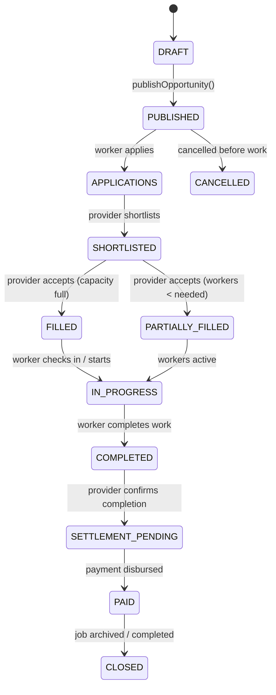
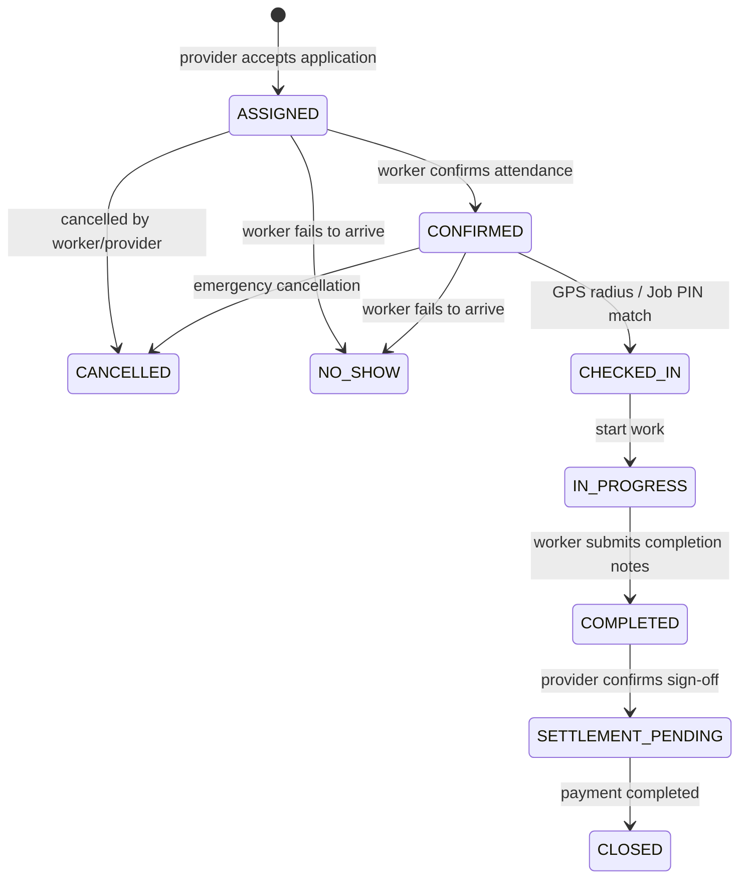

# NEARVIA — Complete Job Lifecycle (Phase 11)

## 1. Overview & Architectural Principles

The NEARVIA Job Lifecycle is a deterministic, server-authoritative state machine governing work opportunities and worker assignments from inception to financial settlement and closure.

### Key Tenets
1. **Server-Authoritative State**: State transitions cannot be triggered or forged by client-side optimism. Every transition is validated by database-backed business logic with row-level locks (`SELECT ... FOR UPDATE`).
2. **Deterministic State Machine**:
   - Out-of-order, illegal, or premature transitions are rejected with `400 Bad Request`.
   - Unauthorized attempts (e.g. provider manipulating another provider's job, worker confirming another worker's assignment) are rejected with `403 Forbidden`.
3. **No Duplicate Active Assignments**: A database partial unique constraint guarantees that a worker cannot hold more than one active assignment for the same job simultaneously.
4. **Synchronized Timeline & Milestone Visibility**: Both provider and worker query the same authoritative endpoint (`/jobs/:id/lifecycle` or `/assignments/:id/lifecycle`) to inspect current stage, chronological timeline milestones, and role-tailored next available actions.
5. **Real Settlement & Audit Trail**: Moving to completion transitions the opportunity to `SETTLEMENT_PENDING`, automatically initializes pending financial records in `payment_records`, and logs immutable audit records in `platform_events`.

---

## 2. Target Lifecycle & State Transitions

### Job (Work Opportunity) States


### Worker Assignment States


---

## 3. Database Schema & Concurrency Safety

### 3.1 Migration `00016_job_lifecycle_settlement.sql`
- **Extended Enum Values**:
  - `work_opportunity_status`: Extended with `'SETTLEMENT_PENDING'`, `'PAID'`, `'CLOSED'`.
  - `assignment_status`: Extended with `'SETTLEMENT_PENDING'`, `'CLOSED'`.
- **Partial Unique Index for Active Assignments**:
  ```sql
  CREATE UNIQUE INDEX IF NOT EXISTS idx_assignments_unique_active_worker
  ON assignments(work_opportunity_id, worker_id)
  WHERE status IN ('ASSIGNED', 'CONFIRMED', 'CHECKED_IN', 'IN_PROGRESS');
  ```
  This index prevents race conditions where a worker could be assigned multiple times to the same job, while still allowing historical records (e.g. past cancelled or completed assignments) for the same worker.

### 3.2 Capacity Enforcement & Row-Level Locking
In `services/api/src/modules/applications/service.ts`:
```typescript
const oppRes = await client.query(
  `SELECT id, provider_id, status, workers_needed, workers_assigned, payment_amount, title
   FROM work_opportunities 
   WHERE id = $1 FOR UPDATE`,
  [app.work_opportunity_id]
);
```
- If `workers_assigned >= workers_needed`, application acceptance is immediately rejected with `409 Conflict`.
- When an assignment is cancelled, `workers_assigned` is safely decremented and opportunity status reverts to `PUBLISHED` if capacity was previously full.

---

## 4. Authoritative Lifecycle Service & API Endpoints

### 4.1 Endpoints Mounted
- `GET /api/v1/jobs/:id/lifecycle`: Provider, worker, or admin view of authoritative job lifecycle.
- `GET /api/v1/work-opportunities/:id/lifecycle`: Alias endpoint.
- `GET /api/v1/assignments/:id/lifecycle`: Direct assignment-linked view of lifecycle.

### 4.2 Standardized Response Payload
```json
{
  "success": true,
  "data": {
    "jobId": "e6136fc7-473b-44aa-b6f3-598c513a461a",
    "jobTitle": "Deep Cleaning Shift",
    "jobStatus": "SETTLEMENT_PENDING",
    "currentStage": "SETTLEMENT_PENDING",
    "workersNeeded": 1,
    "workersAssigned": 1,
    "assignmentId": "...",
    "assignmentStatus": "COMPLETED",
    "workerId": "...",
    "workerName": "Suresh Kumar",
    "providerId": "...",
    "providerName": "CleanPro Facilities",
    "agreedWage": 1200,
    "timeline": [
      { "stage": "PUBLISHED", "label": "Job Published", "status": "COMPLETED", "timestamp": "..." },
      { "stage": "ASSIGNED", "label": "Worker Assigned", "status": "COMPLETED", "timestamp": "..." },
      { "stage": "CONFIRMED", "label": "Attendance Confirmed", "status": "COMPLETED", "timestamp": "..." },
      { "stage": "CHECKED_IN", "label": "On-Site Check-In", "status": "COMPLETED", "timestamp": "..." },
      { "stage": "IN_PROGRESS", "label": "Work In Progress", "status": "COMPLETED", "timestamp": "..." },
      { "stage": "COMPLETED", "label": "Work Completed", "status": "COMPLETED", "timestamp": "..." },
      { "stage": "SETTLEMENT_PENDING", "label": "Settlement & Payment", "status": "ACTIVE", "timestamp": "..." }
    ],
    "nextActions": [
      {
        "action": "SETTLE_PAYMENT",
        "label": "Process Settlement",
        "endpoint": "/api/v1/payments/settle",
        "method": "POST",
        "description": "Finalize worker payment disbursement and close opportunity."
      }
    ]
  }
}
```

---

## 5. Audit Trail & Event Logging

Key lifecycle transitions are logged to the `platform_events` audit table:
- `WORKER_SELECTED`: Provider shortlists or accepts an application.
- `ASSIGNMENT_CONFIRMED`: Worker confirms attendance.
- `WORKER_CHECKED_IN`: Worker checks in on site.
- `WORK_STARTED`: Work commences.
- `WORK_COMPLETED`: Worker marks work complete with notes.
- `PROVIDER_CONFIRMED_COMPLETION`: Provider inspects and confirms work.
- `SETTLEMENT_PENDING`: Job moves to financial settlement.
- `ASSIGNMENT_CANCELLED`: Assignment cancelled with reason.

---

## 6. Frontend Milestone Synchronization

The web application (`apps/web`) uses synchronized state across:
1. `AssignmentStatusTimeline.tsx`: 6-step responsive grid displaying `Assigned`, `Confirmed`, `Checked In`, `In Progress`, `Completed`, and `Settlement & Closed`.
2. `ProviderAssignmentDetailPage.tsx`: Step guidance for inspecting completed work, reviewing notes, and approving payment settlement.
3. `WorkerAssignmentDetailPage.tsx`: Step guidance tracking attendance confirmation, check-in, live shift timer, completion submission, and pending payout.

---

## 7. Automated Test Suite

A comprehensive test suite of 17 tests runs in `services/api/tests/job_lifecycle.test.ts`:
- **Test 1**: Provider creates draft and publishes (`DRAFT` → `PUBLISHED`).
- **Test 2**: Worker submits application (`APPLICATIONS`).
- **Test 3**: Provider shortlists applicant (`PENDING` → `SHORTLISTED`).
- **Test 4**: Provider accepts worker application → assignment created (`ASSIGNED`, `FILLED`).
- **Test 5**: Worker confirms attendance (`ASSIGNED` → `CONFIRMED`).
- **Test 6**: Valid transition sequence executes properly (`CHECKED_IN` → `IN_PROGRESS` → `COMPLETED`).
- **Test 7**: Out-of-order or invalid transitions are strictly rejected (`400`).
- **Test 8**: Unauthorized provider rejected (`403`).
- **Test 9**: Unauthorized worker rejected (`403`).
- **Test 10**: Attempting duplicate active assignment for worker rejected by database unique constraint (`idx_assignments_unique_active_worker`).
- **Test 11**: Capacity limit strictly enforced when opportunity is full (`409`).
- **Test 12**: Worker completion record contains notes and timestamp in database.
- **Test 13 & 14**: Provider confirms completed work → reaches `SETTLEMENT_PENDING` and creates pending `payment_records` row.
- **Test 15**: Cancelling assignment decrements `workers_assigned` and reverts opportunity to `PUBLISHED`.
- **Test 16**: Repeated cancellation or invalid state changes do not corrupt state.
- **Test 17**: Authoritative lifecycle endpoint returns synchronized 7 milestones and next actions.
- **Test 18**: Platform events audit trail correctly recorded key lifecycle milestones.
