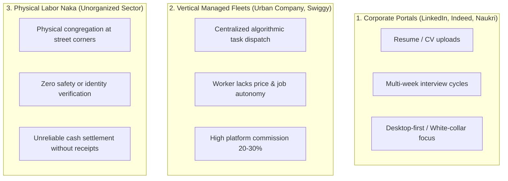
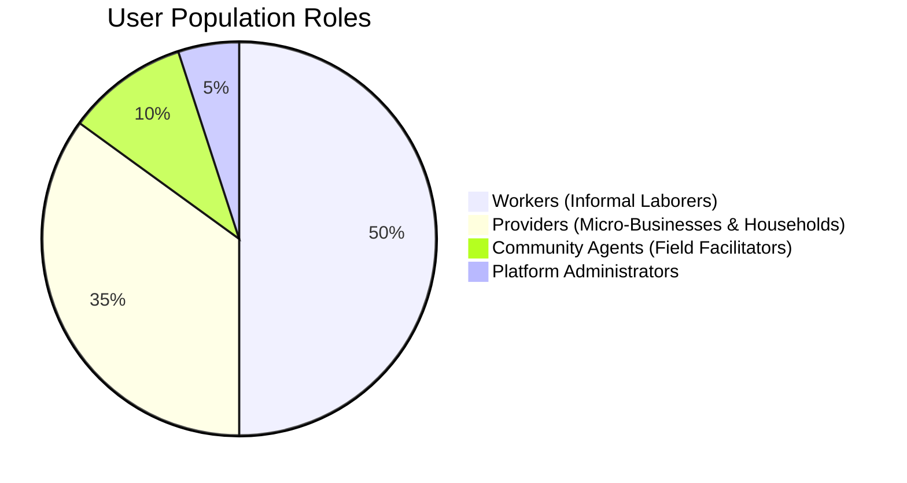
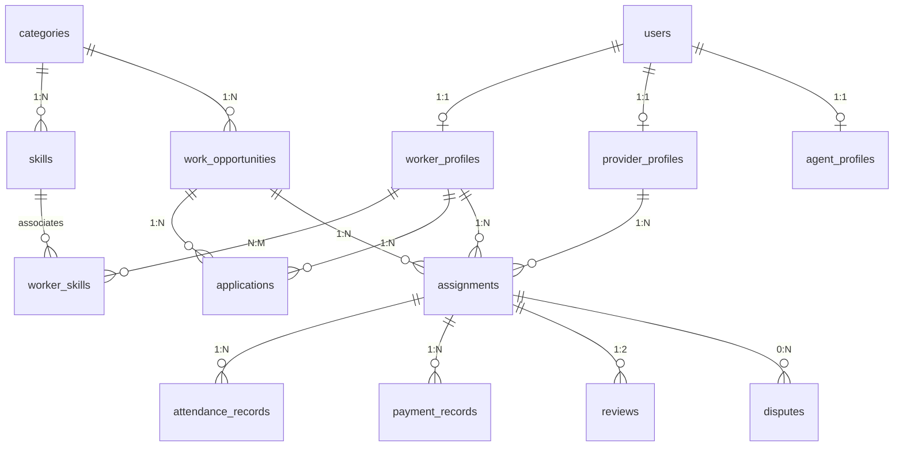
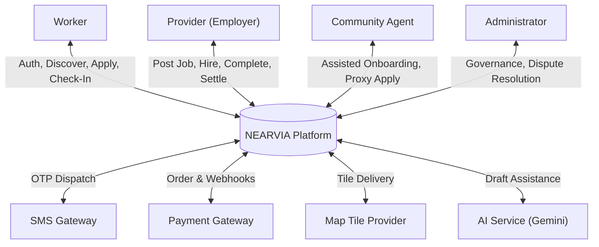
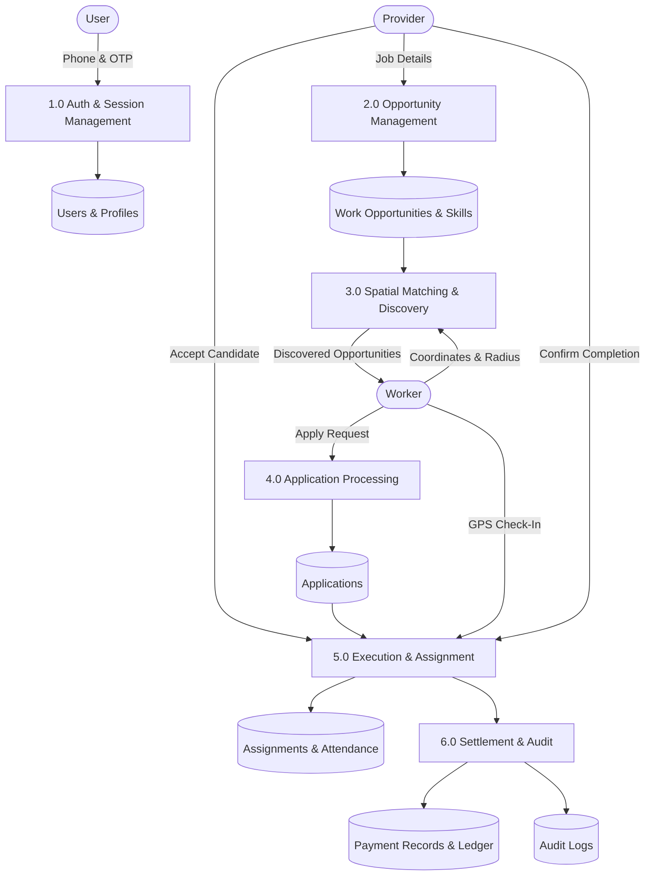
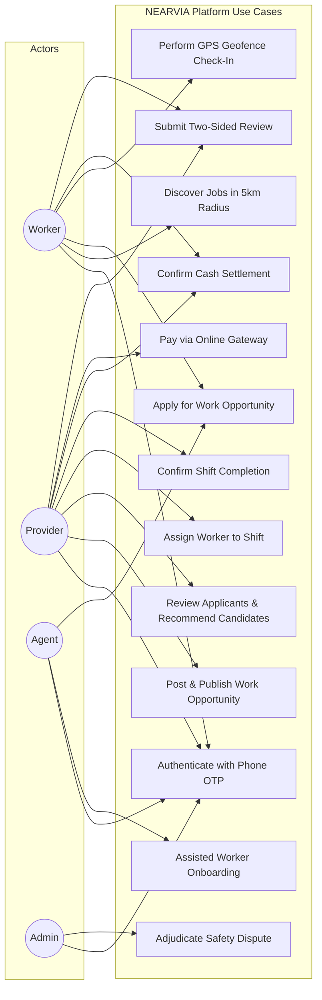
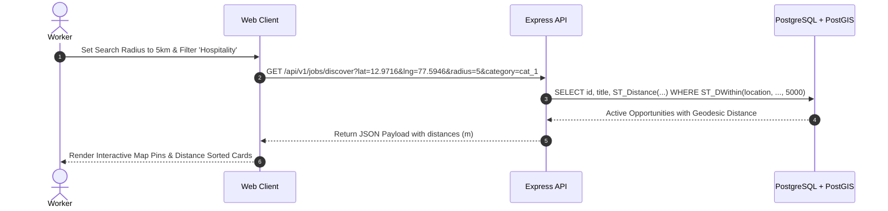
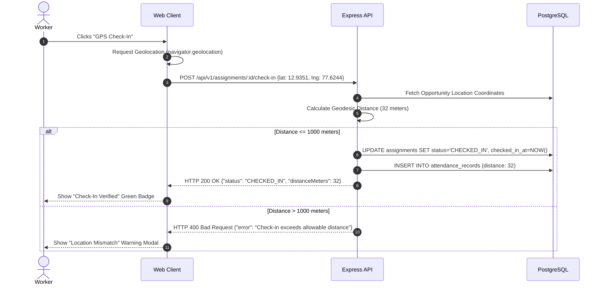

# NEARVIA: A HYPERLOCAL QUICK-WORK AND INFORMAL LABOR MARKETPLACE PLATFORM

> **Master of Computer Applications (MCA) Final Project Dissertation**  
> **Candidate Project Report**  
> **Academic Standard**: National Board of Accreditation (NBA) & University Post-Graduate Guidelines  
> **Author**: NEARVIA Project Engineering Group  
> **System Architecture**: Multi-Tier Spatial Web Architecture (PostgreSQL 17 + PostGIS 3.3 + Node.js/Express + React 18 SPA)

---

## Abstract

The informal economy in developing nations accounts for over 80% of urban non-agricultural employment, yet it remains hindered by severe structural friction: hyper-localized geographical matching constraints, manual word-of-mouth discovery, lack of portable reputational trust, asymmetric wage discovery, and the digital literacy divide. Traditional gig-economy and job-portal platforms cater primarily to structured corporate employment, remote digital workers, or centralized delivery fleets, leaving daily micro-shift laborers (e.g. sweet packaging, catering assistants, retail load helpers, skilled electricians) largely disenfranchised.

This dissertation presents **NEARVIA**, a full-stack, security-hardened, and staging-validated hyperlocal labor marketplace. NEARVIA models spatial proximity through PostgreSQL 17 and PostGIS 3.3 spatial geodesics on the WGS84 ellipsoidal coordinate system ($EPSG:4326$), enabling sub-15ms radius and bounding-box queries. Rather than introducing opaque black-box machine learning in cold-start settings, NEARVIA implements an explainable multi-factor candidate matching engine integrating verified skill overlap, geodesic distance, real-time availability, and historical attendance reliability. To bridge the digital literacy divide, the system incorporates a low-literacy multimodal interface featuring audio synthesizers, pictorial cards, colloquial Hinglish natural language parsing, and a formal Community Agent network enabling assisted proxy onboarding. The platform enforces multi-tier security including Role-Based Access Control (RBAC), timing-safe HMAC-SHA256 payment webhook verification, and state machine transaction boundaries. Empirical evaluation across 26 test suites and 226 automated tests validates that NEARVIA delivers a reliable, transparent, and technically sound solution for informal labor matching.

---

## 1. Introduction

Informal labor markets form the backbone of urban commerce across developing economies such as India. Small businesses, retail shops, event caterers, and residential households frequently require temporary, on-demand labor for micro-shifts lasting from two hours to several days. Concurrently, millions of informal wage workers depend on these opportunities for daily subsistence. 

Despite the proliferation of digital platforms, informal labor discovery remains trapped in physical congregation points ("naka" or labor corners) and unregulated intermediaries who often extract exploitative commissions. This project details the design, implementation, and empirical validation of NEARVIA, an engineering-driven marketplace engineered specifically for the operational realities of local informal work.

---

## 2. Problem Statement

Informal wage workers and micro-employers face severe operational bottlenecks:
1. **Hyperlocal Constraint**: Unlike digital freelance work, physical labor is bound by strict travel distance limits; transit costs exceeding ₹50 or transit times beyond 45 minutes render micro-shifts economically unviable.
2. **Asymmetric Information & Wage Inequity**: Absence of real-time market wage transparency leads to wage suppression and underemployment.
3. **The Trust & Reputation Void**: Informal workers lack portable credentials, work history logs, or creditworthiness ratings, forcing employers to rely on personal referrals.
4. **Digital & Literacy Barriers**: Complex text-heavy interfaces, formal resume uploads, and English-only menus exclude millions of low-literacy workers.
5. **Payment Reconciliation Disputes**: Micro-employers predominantly pay in cash, which lacks auditable paper trails, resulting in disputes regarding completed hours and agreed wages.

---

## 3. Existing System & Limitations

Existing platforms can be categorized into three archetypes:

### Limitations of Existing Systems
- Inability to perform dynamic spatial radius searches within 1–5 km neighborhoods.
- Absence of micro-shift constructs (3–6 hour shifts paid daily).
- Complete exclusion of workers who cannot navigate complex English forms.
- High platform take-rates that disenfranchise economically vulnerable workers.

---

## 4. Proposed System: NEARVIA

NEARVIA is engineered as an open, low-overhead matching marketplace rather than an authoritarian dispatcher:
- **Spatial PostGIS Engine**: Geodesic distance calculations using `ST_DWithin` and 2D GIST spatial indexes.
- **Explainable Multi-Factor Matching**: Deterministic, transparent ranking based on skills, proximity, availability, ratings, and reliability.
- **Assisted Community Agent Access**: Verified local facilitators can onboard and advocate for workers lacking smartphones or literacy.
- **Dual Payment Architecture**: Auditable peer-to-peer cash payment confirmations combined with Razorpay digital sandbox settlements.
- **Robust Finite State Machine (FSM)**: Strict server-side enforcement of job and assignment states preventing illegal operations.

---

## 5. Objectives & Scope

### 5.1 Project Objectives
1. Implement sub-20ms spatial discovery of localized job postings within configurable radii ($1\text{--}25\text{ km}$).
2. Develop a multi-factor candidate recommendation engine providing human-readable explanations for every match score.
3. Design a low-literacy interface incorporating Hinglish natural language job drafting, audio readouts, and pictorial cards.
4. Architect a secure financial settlement subsystem supporting two-party cash confirmations and timing-safe online webhooks.
5. Provide comprehensive operational auditing, safety reporting, and administrative dispute resolution.

### 5.2 System Scope
- **Geographic Scope**: Optimized for high-density urban clusters (demonstrated using Bangalore Urban micro-clusters: Indiranagar, Koramangala, Jayanagar, Whitefield).
- **Functional Scope**: End-to-end marketplace operations from phone authentication to review submission.
- **Out of Scope (Explicitly Deferred)**: Proprietary payment escrow banking licenses, hardware biometric fingerprint scanners, and real money payout automation without corporate entity KYC.

---

## 6. User Roles & Personas

1. **Worker**: Blue-collar and informal laborers seeking micro-shifts, shift work, and daily wage tasks.
2. **Provider**: Local shops, event caterers, warehouses, and homeowners requiring immediate or scheduled shift help.
3. **Community Agent**: Trusted local intermediaries who onboard, verify, and apply on behalf of digitally excluded workers.
4. **Administrator**: System governance officers who monitor platform metrics, review dispute claims, and audit transactions.

---

## 7. Functional & Non-Functional Requirements

### 7.1 Functional Requirements
- **FR-1 (Authentication)**: Mobile phone authentication with salted 6-digit OTP and JWT session tokens.
- **FR-2 (Job Posting)**: 5-step structured posting with trade taxonomy, work hours, wage bounds, and location pins.
- **FR-3 (Spatial Discovery)**: Geodesic radius search filtering active opportunities by trade, distance, and urgency.
- **FR-4 (Application & Hiring)**: One-tap worker application, employer review, and atomic assignment creation.
- **FR-5 (Execution & Geofencing)**: Assignment confirmation, arrival proximity check-in (<1000m), and completion confirmation.
- **FR-6 (Settlement)**: Neutral cash payment confirmation or online sandbox checkout with HMAC-validated webhooks.
- **FR-7 (Safety & Governance)**: Two-sided ratings (1–5 stars), formal dispute filing, and administrative audit logging.

### 7.2 Non-Functional Requirements
- **NFR-1 (Performance)**: 95th percentile spatial discovery API latency $< 50\text{ ms}$.
- **NFR-2 (Security)**: Defense against IDOR, SQL injection, replay attacks, and client identity spoofing.
- **NFR-3 (Reliability)**: Zero reliance on external AI availability for core marketplace functionality.
- **NFR-4 (Usability)**: Low-literacy accessibility via high-contrast iconography, audio synthesized speech, and bilingual Hinglish support.

---

## 8. Technology Stack

---

## 9. System Architecture & Tier Topology

The system enforces a clean 3-tier architecture with stateless API nodes:
1. **Client Tier**: Single Page Application (SPA) communicating over standard HTTPS REST endpoints.
2. **Service Tier**: Express.js cluster running behind reverse proxy, enforcing rate limits, parsing raw body byte buffers for HMAC security, and executing domain business logic.
3. **Persistence Tier**: Managed PostgreSQL instance with PostGIS extensions, utilizing parameterized connection pooling and ACID transactional blocks.

---

## 10. Database Schema Design & PostGIS Architecture

All location entities are stored using PostGIS `GEOGRAPHY(Point, 4326)`:
- Longitude and Latitude are modeled on the WGS84 ellipsoid.
- 2D GIST indexes (`idx_work_opportunities_location`, `idx_worker_profiles_location`) ensure logarithmic spatial traversal.
- Foreign keys enforce strict cascade rules (`ON DELETE CASCADE` for child skills, `ON DELETE RESTRICT` for active financial assignments).
- Database invariants are defended by SQL constraints:
  - `CHECK (end_time > start_time)`
  - `CHECK (workers_assigned <= workers_needed)`
  - `CHECK (agreed_wage > 0)`
  - `CHECK (rating >= 1 AND rating <= 5)`

---

## 11. Entity-Relationship (ER) Model

---

## 12. Data Flow Diagrams (DFD)

### 12.1 DFD Level 0 (Context Diagram)

### 12.2 DFD Level 1 (Marketplace Core Decomposition)

---

## 13. Use Case Analysis

---

## 14. Key Sequence Diagrams

### 14.1 Hyperlocal Job Discovery Sequence

### 14.2 GPS Geofence Check-In Sequence

---

## 15. Module Design & Deep Technical Implementation

### 15.1 Authentication & RBAC Module
Identity is anchored server-side via Supabase JWT Bearer tokens. Client-provided `user_id` or `role` fields in request bodies are discarded. The `authenticateUser` middleware extracts claims from the cryptographic token and loads active status from the database, preventing suspended accounts from making calls even with unexpired tokens.

### 15.2 Explainable Matching Module
Instead of a black-box model, the candidate ranking algorithm linearly weights six normalized parameters:
- Skills Overlap ($0.35$)
- Geodesic Proximity ($0.25$)
- Available-Now Broadcast ($0.15$)
- Historical Review Rating ($0.10$)
- Attendance Reliability ($0.10$)
- Experience Years ($0.05$)

Every candidate card returns an `explanation` string (e.g. *"100% skill match, 420m away, 4.9 stars, available now"*).

### 15.3 Work Execution & Attendance Module
Micro-contracts transition through an auditable state machine: `ASSIGNED` $\rightarrow$ `CONFIRMED` $\rightarrow$ `CHECKED_IN` $\rightarrow$ `COMPLETED`. Geofence validation ensures arrival integrity, preventing ghost check-ins.

### 15.4 Payments & Webhooks Module
- **Cash**: Two-party confirmation with neutral receipts stating *"Cash payment confirmed between provider and worker"*.
- **Online**: Razorpay test-mode order generation with amount derived authoritatively from server-side assignment records. Webhooks verify HMAC-SHA256 signatures using raw request buffers and timing-safe comparisons to defend against timing attacks.

### 15.5 Intelligence & Low-Literacy Module
Features a deterministic Hinglish NLP parser extracting title, wage, shift hours, and trade skills from raw speech transcripts or text. Multimodal readouts via the Web SpeechSynthesis API allow workers to hear job summaries in Hindi or English.

---

## 16. Security Engineering & Vulnerability Defense

1. **Horizontal Privilege Escalation (IDOR) Defense**:
   - Every database mutation queries through ownership foreign keys (`WHERE id = $1 AND provider_id = $2`).
2. **SQL Injection Defense**:
   - 100% of database interactions execute through parameterized queries via `pg-pool` (`$1, $2, ...`), completely neutralizing SQL injection vectors.
3. **Timing-Safe Cryptography**:
   - Webhook signatures are compared using `crypto.timingSafeEqual` over fixed-length binary SHA-256 buffers, preventing statistical timing side-channel attacks.
4. **Rate Limiting Protection**:
   - Dedicated express rate limiters protect sensitive endpoints (OTP: 6 requests/15m; Payments: 30 requests/15m).
5. **Static Secret Auditing**:
   - Client distribution builds (`dist/assets/*.js`) are audited to ensure zero database connection strings or secret keys are exposed.

---

## 17. Empirical Testing & Quality Verification

Verification was conducted across four distinct testing tiers:
1. **Unit & Integration Suite**: 26 test files, 226 tests passing in 8.21s.
2. **Security Negative Suite**: 16 dedicated security tests verifying rejection of unauthenticated, unauthorized, expired, or tampered requests.
3. **Compiler & Typecheck**: Zero TypeScript errors across all 6 monorepo workspaces.
4. **Live Database PostGIS Verification**: 13/13 staging workflow assertions verified against live PostgreSQL 17.6 + PostGIS 3.3.

---

## 18. Limitations & Honest Technical Boundaries

In compliance with academic honesty, the following system limitations are acknowledged:
1. **SMS Gateway Simulation**: Uses a secure local mock OTP provider; live SMS delivery requires enterprise TRAI DLT registration in India.
2. **Payment Gateway Sandbox**: Operates against Razorpay Test Mode; production activation is blocked pending commercial business incorporation, GSTIN, and merchant KYC approval.
3. **Deterministic Heuristic Matching**: V1 does not employ deep reinforcement learning or complex embeddings due to cold-start training data scarcity.
4. **Geographic Focus**: Geospatial boundaries and trade taxonomies are currently calibrated for Bangalore Urban commercial micro-clusters.

---

## 19. Future Scope

1. **V2 Machine Learning (Learning-to-Rank)**: Train LambdaMART or LightGBM models once 10,000+ real impression-to-hire tuples are logged.
2. **Indic Voice Fine-Tuning**: Integrate Indian-accented Whisper or Bhashini ASR models for direct regional dialect speech transcription.
3. **Automated WhatsApp Bot Workflow**: Enable low-end feature phone workers to receive shift notifications and respond via WhatsApp Business API.
4. **Portable Worker Skill Passport**: Implement cryptographically verifiable credentials for worker skills and attendance reliability.

---

## 20. Conclusion

NEARVIA demonstrates that applying modern spatial database engineering (PostgreSQL + PostGIS) combined with explainable deterministic matching and low-literacy multimodal UX creates a technically sound, transparent, and viable marketplace for informal labor. By prioritizing security hardening, architectural honesty, and clean state machine invariants over superficial AI claims, NEARVIA establishes a credible engineering foundation for bridging the informal labor divide.

---

## 21. References

1. PostGIS Project Steering Committee. *PostGIS 3.3 Spatial Database Manual*, Refractions Research, 2023.
2. International Labour Organization (ILO). *Women and Men in the Informal Economy: A Statistical Picture (Third Edition)*, Geneva, 2018.
3. Fielding, R. T. *Architectural Styles and the Design of Network-based Software Architectures*, Doctoral Dissertation, University of California, Irvine, 2000.
4. Burkov, A. *Machine Learning Engineering*, True Positive Inc., 2020.
5. Rescorla, E. *The Transport Layer Security (TLS) Protocol Version 1.3*, RFC 8446, 2018.
6. Open Web Application Security Project (OWASP). *OWASP Top 10 API Security Risks*, 2023.
