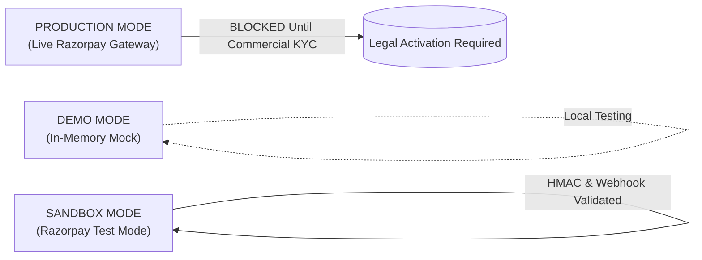
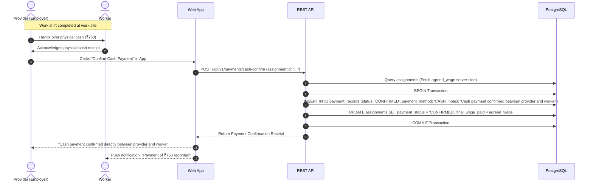
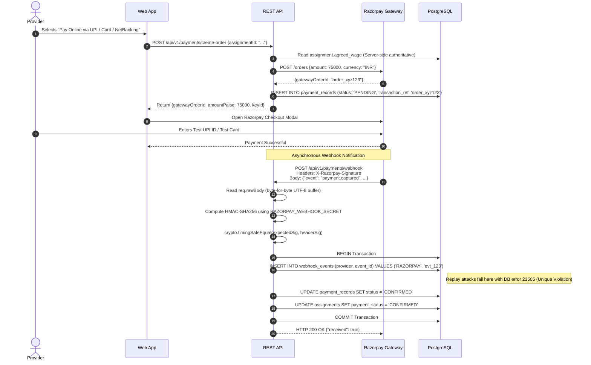

# NEARVIA — PAYMENT SYSTEM ARCHITECTURE & FINANCIAL SPECIFICATION

> **Document Version**: 2.0.0  
> **Currency Support**: INR (Indian Rupee, ₹)  
> **Precision Standard**: Integer Paise ($1\text{ INR} = 100\text{ paise}$) to eliminate floating-point rounding errors.  
> **Regulatory Boundary**: NEARVIA is an information intermediary and matching marketplace. **NEARVIA does NOT physically hold, escrow, or transmit physical cash.**

---

## 1. Multi-Tier Payment Operational Modes

NEARVIA maintains three distinct payment configurations:

### 1.1 Mode Definitions
| Payment Mode | Target Tier | Gateway Key Prefix | Verification Mechanism | Status |
| :--- | :--- | :--- | :--- | :---: |
| **`DEMO`** | Local Development | `mock_key_...` | In-memory simulated transitions | `IMPLEMENTED` |
| **`SANDBOX`** | Staging / Testing | `rzp_test_...` | Real Razorpay Test API + HMAC-SHA256 Webhooks | `TESTED` / `SANDBOX` |
| **`PRODUCTION`** | Live Real-World Pilot| `rzp_live_...` | Commercial Payment Capture & Bank Settlements | `BLOCKED — REQUIRES BUSINESS ACTIVATION` |

---

## 2. Cash Payment Confirmation Workflow

In the Indian informal gig economy, cash-on-completion is the predominant settlement method for micro-shifts. NEARVIA supports a transparent, peer-to-peer cash confirmation workflow without handling physical currency.

### 2.1 Cash Fraud Mitigation & Neutral Phrasing
- **Neutral Terminology**: To avoid misrepresenting that NEARVIA guarantees or possesses the funds, system UI and receipts strictly display:  
  `"Cash payment confirmed between provider and worker."`
- **Two-Sided Protection**: If an employer falsely claims cash was given or a worker denies receipt, either party can trigger an instant dispute (`POST /api/v1/safety/disputes`) which halts rating updates and escalates the record to the administrative review console.

---

## 3. Online Digital Payment Workflow (Razorpay Sandbox)

---

## 4. Production Payment Activation Blockers

In accordance with strict production engineering and regulatory compliance, digital payments cannot be made live until the following four prerequisites are resolved:

1. **Commercial Legal Entity Formation**:
   - A registered Indian business entity (Private Limited, LLP, or Sole Proprietorship) with an active Certificate of Incorporation and PAN.
2. **Goods and Services Tax (GST) Registration**:
   - Valid GSTIN registration for electronic commerce operator tax collection under Section 52 of the CGST Act.
3. **Razorpay Live Merchant KYC & Bank Settlement Approval**:
   - Submission of corporate bank statements, director identity verification, and merchant categorization code (MCC) review by partner acquiring banks.
4. **Escrow Regulatory Compliance (RBI Guidelines)**:
   - Compliance with Reserve Bank of India (RBI) Payment Aggregator and Payment Gateway (PA/PG) guidelines. Platforms aggregating third-party worker settlements require direct nodal account or composite escrow integration.
