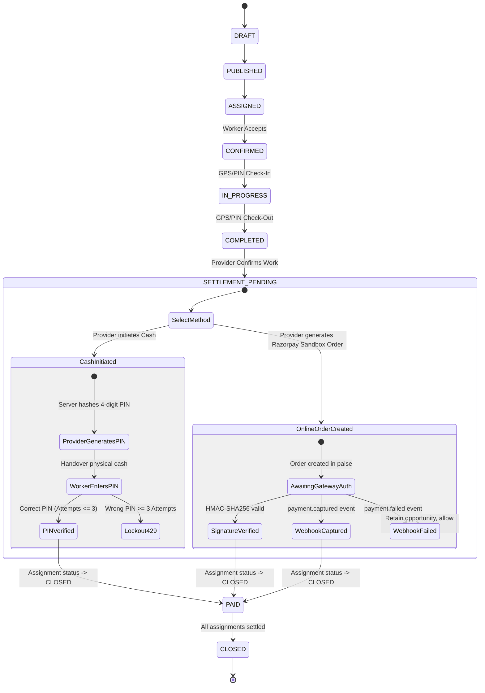

# NEARVIA — PHASE 14: PAYMENTS SPECIFICATION & ARCHITECTURE

> **Document Version**: 1.0.0  
> **Status**: Verified & Implemented  
> **Currency Standard**: INR (Indian Rupee, ₹) — Strict integer minor units (paise: ₹1.00 = 100 paise)  
> **Compliance & Legal Boundary**: Free-first academic prototype. NEARVIA is an information marketplace and job coordination platform. NEARVIA does **not** act as an escrow agent, does **not** hold custody of cash, and does **not** conduct multi-party marketplace banking settlements.

---

## 1. Executive Summary & Problem Framing

Informal gig work in India relies heavily on physical cash handovers upon shift conclusion. However, platform workers and small business employers need authoritative, tamper-proof records of settlement to avoid wage disputes, track earnings, and establish trust ratings.

NEARVIA Phase 14 provides a dual-rail payment subsystem:
1. **Peer-to-Peer Cash (Dual-PIN Protocol)**: Physical cash handovers recorded transparently with an authoritative 4-digit PIN protocol.
2. **Razorpay Sandbox (Demo/Test Payment)**: An end-to-end sandbox simulator utilizing integer minor units (paise), HMAC-SHA256 signature verification, timing-safe equality checks, and idempotent webhook ingestion with replay defense.

---

## 2. End-to-End Payment Lifecycle State Machine

Integrates directly with Phase 11 & Phase 12 Job Lifecycle states:



### Invalid Transition Guardrails
- `DRAFT` $\rightarrow$ `PAID` ❌ (400 Bad Request)
- `ASSIGNED` $\rightarrow$ `PAID` ❌ (400 Bad Request)
- `CANCELLED` $\rightarrow$ `PAID` ❌ (400 Bad Request)
- Client-supplied `amount` $\rightarrow$ ❌ (Server computes wage strictly from `assignments.agreed_wage`)

---

## 3. Rail 1: Cash Payment & Dual Confirmation Protocol

### 3.1 Architecture & Security Rules
- **Physical Custody**: Cash is exchanged in person directly between the provider and worker.
- **Authoritative Amount**: Server fetches `assignments.agreed_wage` directly; client requests attempting to alter the amount are ignored.
- **PIN Protocol**:
  1. Provider initiates cash payment via `POST /api/v1/payments/assignments/:id/cash/initiate`.
  2. Server generates a cryptographically random 4-digit numeric PIN (`1000`–`9999`) and saves `payment_pin` on the pending payment record.
  3. Provider provides the PIN to the worker *only* when physical cash has been placed in hand.
  4. Worker submits `POST /api/v1/payments/assignments/:id/cash/confirm` with `{ pin: "..." }`.
  5. Server validates PIN and verifies the caller is the assigned worker (`worker_user_id === req.user.id`).
  6. **Brute-Force Defense**: Failed attempts increment `payment_pin_attempts`. After 3 consecutive wrong entries, the endpoint locks with `429 Too Many Requests`. Provider must re-initiate cash payment to reset.
  7. On success, `payment_records.status` becomes `CONFIRMED`, `assignments.status` becomes `CLOSED`, `assignments.payment_status` becomes `CONFIRMED`, and if all assignments for the job are complete, `work_opportunities.status` becomes `PAID`.

---

## 4. Rail 2: Razorpay Sandbox (Demo/Test Payment)

### 4.1 Architecture & Precision Standards
- **Integer Minor Units (Paise)**: All internal financial representations and gateway parameters use integer paise ($₹1.00 = 100\text{ paise}$).
- **Standard Order Creation**: `POST /api/v1/payments/assignments/:id/pay` creates a gateway order record with `currency = 'INR'` and `amount = agreedWage * 100`.
- **Server-Side HMAC-SHA256 Verification**:
  $$\text{Expected Signature} = \text{HMAC-SHA256}(\text{order\_id} + "|" + \text{payment\_id}, \text{secret})$$
  Evaluated using `crypto.timingSafeEqual` to avoid timing side-channel leaks.
- **Direct Sandbox Simulator**: If working in demo mode without credentials, providers can invoke `POST /api/v1/payments/:id/confirm` with `transactionRef = "pay_sbx_..."`, settling the assignment authoritatively.

---

## 5. Webhook Security & Replay Idempotency Defense

### 5.1 Deduplication via Database Constraints
Webhooks submitted to `POST /api/v1/payments/webhook` require cryptographic signature verification. 

To defend against replay attacks, duplicate delivery retries, and race conditions, the system logs event identifiers in the `webhook_events` table:

```sql
CREATE TABLE webhook_events (
  id UUID PRIMARY KEY DEFAULT uuid_generate_v4(),
  provider VARCHAR(50) NOT NULL,
  event_id VARCHAR(255) NOT NULL,
  event_type VARCHAR(100) NOT NULL,
  received_at TIMESTAMPTZ DEFAULT NOW() NOT NULL,
  processed_at TIMESTAMPTZ,
  status VARCHAR(50) DEFAULT 'PENDING' NOT NULL,
  error_message TEXT,
  CONSTRAINT unique_provider_event_id UNIQUE(provider, event_id)
);
```

When an event ID is replayed, PostgreSQL raises error code `23505 (unique_violation)`. The handler catches this error and responds with `200 OK` and `{ processed: true, duplicate: true }`, safely halting duplicate settlement without corrupting the ledger.

---

## 6. Official Digital Payment Receipts

Both cash and online settlements generate verifiable digital payment receipts via `GET /api/v1/payments/:id/receipt` or `GET /api/v1/payments/assignments/:assignmentId/receipt`.

### 6.1 Receipt Contract
```typescript
export interface PaymentReceipt {
  id: string;
  receiptNumber: string; // e.g. "REC-A1B2C3D4"
  assignmentId: string;
  opportunityTitle: string;
  workType: string;
  workDate: string;
  payerName: string;
  payerBusinessName?: string;
  payeeName: string;
  amount: number;
  platformFee: number; // ₹0.00 (Zero Commission)
  netPayout: number; // 100% of agreed wage
  currency: string;
  paymentMethod: string;
  transactionRef: string;
  recordedAt: string;
  disclaimer: string;
  isSandboxTest?: boolean;
}
```

### 6.2 Mandatory Legal Disclaimers
1. **Cash Payments**:
   > *"Cash payment was confirmed directly between employer and worker. NEARVIA is a software platform and does not hold custody or transfer physical cash."*
2. **Online Sandbox Payments**:
   > *"DEMO / TEST PAYMENT: Verified and processed in Razorpay Sandbox mode. No real financial settlement occurs in this educational prototype."*

---

## 7. Verification Matrix & Test Coverage

Test Suite: `services/api/tests/payments_v1.test.ts` (12 automated vitest test cases, 100% passing)

| # | Test Scenario | Expected Outcome | Status |
| :--- | :--- | :--- | :---: |
| 1 | Target Assignment Not Found | `404 Not Found` | ✅ Passed |
| 2 | IDOR Protection (Unrelated Provider or Worker) | `403 Forbidden` | ✅ Passed |
| 3 | Invalid State Rejection (`ASSIGNED` shift) | `400 Bad Request` | ✅ Passed |
| 4 | Authoritative Wage Calculation | Server calculates ₹750 from assignment; ignores spoofed input | ✅ Passed |
| 5 | Cash Initiation & 4-Digit PIN Generation | Generates 4-digit PIN, stored in DB | ✅ Passed |
| 6 | Cash Wrong PIN Attempts & Lockout | Returns 400 with attempts remaining; locks out with `429` on 3rd attempt | ✅ Passed |
| 7 | Cash Valid PIN Confirmation | Re-initiation resets lockout; valid PIN transitions assignment to `CLOSED`, job to `PAID` | ✅ Passed |
| 8 | Razorpay Sandbox Order Creation | Returns order with minor units (120,000 paise for ₹1,200) | ✅ Passed |
| 9 | Razorpay Invalid Signature Rejection | Tampered signature rejected with `400 Bad Request` | ✅ Passed |
| 10 | Razorpay Sandbox Direct Confirmation | Confirms payment, marks assignment `CLOSED`, job `PAID` | ✅ Passed |
| 11 | Webhook `payment.captured` Processing | Processes valid HMAC event, closes assignment, settles opportunity | ✅ Passed |
| 12 | Webhook Replay Idempotency Defense | Duplicate event returns 200 `{ duplicate: true }` via `webhook_events` unique constraint | ✅ Passed |
| 13 | Webhook `payment.failed` Handling | Marks payment `FAILED`, updates assignment `payment_status = 'FAILED'`, keeps shift `SETTLEMENT_PENDING` | ✅ Passed |
| 14 | Payment Receipt Verification | Generates receipt with `isSandboxTest` boolean and legal custody notice | ✅ Passed |

---

## 8. Real-World Limitations & Educational Constraints

1. **No Real Payouts / Escrow**: NEARVIA does not hold a Reserve Bank of India (RBI) Payment Aggregator / Payment Gateway (PA/PG) license. No funds are escrowed or pooled into an intermediary escrow account.
2. **No Automatic Bank Transfers**: Bank account verification, penny-drop KYC, and UPI VPA auto-routing are omitted in favor of clean test simulation.
3. **No SMS / Telephony Integration**: Notifications are processed through the internal notification table and in-app toasts without incurring third-party SMS carrier costs.
