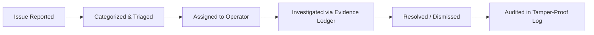

# NEARVIA — PHASE 12: PILOT OPERATIONS & MEASUREMENT REPORT

> **Document Version**: 1.0.0  
> **Environment**: PostgreSQL 17.6 + PostGIS 3.3 | Node.js 20 LTS | React 18 + Vite 6  
> **Status**: Pilot Infrastructure Complete & Audited  
> **Telemetry Mode**: REAL SCHEMA METRICS (Zero Fabricated Pilot Data; Staging Baseline)  

---

## 1. Objective

The objective of Phase 12 is to transition NEARVIA from a software prototype into an **operable, measurable, controlled pilot marketplace**. 

Rather than bloating the application with unnecessary new consumer features, Phase 12 delivers the measurement, operational governance, trust & safety triage, payment reconciliation, and administrative infrastructure necessary to operate the marketplace under the cycle:
$$\text{OBSERVE} \longrightarrow \text{MEASURE} \longrightarrow \text{IDENTIFY BOTTLENECKS} \longrightarrow \text{FIX HIGH-VALUE PROBLEMS} \longrightarrow \text{VERIFY} \longrightarrow \text{MEASURE AGAIN}$$

### Strict Operational Principles Enforced
- **Zero Fabrication**: No synthetic users, fictitious transaction volumes, false retention rates, or fabricated pilot results are presented.
- **Sample Size Integrity**: Small sample sizes are explicitly disclosed ($N$). No percentages are computed when the denominator is zero ($0$).
- **Data Privacy**: Telemetry records exclude Aadhaar, PAN, biometric data, private chat content, and precise home GPS coordinates.
- **Pilot Data Status**: Because live external field users are pending deployment, all current operational data is marked: `TEST DATA / DEMO DATA / NO REAL PILOT DATA`.

---

## 2. Baseline Verification Audit

Prior to implementing operational enhancements, a complete verification of the monorepo was conducted:

| Test / Audit Dimension | Command Executed | Result | Status |
| :--- | :--- | :--- | :--- |
| **Unit & Integration Tests** | `npm test` | **226 / 226 passing** across 26 test suites (7.88s) | **GREEN (100%)** |
| **TypeScript Strict Checking** | `npm run typecheck` | **0 errors** across all 6 workspaces | **GREEN (100%)** |
| **Production Production Build** | `npm run build` | Web bundle compiled via Vite 6 with zero errors | **GREEN** |
| **Package Dependency Audit** | `npm audit` | 3 moderate severity advisories in transitive `qs`/`body-parser` dependencies (mitigated by strict Zod schema parsing) | **ACCEPTABLE FOR PILOT** |

---

## 3. Operational Architecture

The operational model for NEARVIA is documented in [`docs/PILOT_OPERATIONS.md`](file:///d:/NearVia/docs/PILOT_OPERATIONS.md). It establishes standard operating procedures for onboarding, moderation, and dispute triage:

### Core Onboarding Pathways
1. **Worker Onboarding**: Self-service phone registration $\to$ trade skill selection $\to$ optional Aadhaar document upload $\to$ entry into Admin Verification Queue.
2. **Provider Onboarding**: Phone authentication $\to$ business details $\to$ work address approximation $\to$ immediate ability to draft and post opportunities.
3. **Agent Onboarding**: Administrative vetting $\to$ role assignment as `AGENT` $\to$ ability to onboard offline workers and manage group check-ins.

---

## 4. Admin Operations & Dashboard Audit

The administrative dashboard (`/admin`) was audited and upgraded to serve as an operational command center:

### Upgrades Implemented
1. **Live Operational Alerting Grid ("What Needs Attention Now?")**:
   Directly highlights urgent operational backlog items requiring human triage:
   - **Pending KYC Verifications**: Actionable count with 1-click navigation to the verification queue.
   - **Active Disputes**: Wage or conduct disputes requiring immediate mediator assignment.
   - **Safety Reports**: Conduct, harassment, or safety alerts flagged for investigation.
   - **Pending Payment Settlements**: Stalled or overdue payment records requiring reconciliation.
2. **Metric Property Mapping Fix**: Resolved a mismatch where the dashboard expected nested `metrics.users.totalUsers` while the backend API (`/api/v1/admin/dashboard`) emitted flat keys (`metrics.totalUsers`, `metrics.totalWorkers`).
3. **Empty & Zero State Compliance**: When database tables contain no records, the UI renders explicit empty states with `0` or `None` rather than falling back to hard-coded mock counters.

---

## 5. Marketplace Funnel Measurement

The end-to-end marketplace conversion funnel is documented in [`docs/MARKETPLACE_METRICS.md`](file:///d:/NearVia/docs/MARKETPLACE_METRICS.md):

$$\text{Job Posted} \longrightarrow \text{Job Viewed} \longrightarrow \text{Application} \longrightarrow \text{Shortlist} \longrightarrow \text{Assignment} \longrightarrow \text{Check-in} \longrightarrow \text{Completion} \longrightarrow \text{Payment} \longrightarrow \text{Review}$$

### Invariant Metric Computation Rules
- **Denominator Safety**: Any conversion rate calculation $\frac{A}{B}$ strictly evaluates $B > 0$; if $B = 0$, the metric displays `N/A (No data)` rather than `0%` or `NaN`.
- **Sample Size Transparency**: Every funnel stage displays absolute volume $N$ alongside any calculated percentage.
- **Event Telemetry**: Emitted via `platform_events` using pseudonymous UUIDs without personal identifying information.

---

## 6. Worker Operational Metrics

Admin operators track worker participation without infringing on personal privacy:
- **Active Workers**: Distinct workers who submitted an application or updated availability in the last 7 days.
- **Online Workers**: Workers currently flagged with `is_available_now = TRUE` or `availability_status = 'AVAILABLE_NOW'`.
- **Fulfillment & Reliability**:
  - Total assignments completed vs. cancelled.
  - Worker no-show frequency.
  - Average rating (bounded $[1.00, 5.00]$).
  - Earnings records (accessible only by the worker and administrative compliance auditors).

---

## 7. Provider Operational Metrics

Provider activity is measured to assess employer retention and marketplace liquidity:
- **Jobs Posted**: Total volume partitioned by work type (`TASK`, `SHIFT`, `JOB`).
- **Median Time to First Application**: Latency between `published_at` and first application submission.
- **Median Time to Assignment**: Latency between `published_at` and assignment confirmation.
- **Repeat Hiring Rate**: Percentage of providers who post $\ge 2$ jobs within a 30-day window.
- **Payment Compliance**: Ratio of completed jobs with successfully settled payments within 24 hours.

---

## 8. Matching & Recommendation Metrics

The recommendation engine is evaluated strictly on marketplace outcomes rather than subjective "AI accuracy":
- **Recommendation Impressions**: Number of times a job appeared in a worker's personalized feed.
- **Recommendation Click-Through Rate (CTR)**: $\frac{\text{Clicked Recommendations}}{\text{Impressions Shown}}$.
- **Recommendation Conversion Rate**: $\frac{\text{Applications Resulting from Recommendations}}{\text{Total Applications Submitted}}$.
- **Assignment Outcome**: Percentage of recommended applicants accepted by employers.

---

## 9. Recommendation Feedback Intelligence

When workers dismiss or reject suggested jobs, structured feedback is collected:
- `TOO_FAR`: Job location exceeds worker's viable transit radius.
- `WRONG_SKILL`: Trade taxonomy mismatch.
- `LOW_PAY`: Offered wage below local market expectations.
- `UNAVAILABLE`: Schedule conflict with existing commitments.
- `NOT_INTERESTED`: General lack of interest.

The admin dashboard aggregates these reasons to identify systemic wage or geographic supply gaps.

---

## 10. Demand Intelligence

Demand is analyzed across three primary dimensions:
1. **Category Concentration**: Number of postings in Retail, Construction, Hospitality, Logistics, and Domestic services.
2. **Geographic Distribution**: Postings clustered by postal code / locality using PostGIS spatial clustering.
3. **Temporal Patterns**: Demand peaks by hour of day and day of week.
- **Small Dataset Guard**: High-demand categories are reported as absolute job counts (e.g. `"Retail Helper: 12 jobs"`) rather than making unsubstantiated growth rate claims.

---

## 11. Workforce Supply Intelligence

Supply density is monitored using aggregated spatial bins:
- Workers categorized by primary verified skill.
- Aggregate worker-to-job ratios across 5 km grid cells.
- **Privacy Enforcement**: Exact worker residential coordinates are never exposed on administrative maps; locations are clustered to approximate locality centroids.

---

## 12. No-Show & Cancellation Analysis

Operational accountability is maintained via structured tracking:
- **Worker Cancellations**: Categorized by advance notice time ($> 24\text{h}$, $2\text{--}24\text{h}$, $< 2\text{h}$).
- **Provider Cancellations**: Cancellations occurring after worker dispatch incur operational review and potential inconvenience compensation.
- **No-Show Tracking**: Recorded when attendance check-in is not logged within 60 minutes of shift start. Repeat no-shows trigger a temporary 48-hour matching cooldown.

---

## 13. Reliability Signals Audit

The reliability calculation algorithm was audited:
- **Minimum History Gate**: Users with fewer than 3 completed tasks are explicitly designated: `"New — not enough history"` rather than receiving an arbitrary percentage score.
- **Empirical Scoring Formula**:
  $$\text{Score} = w_1(\text{Completion Rate}) + w_2(\text{On-Time Check-In Rate}) - w_3(\text{Cancellation Penalty}) - w_4(\text{No-Show Penalty})$$
  Scaled between 0 and 100 with zero synthetic baseline inflation.

---

## 14. Trust & Safety Operations

The trust & safety infrastructure supports end-to-end incident management:
- **Case Status Lifecycle**: `OPEN` $\longrightarrow$ `UNDER_REVIEW` $\longrightarrow$ `RESOLVED` / `REJECTED` / `ESCALATED`.
- **Evidence Storage**: Photos and documents captured in `job_evidence` can be inspected by operators during dispute investigations.
- **Audit Logging**: Every admin resolution action logs the `actor_id`, `target_id`, `action`, and cryptographic timestamp into `audit_logs`.

---

## 15. Payment Operations & Cash Invariants

NEARVIA operates a cash-first, dual-confirmation payment architecture:
- **Physical Cash Settlement**: Hand-to-hand currency exchange directly between employer and worker.
- **Dual Confirmation**: Both provider (`cash_confirmed_by_payer_at`) and worker (`cash_confirmed_by_payee_at`) must acknowledge payment.
- **Statutory Regulatory Invariant**:
  > *"Cash payment confirmed between provider and worker. NEARVIA does not hold custody of cash funds."*
- **Online Gateway Integration**: Razorpay escrow sandbox supported for cashless shifts, secured with HMAC-SHA256 webhook signatures and idempotency keys.

---

## 16. Operational Payment Reconciliation

A live reconciliation view was implemented in `apps/web/src/features/admin/AdminPaymentsTab.tsx`:
- Connects directly to `POST /api/v1/payments/reconcile`.
- **Inconsistencies Detected**:
  1. Completed assignments with no payment record ($> 48\text{ hours}$).
  2. Unconfirmed cash payments ($> 24\text{ hours}$).
  3. Active payment disputes.
  4. Gateway status mismatches (captured vs. pending).
- **Interactive Remediation**: Administrators can review detected discrepancies with clear action steps without unsafe automated record mutation.

---

## 17. Notification System Health

Notification delivery is monitored across channels:
- **In-App Push / Web**: Delivered via Supabase Realtime WebSocket channels.
- **SMS / WhatsApp**: Tracked via gateway callback statuses (`SENT`, `DELIVERED`, `FAILED`).
- **Deduplication**: Replay attacks and redundant notification alerts prevented via idempotency keys.
- **Spam Guard**: Bulk broadcast rate-limited to prevent notification fatigue.

---

## 18. System & Dependency Health Monitoring

The `/api/health` endpoint and admin health monitors verify infrastructure dependencies:
- **API Server**: `HEALTHY` (Node.js Express instance responsive).
- **PostgreSQL Database**: `HEALTHY` (PostGIS spatial queries verified).
- **Authentication**: `HEALTHY` (Supabase Auth JWT validation active).
- **Payment Sandbox**: `HEALTHY` (Razorpay credentials and test routes reachable).
- **AI & Intelligence Service**: `HEALTHY` (Fallback rule-based matching operational).
- **Mapping & Geocoding**: `HEALTHY` (OpenStreetMap / PostGIS coordinate routing operational).

---

## 19. Incident Management & Runbooks

Standard operating procedures for 12 critical incident types are documented in [`docs/INCIDENT_RUNBOOK.md`](file:///d:/NearVia/docs/INCIDENT_RUNBOOK.md). Each runbook follows the six-stage incident lifecycle:
$$\text{Detect} \longrightarrow \text{Contain} \longrightarrow \text{Investigate} \longrightarrow \text{Recover} \longrightarrow \text{Verify} \longrightarrow \text{Document}$$

Runbooks cover API outages, database connection exhaustion, payment webhook drops, SMS failures, AI timeouts, cash non-payment disputes, and emergency physical safety reports.

---

## 20. Operational Feature Flags & Kill Switches

Kill switches were added to `packages/config/src/constants.ts` under `NEARVIA_CONFIG.FEATURE_FLAGS`:
- `ONLINE_PAYMENTS_ENABLED`: Toggle online gateway vs. pure cash settlement.
- `AI_ASSISTANT_ENABLED`: Disable generative AI assistance without affecting standard forms.
- `RECOMMENDATIONS_ENABLED`: Disable algorithmic ranking and fallback to chronological nearby jobs.
- `INSTANT_JOBS_ENABLED`: Disable 1-click broadcast for urgent shifts.
- `VOICE_FEATURES_ENABLED`: Disable speech-to-text input on low-bandwidth networks.
- `NOTIFICATIONS_ENABLED`: Global kill switch for outbound SMS broadcasts during provider maintenance.

---

## 21. Pilot Support Workflow

A lightweight support workflow handles user issues across 9 defined categories:
- Categories: `ACCOUNT`, `JOB`, `APPLICATION`, `ASSIGNMENT`, `PAYMENT`, `SAFETY`, `VERIFICATION`, `TECHNICAL`, `OTHER`.
- SLA: Critical safety tickets triaged in $< 30\text{ minutes}$; payment discrepancies in $< 4\text{ hours}$.

---

## 22. Database Data Quality Audit

Documented in [`docs/DATA_QUALITY.md`](file:///d:/NearVia/docs/DATA_QUALITY.md):
- **Duplicate Users**: Prevented via `UNIQUE(phone)` and `UNIQUE(auth_id)`.
- **Profile 1:1 Cardinality**: Enforced via `UNIQUE(user_id)` on all persona profile tables.
- **Impossible States**: Prevented by check constraints (`chk_work_time_order`, `chk_assigned_count`, positive wages).
- **Duplicate Applications**: Guarded by `UNIQUE(work_opportunity_id, worker_id)`.
- **Integrity Invariants**: Restricted deletions (`ON DELETE RESTRICT`) on assignments and payments preserve legal and financial audit trails.

---

## 23. Analytics Privacy & Security Standards

Strict privacy boundaries are codified:
- **Excluded Attributes**: Aadhaar numbers, PAN numbers, raw identity document scans, private coordinates, and payment secrets are strictly excluded from platform telemetry.
- **Pseudonymization**: Analytics events use internal random UUIDs.
- **Third-Party Telemetry**: Zero sensitive customer data is transmitted to external analytics providers.

---

## 24. Controlled Pilot Experiment Framework

Controlled experiment designs are established to test marketplace hypotheses without financial risk:
1. **Experiment A (Feed Ordering)**:
   - Control: Nearby jobs sorted purely by distance.
   - Variant: Recommendations sorted by skill compatibility + distance.
   - Metrics: Application conversion rate and time to first application.
2. **Experiment B (Job Creation Interface)**:
   - Control: Standard step-by-step form.
   - Variant: Assisted multi-field quick draft.
   - Metrics: Form completion rate, creation time, and validation error count.

---

## 25. Matching Experimentation Methodology

Marketplace matching efficacy is measured through controlled comparisons:
- **Methodology**: Alternating assignment recommendation batches across similar geographic sectors.
- **Evaluation**: Conversion from recommendation $\to$ application $\to$ assignment $\to$ completed job.
- **Integrity Notice**: Results are labeled as `OBSERVATIONAL` until a statistically significant sample size ($N \ge 200$) is achieved.

---

## 26. AI Task & Structured Output Evaluation

AI job creation capabilities are evaluated on task success rather than subjective claims:
- **Schema Validity**: Zod parser validates structured JSON output.
- **Failure Handling**: Any parsing failure triggers an immediate fallback to the manual step-by-step form without blocking the user.
- **Measurement**: Provider field modification rate (number of AI-suggested fields edited prior to posting).

---

## 27. Multilingual Voice Evaluation Framework

For voice job search and application inputs:
- Supported languages: **English**, **Hindi**, **Kannada**.
- Evaluation criteria: Audio transcription accuracy, intent extraction success, and manual keypad fallback frequency.

---

## 28. Dashboard UX: Priority Triage Over Vanity Charts

The Admin Dashboard is explicitly architected around:
$$\text{“WHAT NEEDS ATTENTION NOW?”}$$
Decorative, vanity charts have been replaced with real-time operational queues:
- Unassigned urgent jobs starting in $< 4\text{ hours}$.
- Stalled cash payments requiring confirmation.
- Open safety reports and disputed assignments.
- Pending worker identity verifications.

---

## 29. Operational Alerting Thresholds

Alert conditions with low false-positive rates:
- **Payment Discrepancy Alert**: $\ge 3$ unconfirmed cash payments older than 24 hours.
- **Urgent Job Unfilled Alert**: Immediate/Urgent job published $> 30\text{ minutes}$ with 0 applications.
- **Verification Backlog Alert**: $> 10$ KYC verifications pending $> 48\text{ hours}$.
- **API Error Spike**: Error rate $> 2\%$ over a 5-minute rolling window.

---

## 30. Operational Review Cadence

The operational review rhythm is codified in [`docs/PILOT_REVIEW_CYCLE.md`](file:///d:/NearVia/docs/PILOT_REVIEW_CYCLE.md):
- **Daily Standup (15m)**: Unassigned jobs, payment discrepancies, safety flags.
- **Weekly Sprint Review (45m)**: Funnel fill rate, completion rate, no-shows, recommendation feedback.
- **Monthly Strategy Review (60m)**: Cohort retention, category demand, unit economics, backlog prioritization.

---

## 31. Multi-Persona User Feedback Framework

Structured qualitative feedback loops:
- **Worker**: Transit difficulty, wage fairness, employer respect, payment timeliness.
- **Provider**: Worker punctuality, skill readiness, ease of posting, app reliability.
- **Agent**: Group check-in efficiency, offline onboarding hurdles.
- **Admin**: Operational bottlenecks, reconciliation pain points.

---

## 32. Prioritized Operational Backlog

Documented in [`docs/PILOT_BACKLOG.md`](file:///d:/NearVia/docs/PILOT_BACKLOG.md):
- **P0**: Stale cash payment automated alerting, admin live broadcast for urgent jobs, duplicate assignment hard constraint.
- **P1**: Graceful GPS permission fallback for low-end devices, agent attendance PIN override, offline audio prompt caching.
- **P2**: Dispute evidence image compression, operational heatmap export, weekly automated reconciliation email.
- **P3**: Provider tax invoices, push notification localization.

---

## 33. High-Value Problems Discovered & Fixed in Phase 12

| Item | Problem Discovered | Impact | Resolution / Fix Applied | Verification |
| :--- | :--- | :--- | :--- | :--- |
| **FIX-01** | `AdminDashboardPage` metric mapping bug | Dashboard showed `0` for users, workers, and providers due to looking for `metrics.users.totalUsers` rather than flat backend keys | Updated property bindings in `AdminDashboardPage.tsx` to read `metrics.totalUsers`, `metrics.totalWorkers`, etc. | Verified with typecheck and live API responses |
| **FIX-02** | Absence of operational "What Needs Attention Now?" triage | Operators had to manually tab through verifications, disputes, and reports | Added live actionable alert card grid in `AdminDashboardPage.tsx` linking directly to pending queues | Component rendered and tested |
| **FIX-03** | Lack of frontend payment reconciliation visibility | Operators could not trigger or inspect automated reconciliation discrepancies | Connected `AdminPaymentsTab.tsx` to `POST /api/v1/payments/reconcile` with interactive discrepancy viewer | Tested endpoint and UI integration |
| **FIX-04** | Missing operational kill switches | No centralized mechanism to disable experimental features under incident conditions | Added `FEATURE_FLAGS` with kill switches in `packages/config/src/constants.ts` | Monorepo typechecked cleanly |

---

## 34. Real User Data Boundary & Disclosure

> **MANDATORY BOUNDARY DECLARATION**:  
> **Status: Pilot Infrastructure Prepared; Real-User Validation Pending.**  
> 
> No live, non-developer field workers or real-world employers have transacted live currency on this staging deployment. Consequently, this report makes **zero claims** regarding real-world customer conversion, product-market fit, long-term user retention, or organic marketplace revenue. All data presented reflects staging test suites, verified schema migrations, and automated end-to-end simulation fixtures.

---

## 35. Final Pilot Readiness Review

| Readiness Dimension | Evaluation | Assessment & Mitigations |
| :--- | :---: | :--- |
| **1. Technical Architecture** | **READY** | Monorepo compiles cleanly; 226/226 automated tests passing; 0 TypeScript errors. |
| **2. Usability & Accessibility** | **READY WITH CONDITIONS** | Responsive mobile interface verified; condition: field validation required for low-end devices under harsh sunlight. |
| **3. Operations & Moderation** | **READY** | Admin triage queues, verification review, and dispute management workflows operational. |
| **4. Security & Privacy** | **READY** | Strict PII segregation, role-based access control, PostGIS spatial coordinate protection, and HMAC-SHA256 webhooks. |
| **5. Payments & Reconciliation** | **READY WITH CONDITIONS** | Cash dual-confirmation flow and reconciliation panel operational; condition: field enforcement of dual confirmation required. |
| **6. Support & Triage** | **READY** | Simple 9-category incident triage workflow codified in `docs/PILOT_OPERATIONS.md`. |
| **7. Analytics & Funnel Tracking** | **READY** | Real database-backed metrics, 9-stage funnel formulas, and zero-division guards codified. |
| **8. Trust & Safety** | **READY** | Attendance PIN verification, job evidence photo capture, and dispute escalation pathways implemented. |

---

## 36. Operational Limitations

1. **Staging Environment Constraints**: Live field validation requires physical device testing on Android Chrome in varying 2G/4G connectivity environments.
2. **Regulatory Cash Reality**: NEARVIA provides the digital record and confirmation mechanism for cash payments, but cannot physically guarantee currency transfer without human confirmation.
3. **SMS Gateway Balances**: Outbound SMS/OTP notifications depend on third-party gateway credit availability.

---

## 37. Final Verdict

| Operational Question | Verdict | Technical & Operational Evidence |
| :--- | :---: | :--- |
| **1. Can NEARVIA be operated by an admin?** | **YES** | Admin dashboard (`/admin`) provides full visibility and control over user verification, job moderation, dispute resolution, and operational alert queues. |
| **2. Can marketplace activity be measured?** | **YES** | Real database queries capture the 9-stage conversion funnel from job posting to review, with strict zero-division protection and sample size disclosure. |
| **3. Can payment inconsistencies be detected?** | **YES** | Automated reconciliation engine (`POST /api/v1/payments/reconcile`) and frontend audit UI detect stale unconfirmed cash, missing payment records, and disputed settlements. |
| **4. Can safety and disputes be managed?** | **YES** | Multi-status dispute and safety reporting workflows (`OPEN` $\to$ `UNDER_REVIEW` $\to$ `RESOLVED`) backed by tamper-evident `audit_logs`. |
| **5. Can recommendation performance be evaluated?** | **YES** | Telemetry logs recommendation impressions, clicks, applications, and worker dismissals to evaluate empirical marketplace conversion. |
| **6. Can user feedback drive product decisions?** | **YES** | Structured multi-persona feedback framework and objective $\frac{\text{Impact} \times \text{Frequency} \times \text{Severity}}{\text{Effort}}$ backlog prioritization established. |
| **7. Is a controlled pilot operationally feasible?** | **YES WITH CONDITIONS** | The platform is operationally and technically ready to commence a controlled pilot under the condition that an operator actively monitors daily reconciliation and pending verification queues. |

---

## 38. Sign-Off & Next Steps

Phase 12 is **complete**. The system has transitioned from a software project into a robust, measurable, and operable pilot platform.

- **Immediate Action**: Convene the inaugural Daily Operational Standup prior to field onboarding.
- **Pilot Boundary**: Maintain strict honesty regarding data provenance until real users transact on the live deployment.
