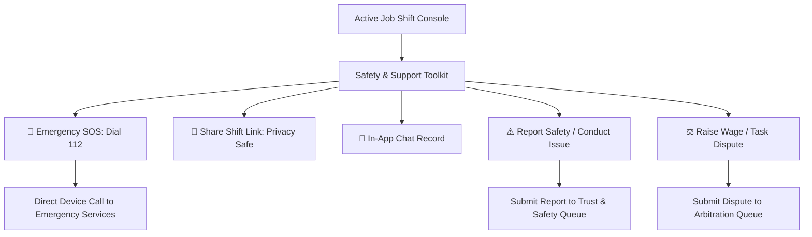
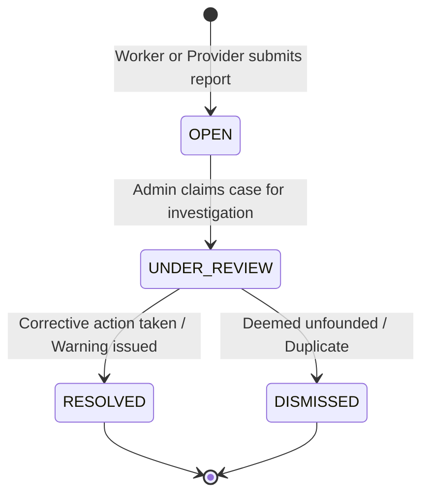
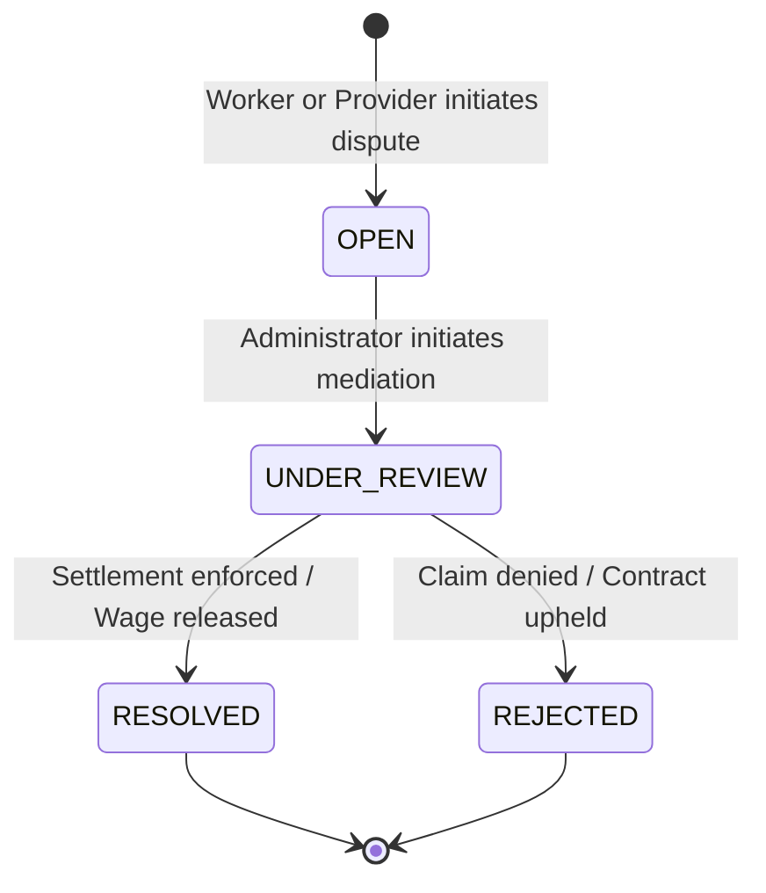

# NEARVIA: Safety, Incident Reports & Transaction Disputes (Phase 13)

## 1. Overview & Architecture Goals
The **NEARVIA Safety, Reports & Disputes** subsystem provides a transparent trust, safety, and administrative arbitration framework across active work assignments. Built on a free-first architectural foundation without paid third-party dispatchers or black-box AI moderation services, it provides:

1. **Active Job Safety Controls**: Real-time tools for workers and providers during active shifts, including safety issue reporting, dispute filing, and encrypted shift link sharing with family/friends.
2. **Authoritative Platform Disclaimer & National Emergency SOS**: Direct integration with National Emergency Services (`112` in India) with prominent platform disclaimers clarifying that NEARVIA is a software platform and does not dispatch emergency or armed response units.
3. **Server-Authoritative Reports Subsystem**: Deterministic report lifecycles (`OPEN` → `UNDER_REVIEW` → `RESOLVED` / `DISMISSED`) with target existence validation, self-reporting prohibition, anti-abuse throttling, and IDOR protection.
4. **Server-Authoritative Disputes Subsystem**: Formal transaction dispute lifecycles (`OPEN` → `UNDER_REVIEW` → `RESOLVED` / `REJECTED`) for wage, attendance, or scope disagreements, backed by PostgreSQL partial unique indexes preventing concurrent duplicate claims.
5. **Decoupled Architecture**: Reputation scores and public reviews remain strictly decoupled from safety reports and disputes to prevent retaliation, harassment, or coerced reviews.
6. **Audit Trail & Immutable Governance**: Comprehensive audit logging in `audit_logs` tracking submission, moderation review, and resolution actions with administrative actor timestamps.

---

## 2. Safety Actions & National Emergency SOS



### Emergency SOS Design Principles:
- **No Fake Dispatching**: NEARVIA never pretends to track police or medical dispatchers.
- **Explicit Platform Disclaimer**:
  > *"If you are in immediate danger, dial 112 (Police / Medical / Fire) directly. NEARVIA is a software platform and cannot dispatch armed or first-responder emergency units."*
- **Privacy-Safe Job Sharing**: Generates a shareable URL (`/share/job/:id`) allowing workers to share active shift status and general locality with trusted friends/family without leaking exact phone numbers, client identity, or GPS tracking logs.

---

## 3. Reports Subsystem Architecture

### Report Lifecycle State Machine:


### Supported Report Categories:
- `UNSAFE_WORK`: Hazardous worksite, lack of fall protection/PPE, electrical hazard
- `HARASSMENT`: Sexual harassment, threats, discrimination, verbal hostility
- `FRAUD`: Fake employer, payment scam, false identity
- `NO_SHOW`: Worker did not arrive for scheduled shift
- `MISLEADING_INFORMATION`: Shift demands significantly differed from posting
- `PAYMENT_PROBLEM`: Underpayment, refused payment, illegal deduction
- `ABUSIVE_BEHAVIOR`: Threatening physical or psychological conduct
- `INAPPROPRIATE_CONTENT`: Inappropriate images or messages
- `OTHER`: Unlisted safety concerns

### Anti-Abuse & IDOR Controls:
1. **Target Existence Verification**: Validates target entity in `users`, `work_opportunities`, `assignments`, or `reviews`. Returns `404 NOT_FOUND` if target does not exist.
2. **Self-Reporting Prevention**: If `targetType === "USER"` and `targetId === reporterUserId`, immediately rejected with `400 CANNOT_REPORT_SELF`.
3. **Assignment IDOR Isolation**: When reporting an `ASSIGNMENT`, the backend queries `assignments` and verifies `worker_user_id === reporterId || provider_user_id === reporterId`. Third parties attempting to report stranger assignments receive `403 FORBIDDEN`.
4. **Duplicate Report Throttling**: Checks for active reports (`OPEN`, `UNDER_REVIEW`) on the same target by the same reporter. If found, returns `409 CONFLICT`.

---

## 4. Disputes Subsystem Architecture

### Dispute Lifecycle State Machine:


### Supported Dispute Reasons:
- `WORK_NOT_COMPLETED`: Tasks abandoned before completion
- `PAYMENT_DISAGREEMENT`: Withheld cash, incorrect deductions, overtime dispute
- `WORK_DESCRIPTION_MISMATCH`: Unagreed duties or hazardous scope change
- `CANCELLATION_ISSUE`: Late cancellation without notice
- `ATTENDANCE_DISAGREEMENT`: Disputed hours, break timings, or arrival time
- `INAPPROPRIATE_BEHAVIOR`: Disruption, property damage, contract breach
- `OTHER`: Miscellaneous operational disputes

### Guardrails & Counterparty Resolution:
1. **Strict Assignment Participant Check**: Only the assigned worker or provider can raise a dispute on that assignment (`403 FORBIDDEN` for third parties).
2. **Automated Counterparty Assignment**: Initiator ID is recorded, and the respondent ID is set automatically to the other party on the assignment.
3. **Database Unique Partial Index**:
   ```sql
   CREATE UNIQUE INDEX IF NOT EXISTS uq_active_dispute_per_assignment_initiator 
   ON disputes (assignment_id, initiator_id) 
   WHERE status IN ('OPEN', 'UNDER_REVIEW');
   ```
   Ensures mathematical impossibility of filing duplicate concurrent disputes for the same shift.
4. **Lifecycle Independence**: Filing a dispute does not prematurely mutate or corrupt the assignment state machine; settlement payouts remain protected under mediation until administrative sign-off.

---

## 5. Admin Moderation & Resolution Queues

Protected under `requireRole(UserRole.ADMIN)`:
- `GET /api/v1/reports/admin/all`: Paginated reports with target entity details and status filtering (`OPEN`, `UNDER_REVIEW`, `RESOLVED`, `DISMISSED`).
- `PATCH /api/v1/reports/admin/:id`: Admin updates status with mandatory resolution notes; logs `REPORT_MODERATION_UPDATED` in `audit_logs`.
- `GET /api/v1/disputes/admin/all`: Paginated disputes with opportunity title, agreed wage, initiator/respondent names, and status filtering (`OPEN`, `UNDER_REVIEW`, `RESOLVED`, `REJECTED`).
- `PATCH /api/v1/disputes/admin/:id`: Admin updates status with mandatory arbitration notes; logs `DISPUTE_MODERATION_UPDATED` in `audit_logs`.

---

## 6. Frontend Integration & Consoles

1. **Shift Execution Console (`WorkerAssignmentDetailPage.tsx`)**:
   - Header button: `🛡️ Safety Toolkit` triggering `SafetyToolkitModal`.
   - On-shift safety card: "Need Help With This Shift?" with direct links to the Safety & Dispute Toolkit and National Emergency SOS (`112`).
   - Modal action grid: 3-column trigger for In-App Chat, Incident Report, and Wage/Task Dispute.
2. **Provider Shift Console (`ProviderAssignmentDetailPage.tsx`)**:
   - Header button: `Report Issue` and `Dispute`.
   - Main body safety card: "Need Help With This Assignment?" with direct triggers to Report No-Show / Conduct, Raise Dispute, and Emergency 112.
3. **Admin Moderation Hub (`AdminReportsTab.tsx` & `AdminDisputesTab.tsx`)**:
   - 3-stage arbitration modal allowing admins to transition cases into `UNDER_REVIEW`, `RESOLVED`, or `REJECTED` / `DISMISSED`.
   - Evidence URLs rendered as clickable external links.

---

## 7. Automated Test Coverage & Verification

Automated regression suite verified with 47 passing tests across:
- `services/api/tests/safety_reports_disputes.test.ts` (17 tests)
- `services/api/tests/safety_disputes.test.ts` (13 tests)
- `services/api/tests/job_lifecycle.test.ts` (17 tests)

### Key Test Scenarios:
| # | Test Scenario | Expected Outcome | Result |
|---|---|---|---|
| 1 | Non-existent target user/job/assignment | `404 NOT_FOUND` | PASS |
| 2 | Worker/Provider reporting themselves | `400 CANNOT_REPORT_SELF` | PASS |
| 3 | Duplicate active report on same target | `409 CONFLICT` | PASS |
| 4 | Non-participant reporting an assignment (IDOR) | `403 FORBIDDEN` | PASS |
| 5 | Worker reporting assignment (`UNSAFE_WORK`) | `201 CREATED`, status `OPEN` | PASS |
| 6 | Provider reporting worker (`NO_SHOW`) | `201 CREATED`, status `OPEN` | PASS |
| 7 | Non-participant raising dispute (IDOR) | `403 FORBIDDEN` | PASS |
| 8 | Duplicate active dispute on same assignment | `409 CONFLICT` | PASS |
| 9 | Worker creating dispute (`PAYMENT_DISAGREEMENT`) | `201 CREATED`, counterparty set to provider | PASS |
| 10 | Admin updating report (`UNDER_REVIEW` → `RESOLVED`) | `200 OK`, `reviewed_by` set, audit logged | PASS |
| 11 | Admin arbitrating dispute (`UNDER_REVIEW` → `RESOLVED`) | `200 OK`, `resolved_by` set, audit logged | PASS |
| 12 | Invalid schema inputs (short descriptions/invalid category) | `400 BAD_REQUEST` | PASS |
| 13 | Audit log generation across all actions | Audit rows written with actor & target | PASS |
| 14 | Monorepo production build (`npm run build`) | Exit Code 0 | PASS |
