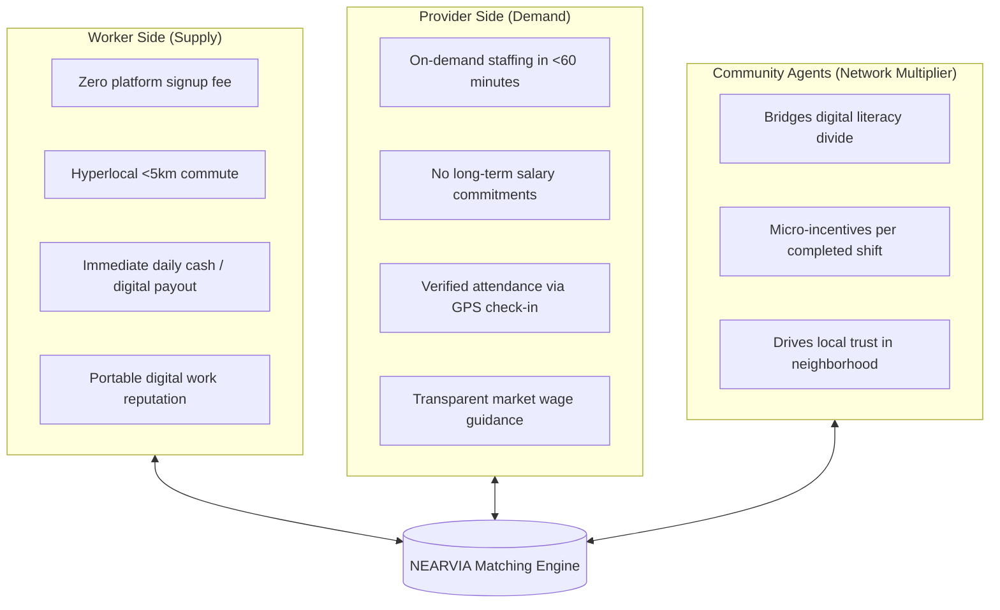

# NEARVIA — STARTUP READINESS & PRODUCT COMMERCIALIZATION SPECIFICATION

> **Document Version**: 2.0.0  
> **Commercialization Standard**: Pre-Seed / Incubator Pitch Documentation  
> **Honesty Mandate**: Zero fabricated traction, users, or revenue figures. NEARVIA is currently a **technically credible, staging-validated platform prototype** preparing for a controlled geographic pilot.

---

## 1. System Maturity Classification Matrix

```
┌─────────────────────────┬───────────────────────────────┬──────────────────────────────────────────┐
│ STAGE                   │ DEFINITION                    │ CURRENT NEARVIA STATUS                   │
├─────────────────────────┼───────────────────────────────┼──────────────────────────────────────────┤
│ **MCA Prototype**       │ Academic proof-of-concept     │ `COMPLETED & DEFENDED`                   │
│ **Staging System**      │ Security-hardened & verified  │ `COMPLETED & OPERATIONAL`                │
│ **Controlled Pilot**    │ 50-worker / 15-business trial │ `SPECIFIED & READY (Awaiting Entity KYC)`│
│ **Commercial Production**│ Live scale with real money    │ `BLOCKED (Requires Incorporation/GSTIN)` │
└─────────────────────────┴───────────────────────────────┴──────────────────────────────────────────┘
```

---

## 2. Marketplace Dynamics & Value Propositions



---

## 3. Competitive Landscape & Fact-Based Differentiation

NEARVIA does **not** claim to operate in a vacuum with "zero competitors." Rather, its defensibility lies in a unique convergence of technical and operational features tailored specifically for urban informal labor:

| Feature Dimension | Traditional Job Portals (LinkedIn/Indeed) | Managed Gig Fleets (Urban Company/Swiggy) | Unorganized Street Naka (Status Quo) | **NEARVIA Marketplace** |
| :--- | :---: | :---: | :---: | :---: |
| **Shift Granularity** | Full-time / Monthly | Task-based dispatch | Daily / Half-day | **Micro-Shifts (2–8 Hours)** |
| **Spatial Radius** | City-wide ($>20\text{ km}$) | Algorithmic routing | Fixed street corner | **Hyperlocal (1–5 km Geodesic)** |
| **Wage Autonomy** | Salaried negotiation | Fixed platform rate | Arbitrary verbal bargaining | **Transparent Market Range + Autonomy** |
| **Platform Take-Rate** | Enterprise subscription | High ($20\text{--}30\%$) | Intermediary cut ($15\text{--}25\%$) | **Low Take-Rate / Flat Booking Fee** |
| **Digital Literacy** | High (English/CV) | Moderate (Smartphone app) | Zero (In-person) | **Low (Audio, Hinglish, Community Agent)**|
| **Cash Settlement** | None (Bank payroll) | None (In-app wallet) | Primary (Unrecorded) | **Peer-to-Peer Cash Confirmation Ledger** |
| **Matching Engine** | Keyword search | Black-box algorithmic dispatch | Physical availability | **Explainable Multi-Factor Scoring** |

---

## 4. Monetization & Unit Economics Model (Post-Pilot)

During the controlled pilot, NEARVIA operates with **zero platform fees** to maximize adoption and calibrate liquidity. At commercial scale, three revenue channels are architected:

1. **Employer Shift Convenience Fee**:
   - Flat fee of ₹25–₹50 per successfully completed shift paid by the employer (e.g. on an ₹800 daily shift, total cost to employer is ₹835; worker receives full ₹800).
2. **Provider Premium Subscriptions**:
   - ₹499/month for small businesses requiring frequent daily staffing (unlimited job postings, priority candidate matching, and automated attendance exports).
3. **Voluntary Worker Micro-Insurance Add-On**:
   - Integration with micro-insurance providers for ₹5/shift accidental injury and transit coverage.

---

## 5. Controlled Pilot Operational Model (Bangalore Micro-Cluster)

### 5.1 Geographic Micro-Cluster: Indiranagar – Domlur Hub
- **Target Boundary**: $3.5\text{ km}$ radius centered on Indiranagar 100ft Road (`12.9784, 77.6412`).
- **Target Cohort**:
  - **Supply**: 50 pre-screened informal workers across retail packing, catering assistance, and electrical repairs.
  - **Demand**: 15 local micro-businesses (sweet marts, bakeries, event caterers, retail stockists).
  - **Facilitation**: 2 trained Community Agents stationed at local community centers.

### 5.2 Pilot Success Metrics (Go / No-Go Gates)
1. **Shift Fill Rate**: $\ge 70\%$ of posted micro-shifts filled within 3 hours.
2. **Attendance Integrity**: $\ge 85\%$ of assigned workers check in within 15 minutes of scheduled start time.
3. **Dispute Rate**: $\le 5\%$ of completed shifts escalated to dispute adjudication.
4. **Repeat Usage**: $\ge 40\%$ of participating employers post a second shift within 14 days.

---

## 6. Regulatory & Operational Risk Assessment

| Risk Category | Nature of Risk | Architectural & Operational Mitigation |
| :--- | :--- | :--- |
| **Escrow Regulations** | RBI PA/PG guidelines prohibit unlicensed holding of third-party funds. | System uses non-custodial direct cash confirmation or licensed payment gateway split-settlement; NEARVIA holds zero escrow. |
| **Cash Confirmation Fraud** | Employer or worker falsely confirms or denies cash handover. | Geofence arrival check-in timestamp + in-app dispute escalation freeze ratings and trigger admin review. |
| **Labor Classification** | Risk of gig workers being classified as formal employees. | NEARVIA acts strictly as a matching exchange. Workers set their own availability, choose which shifts to accept, and can work for multiple employers. |
| **Liquidity Imbalance** | Excess workers with no jobs, or excess jobs with no workers in a cluster. | Strict geographic clustering; expansion only occurs when a micro-cluster achieves self-sustaining liquidity. |
