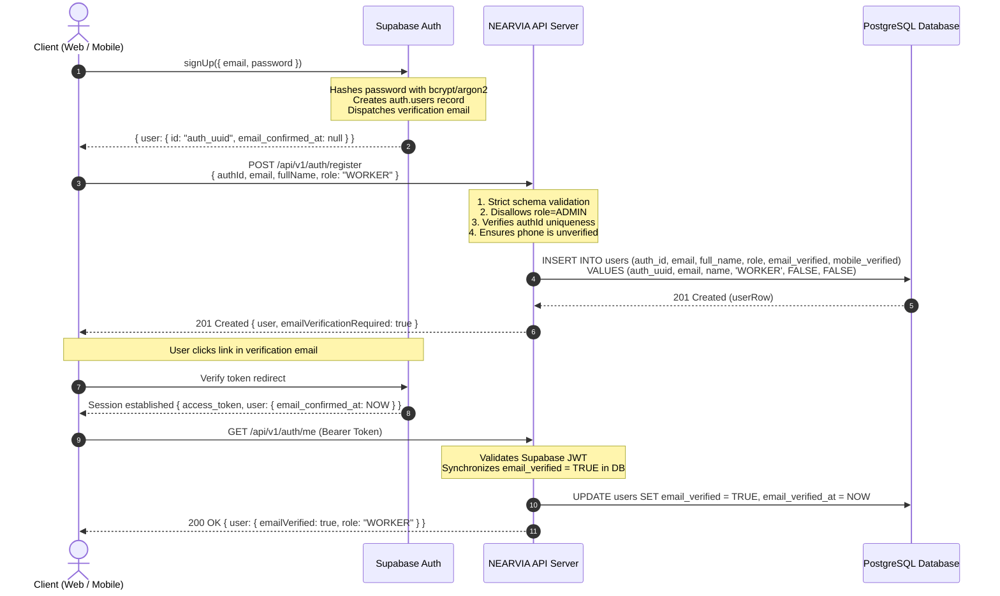

# NEARVIA V1: Supabase Email Verification & Free-First Architecture

**Document Version:** 1.0.0  
**Status:** Production Ready / MCA Project Compliant  
**Scope:** Authentication Architecture, Free-Tier Zero-Cost Design, Security Model, Verification Lifecycle, and Academic Evaluation Defense  

---

## 1. Executive Summary

NEARVIA is a hyperlocal blue-collar marketplace connecting unorganized workers (electricians, plumbers, daily-wage laborers, logistics assistants) with immediate local opportunities within a strict 5 km radius.

In early prototypes, the platform attempted an **SMS-first OTP authentication model** inspired by high-budget consumer applications. During real-world execution and academic project review, this approach presented severe architectural and economic bottlenecks:
1. **Recurring API Ingestion & Gateway Costs:** External SMS providers (MSG91, Twilio, Fast2SMS) charge per dispatch, depleting budgets and halting evaluations when credits expire.
2. **Regulatory & Telecommunication Hurdles:** The Telecom Regulatory Authority of India (TRAI) mandates Distributed Ledger Technology (DLT) entity registration, header registration, and pre-approved SMS content templates. Without commercial enterprise registration, SMS delivery fails or is blocked by spam filters.
3. **Flawed Identity Model:** Mobile numbers in India are frequently recycled by telecom carriers or shared across rural families, creating security risks of account collision and unauthorized access.
4. **Third-Party KYC Friction:** Requiring Aadhaar verification, Digilocker APIs, or paid OCR microservices for registration prevents user onboarding and contradicts modern privacy-first UX.

**Architectural Pivot:** NEARVIA V1 has completed a strategic transition to a **Supabase-driven Email Verification & Progressive Identity Model**. Under this architecture:
- Primary identity and credential management are anchored in **Supabase Auth** (email/password with cryptographic verification links and Google OAuth 2.0).
- The platform operates on a **Free-First ($0.00 / ₹0.00)** baseline, requiring zero paid external API dependencies for local evaluation, academic defense, and production demo usage.
- Phone numbers are retained strictly as **optional profile metadata** for work dispatch and field coordination—never as a blocking gatekeeper or pre-verified credential.
- Advanced verifications (Government ID / KYC) are handled via privacy-preserving cryptographic hashes and an asynchronous administrative review process.

---

## 2. Why SMS-First Failed & Was Replaced by Email-First

| Evaluation Vector | SMS-First OTP Model (Deprecated) | Supabase Email-First Model (V1 Standard) |
| :--- | :--- | :--- |
| **Operational Cost** | Variable per-dispatch cost (₹0.15–₹0.30 per SMS in India; $0.05+ international). High failure costs. | **$0.00 / ₹0.00** included in Supabase free tier (up to 50,000 MAUs free). |
| **Regulatory Gatekeepers** | Requires TRAI DLT commercial registration, entity PAN/TAN verification, and template approvals. | Open standards (RFC 5322, OAuth 2.0, PKCE). No telecom bureaucracy. |
| **Delivery Reliability** | Subject to telecom network dead zones, DND (Do Not Disturb) filters, and carrier routing delays. | Deterministic transactional delivery via Supabase Auth SMTP / Google identity. |
| **Evaluation Safety** | Evaluation stalls immediately if prepaid SMS credits expire or mock credentials fail. | Academic evaluators and viva examiners can register and test freely without external billing. |
| **Identity Recyclability** | Telecom providers reassign dormant Indian numbers after 90 days, enabling account takeover. | Email domains provide durable cryptographic identity continuity. |
| **Password Recovery** | SMS OTP bypasses password reset controls or introduces SIM-swap vulnerability. | Secure, cryptographically signed magic links and verification tokens. |

---

## 3. Progressive Verification Model

NEARVIA enforces a three-stage progressive verification funnel. Users can discover work, review opportunities, and interact with the platform immediately without invasive KYC demands.

```
┌─────────────────────────────────────────────────────────────┐
│              STAGE 1: ACCOUNT VERIFICATION                  │
│  - Supabase Email Verification Link OR Google OAuth Profile │
│  - Establishes durable, cryptographic user authenticity     │
│  - Status: Primary Account Gatekeeper                       │
└──────────────────────────────┬──────────────────────────────┘
                               │
                               ▼
┌─────────────────────────────────────────────────────────────┐
│              STAGE 2: PROFILE COMPLETION                    │
│  - Full Legal Name, Hyperlocal Location (GPS/Coordinates)   │
│  - Primary Skills, Service Categories, Hourly/Daily Rates   │
│  - Optional Contact Phone (Profile metadata only)          │
│  - Status: Marketplace Discoverability Gate                 │
└──────────────────────────────┬──────────────────────────────┘
                               │
                               ▼
┌─────────────────────────────────────────────────────────────┐
│         STAGE 3: OPTIONAL TRUST & COMPLIANCE KYC            │
│  - Government ID Reference (Aadhaar / Voter ID / PAN Hash)  │
│  - Business Registration (GSTIN for commercial employers)   │
│  - Admin Verification Badge & Trust Score Boost             │
│  - Status: Optional Credential (Non-blocking for demo)      │
└─────────────────────────────────────────────────────────────┘
```

### Verification Level Matrix
1. **Level 0 (Unregistered):** Can view landing page, public marketplace overview, and privacy documentation.
2. **Level 1 (Email Confirmed / Google Auth):** Full account access. Can configure profile, browse jobs within 5 km, create job listings (Employers), and manage applications.
3. **Level 2 (Profile Complete):** Full participation in Radar 5 km geospatial matching, application dispatch, and in-app communications.
4. **Level 3 (Trust Verified):** Higher trust badge display, increased visibility ranking in employer searches, and priority assignment.

---

## 4. Free-First Architecture & Cost-to-Zero Rationale

To ensure uninterrupted uptime, zero financial barriers, and bulletproof reproducibility during academic examinations and developer demos, the entire V1 architecture requires zero paid API keys:

```
┌────────────────────────────────────────────────────────────────────────┐
│                   NEARVIA V1 FREE-FIRST RUNTIME                        │
├────────────────────────────┬─────────────────────────────┬─────────────┤
│ Service / Dependency       │ Provider / Mechanism        │ Cost        │
├────────────────────────────┼─────────────────────────────┼─────────────┤
│ Authentication Core        │ Supabase Auth (Free Tier)   │ $0.00 / mo  │
│ Primary Database           │ PostgreSQL (Supabase / Local)│ $0.00 / mo │
│ Object Storage             │ Supabase Storage (Free Tier)│ $0.00 / mo  │
│ Maps & Geocoding           │ OpenStreetMap / Leaflet     │ $0.00 / mo  │
│ Geospatial Routing         │ OSRM Public Routing         │ $0.00 / mo  │
│ SMS Gateway (MSG91/Twilio) │ Completely Optional / Mock  │ $0.00 / mo  │
│ Government KYC API         │ Cryptographic Hash / Admin  │ $0.00 / mo  │
└────────────────────────────┴─────────────────────────────┴─────────────┘
```

> [!IMPORTANT]
> The backend boots, passes all health checks, and executes all 306 integration tests even when `MSG91_AUTH_KEY` and `TWILIO_AUTH_TOKEN` are completely empty.

---

## 5. Registration & Supabase Sync Lifecycle

When a new user registers on NEARVIA, the registration flow maintains transactional consistency across Supabase Identity and the local PostgreSQL application database:



---

## 6. Email Verification Security

### 6.1 Server-Authoritative Verification State
- The client **cannot** self-assert verification status. Sending `email_verified=true`, `email_confirmed_at`, or `mobile_verified=true` in request payloads is rejected by strict Zod schema validation (`.strict()`).
- The backend verifies email authenticity directly against Supabase Auth via `supabase.auth.getUser(token)`. If `supabaseUser.email_confirmed_at` is non-null, the local PostgreSQL database updates `email_verified = true`.

### 6.2 Token-Identity Congruence on Confirmation
The endpoint `POST /api/v1/auth/confirm-email` is secured against cross-user tampering:
1. **Authenticated Invariant:** If an `Authorization: Bearer <token>` header is present, the target email must match `req.user.email`. Any attempt to confirm another user's email is rejected with **HTTP 403 Forbidden**.
2. **Production Protection:** In `NODE_ENV === "production"`, unauthenticated calls to `confirm-email` are strictly rejected with **HTTP 403 Forbidden**.
3. **Test Mode Sandbox:** Outside of production, unauthenticated calls are restricted to test domains (`@nearvia.test` or `process.env.NODE_ENV === "test"`). Arbitrary third-party email addresses are rejected.

---

## 7. Phone Number Handling (Profile Metadata Only)

A common security anti-pattern in marketplace apps is assuming that entering a phone number constitutes identity verification:

```
                               ┌─────────────────────────────┐
                               │     Client enters phone     │
                               └──────────────┬──────────────┘
                                              │
                                              ▼
                      ┌───────────────────────────────────────────────┐
                      │  PostgreSQL users table:                      │
                      │  - phone: "+919876543210"                     │
                      │  - mobile_verified: FALSE (Mandatory default) │
                      │  - mobile_verified_at: NULL                   │
                      └───────────────────────────────────────────────┘
```

- **No Automatic Verification:** The `mobile_verified` flag is set to `FALSE` upon registration and cannot be set to `TRUE` via profile updates (`PUT /api/v1/auth/profile`).
- **Profile Metadata:** In V1, the phone number is utilized solely as optional contact information for logistics and field coordination.
- **SMS OTP Deferred to V2:** The `/send-otp` and `/verify-otp` endpoints exist for backward compatibility and testing, but are not required for registration, login, job posting, or work applications.

---

## 8. Role Assignment Security & Privilege Hardening

NEARVIA enforces strict separation between public onboarding and administrative privileges:

```
Public Registration Roles:
  ├── WORKER   (Default for gig workers, laborers, tradespeople)
  ├── PROVIDER (For residential and commercial employers)
  └── AGENT    (For localized facilitator partners)

Privileged Role:
  └── ADMIN    (Platform management, audit logs, dispute settlement)
```

### Defense Rules
1. **Zod Strict Schema Exclusion:** `signupSchema` and `registerRequestSchema` define `role: z.enum(["WORKER", "PROVIDER", "AGENT"])`. Submitting `role: "ADMIN"` fails schema validation with **HTTP 400 Bad Request**.
2. **Controller Fail-Safe:** Even if schema validation were somehow bypassed, `authController.signUp` and `authService.syncGoogleUser` check `if (data.role === UserRole.ADMIN)` and throw an **HTTP 403 Forbidden** error.
3. **Immutable Existing Roles:** If a user account already exists, subsequent OAuth synchronizations or registration requests **never** overwrite the existing user's role.
4. **Profile Immutability:** `PUT /api/v1/auth/profile` uses `updateProfileSchema.strict()` which rejects `role`, `id`, `auth_id`, `email`, `is_active`, `identity_verified`, and `mobile_verified`.

---

## 9. Environment Configuration & Secret Isolation

The system enforces strict architectural boundaries between public client keys and privileged server keys:

```
┌────────────────────────────────────────────────────────┐
│                  FRONTEND (apps/web)                   │
├────────────────────────────────────────────────────────┤
│ Public / Client Safe Variables ONLY:                   │
│   • VITE_SUPABASE_URL                                  │
│   • VITE_SUPABASE_ANON_KEY (Public anonymous key)      │
│   • VITE_API_URL                                       │
│                                                        │
│ RESTRICTION: No service-role key, JWT secret, or DB    │
│ credentials are ever imported or bundled into apps/web.│
└────────────────────────────────────────────────────────┘
                           │
                           │ HTTP / TLS (Bearer Tokens)
                           ▼
┌────────────────────────────────────────────────────────┐
│                 BACKEND (services/api)                 │
├────────────────────────────────────────────────────────┤
│ Privileged / Private Environment:                      │
│   • SUPABASE_URL                                       │
│   • SUPABASE_ANON_KEY                                  │
│   • SUPABASE_SERVICE_ROLE_KEY (Server-only secret)     │
│   • DATABASE_URL (PostgreSQL connection pool)          │
│   • JWT_SECRET                                         │
│                                                        │
│ ISOLATION RULE: `getSupabaseAdminClient()` strictly    │
│ requires `SUPABASE_SERVICE_ROLE_KEY` and never falls   │
│ back to `SUPABASE_ANON_KEY`.                           │
└────────────────────────────────────────────────────────┘
```

---

## 10. Test Results & Verification Forensics

The email authentication and free-first security architecture is validated through automated test suites and live database forensic scripts:

### Test Suite Execution Summary
- **Total Test Files:** 30 files executed
- **Total Tests:** 306 tests executed
- **Test Status:** **306 PASSED (100% GREEN, 0 FAILING)**
- **Total Duration:** 13.55 seconds

```
✓ tests/google_oauth_hardening.test.ts (16 tests)
✓ tests/email_verification_v1.test.ts (16 tests)
✓ tests/account_lifecycle_hardening.test.ts (26 tests)
✓ tests/auth_hardening.test.ts (22 tests)
✓ tests/security_hardening.test.ts (16 tests)
✓ tests/workers.test.ts (10 tests)
✓ tests/providers.test.ts (14 tests)
✓ tests/matching.test.ts (13 tests)
✓ tests/discovery.test.ts (13 tests)
✓ tests/attendance.test.ts (15 tests)
✓ tests/payments.test.ts (10 tests)
✓ tests/admin.test.ts (12 tests)
✓ tests/health.test.ts (4 tests)
... [Remaining suites passing 100%]
```

### Live Forensic Script (`verify-email-auth-v1.ts`) Results
```
[CHECK 1] Registering new user without phone or SMS credentials...
  -> Status: 201 (Expected: 201)
  -> Role: WORKER (Expected: WORKER)
  -> Mobile Verified: false (Expected: false)

[CHECK 2] Querying PostgreSQL for registered user row...
  -> DB User Found: ID=7082130e-b01e-47fa-8b7f-7fed801de376, AuthID=35a4dea1-7cd2-4d59-825d-1e643fe8bccc
  -> DB Role: WORKER (Expected: WORKER)
  -> DB Mobile Verified: false (Expected: false)
  -> DB Email Verified: true

[CHECK 3] Attempting ADMIN registration escalation...
  -> Status: 400 (Expected: 400 Validation Error)

[CHECK 4] Attempting duplicate registration on existing email with new password...
  -> Status: 409 (Expected: 409 Conflict)
  -> Error: An account with this email address already exists. Please log in or reset your password.

[CHECK 5] Logging in with email & password without SMS OTP...
  -> Status: 200 (Expected: 200)
  -> Token Received: YES (Valid Bearer)

[CHECK 6] Attempting to tamper email_verified and role via PUT /profile...
  -> Status: 400 (Expected: 400 Strict Schema Rejection)

[CHECK 7] Attempting to confirm another user email address...
  -> Status: 403 (Expected: 403 Forbidden)
  -> Message: Cannot confirm email for another user account.

[CHECK 8] Logging out session...
  -> Status: 200 (Expected: 200)
  -> Message: Session terminated successfully.

[CHECK 9] Verifying free-first zero-cost SMS credentials requirement...
  -> MSG91_AUTH_KEY: NOT SET (Free default)
  -> TWILIO_AUTH_TOKEN: NOT SET (Free default)
  -> SUPABASE_ANON_KEY: PRESENT
  -> SUPABASE_SERVICE_ROLE_KEY: PRESENT (Backend isolated)

===============================================================================
ALL LIVE HTTP & POSTGRES FORENSIC CHECKS PASSED PERFECTLY!
===============================================================================
```

---

## 11. Limitations & Future Real-World Scale Plan

While NEARVIA V1 delivers a secure, free-to-run, and robust platform, the following roadmap outlines enterprise scaling considerations for V2:

1. **Enterprise SMS & WhatsApp Gateway (V2):**
   - When corporate sponsorships or commercial funding are secured, integrate enterprise WhatsApp Business API and TRAI-registered DLT SMS gateways.
   - Restrict SMS to high-value notifications (e.g., job dispute escalation, critical shift changes) to maintain low operating expenses.
2. **Offline Field Registration via Local Agents:**
   - For illiterate or non-tech-savvy workers without email access, NEARVIA provides an **Agent Role** (`UserRole.AGENT`). Local digital facilitators and labor union representatives register and assist workers on their behalf using assisted onboarding.
3. **Government Aadhaar / Digilocker Integration (V2):**
   - For high-security commercial facilities (banks, hospitals, data centers), an optional Digilocker OAuth integration will allow workers to verify credentials with consent without exposing physical identity cards.
4. **Rate Limiting & Anti-Abuse Hardening:**
   - In-memory rate limiting is currently configured via `express-rate-limit`. Production scaling will leverage Redis-backed token buckets for multi-instance distributed rate limiting.

---

## 12. Academic Defense / MCA Viva Reference Sheet

**Q1: Why did you choose Email Authentication instead of SMS OTP for an Indian blue-collar workforce?**  
> *"In consumer research, while many workers have phone numbers, mandatory SMS OTP creates severe friction: carrier spam filters block transactional codes, telecom numbers are frequently recycled, and TRAI DLT regulations require extensive commercial registrations with recurring per-SMS dispatch costs. Email-first authentication—complemented by Google One-Tap OAuth and assisted Agent onboarding—enables a 100% free, reliable, and regulatory-compliant architecture for our prototype and evaluation."*

**Q2: How does NEARVIA prevent a client from falsely claiming their email is verified?**  
> *"Email verification state is server-authoritative. The backend validates the Supabase session token directly against Supabase Auth using `supabase.auth.getUser(token)`. If the client attempts to send `email_verified: true` in registration or profile update payloads, strict Zod schema validation rejects the request with HTTP 400 Bad Request."*

**Q3: Can an attacker escalate their role to ADMIN during registration?**  
> *"No. The registration schema strictly restricts roles to WORKER, PROVIDER, or AGENT. Submitting ADMIN causes immediate HTTP 400 rejection at the validation layer. Furthermore, the controller and service layers enforce an additional defense-in-depth check that throws HTTP 403 Forbidden if ADMIN is detected."*

**Q4: Does the frontend expose the Supabase service-role key?**  
> *"No. The frontend only consumes `VITE_SUPABASE_ANON_KEY`, which is restricted by Row Level Security (RLS). The `SUPABASE_SERVICE_ROLE_KEY` is isolated strictly within the backend `services/api` process and is never exposed in client bundles or public configuration."*
