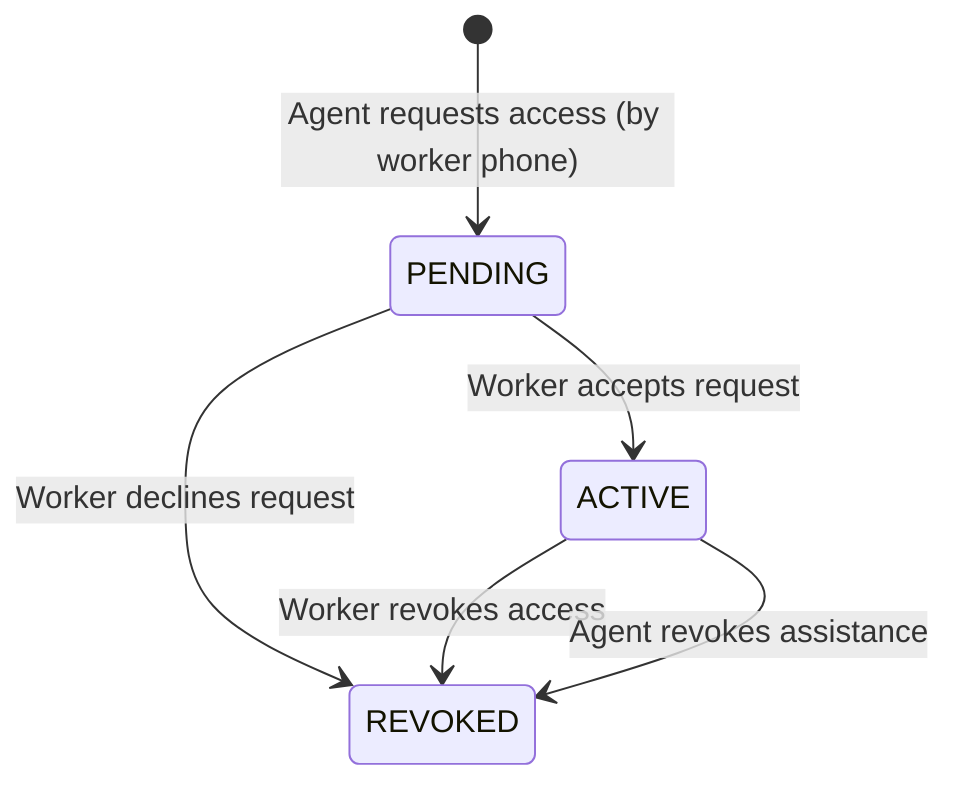

# Architecture Document: Agent-Assisted Job Access (Phase 13)

## 1. Overview & Purpose
In the NEARVIA ecosystem, **Agents** are trusted community members (e.g. local kiosk operators, NGO coordinators, community elders) who bridge the digital literacy divide for workers unable or uncomfortable using mobile smartphone apps.

Key principles:
1. **Assistance, Not Ownership**: The Agent assists with discovery and application submission; the application and agreed wage remain 100% owned by the **Worker**.
2. **Explicit Worker Consent**: Agents cannot silently attach themselves to workers. A worker must explicitly approve the assistance request, and can revoke consent at any time with immediate effect.
3. **Restricted Permissions**: Agents cannot change passwords, view authentication tokens, alter ratings, or receive payments on the worker's behalf.
4. **Complete Auditability**: Every sensitive action (`PROFILE_VIEWED`, `WORK_SEARCHED`, `APPLICATION_ASSISTED`, etc.) is recorded in `agent_assistance`.

---

## 2. Agent-Worker Relationship Lifecycle

### Relational Schema: `agent_worker_relationships`
- `agent_id` (FK `agent_profiles.id`)
- `worker_id` (FK `worker_profiles.id`)
- `status` (`PENDING`, `ACTIVE`, `REVOKED`)
- `requested_at`, `accepted_at`, `revoked_at`, `revoked_by`
- `UNIQUE(agent_id, worker_id)`

---

## 3. Server-Side Security Enforcement

Every agent endpoint strictly validates:
$$\text{Authenticated JWT} \land \text{UserRole.AGENT} \land (\text{Relationship.status} = \text{'ACTIVE'})$$

- Agent identity is derived strictly from `req.user.id` (server-side JWT).
- Any attempt to search work or apply for a non-consenting or revoked worker is rejected with HTTP 403 `FORBIDDEN`.

---

## 4. Reusing Hyperlocal Discovery & Matching
Rather than duplicating discovery algorithms, `AgentsService` dynamically loads:
- **Discovery Service (Phase 7)**: Calls `discoverNearbyWork()` centered on the worker's PostGIS location and service radius.
- **Intelligent Matching (Phase 8)**: Inherits deterministic match scoring (Skill 35%, Availability 25%, Distance 20%, Duration 10%, Category 5%, Urgency 5%).
- **Applications Service (Phase 9)**: Calls `applyForWork()` using the worker's user ID, tagging the record with `assisted_by_agent_id`.
