# NEARVIA Architecture Report: Phase 8 Intelligence Layer

## Executive Principle

> **"Don't turn NEARVIA into an 'AI project.' Turn it into a real marketplace with an intelligence layer."**

NEARVIA implements a sound, production-grade Master of Computer Applications (MCA) architecture:

$$\mathbf{PostGIS + Rules \longrightarrow Explainable\ Matching \longrightarrow Recommendations \longrightarrow Feedback \longrightarrow Future\ ML}$$

rather than an opaque, brittle pattern ($\text{LLM API} \to \text{Random "AI score"} \to \text{Demo}$).

---

## 1. Architectural Blueprint & Data Flow

```mermaid
flowchart TD
    subgraph GeoPostgreSQL ["1. PostGIS Spatial & Relational Storage"]
        SpatialIdx["ST_DWithin Spatial GIST Index (5 km Default)"]
        TrgmIdx["pg_trgm GIN Trigram Indexes (Taxonomy & Matching)"]
        WorkDB["work_opportunities & worker_profiles"]
        WageDB["market_wage_benchmarks (Percentiles & Samples)"]
        VoiceAudit["voice_assistance_logs (Audit Trail)"]
    end

    subgraph DeterministicCore ["2. Deterministic Rule Engines (Zero AI Dependency)"]
        GeoFilter["Geospatial Boundary Filter (Radius & Point)"]
        TaxonomyEngine["10 Core Categories & Skill Match Engine"]
        AvailabilitySlotEngine["Time & Date Slot Overlap Calculator"]
        MultiFactorScorer["Multi-Factor Weighted Scoring Engine [0-100]"]
    end

    subgraph IntelligenceLayer ["3. Intelligence & Accessibility Extensions"]
        NLParser["Deterministic NL & Hinglish Drafter (nlParser.ts)"]
        VoiceEngine["Multilingual Voice & Intent Normalizer (voiceAssistance.ts)"]
        CandidateRanker["Provider-Side Candidate Match Engine (candidateMatching.ts)"]
        MarketEngine["Hyperlocal Wage Percentiles & Hotspot Clustering"]
    end

    subgraph ExplainableUI ["4. Explainable UI & Low-Literacy Interface"]
        SmartDraftModal["SmartJobDraftModal (Auto-Drafter Modal)"]
        WageGuidance["MarketWageGuidance (Real-Time Median Comparison)"]
        CandidateTab["RecommendedCandidatesTab (Factor Breakdown & Limitations)"]
        VoiceWidget["VoiceAssistantWidget (Pictorial Tap Cards + Audio TTS)"]
    end

    GeoPostgreSQL --> DeterministicCore
    DeterministicCore --> IntelligenceLayer
    IntelligenceLayer --> ExplainableUI
```



---

## 2. Mathematical Multi-Factor Scoring Formula

Every match score is **explainable, deterministic, and bounded in $[0, 100]$**:

$$\text{Composite Score} = w_s S_{\text{skill}} + w_a S_{\text{avail}} + w_d S_{\text{dist}} + w_r S_{\text{rel}} + w_g S_{\text{rating}} + w_v S_{\text{kyc}}$$

Where the weights satisfy $\sum w_i = 1.0$:

| Dimension | Weight ($w_i$) | Calculation Rule | Explainability Artifact |
| :--- | :---: | :--- | :--- |
| **Skill Match** | $35\%$ | $\frac{\text{matched required skills}}{\text{total required skills}} \times 100$ | `"✓ Verified match for 2 of 2 required skills (Packing, Catering)"` |
| **Availability** | $25\%$ | $100$ if currently available / overlapping schedule slot; $60$ if open date | `"⚡ Available right now during shift schedule"` |
| **Proximity** | $20\%$ | $\max\left(0, 100 - \frac{\text{distance (km)}}{\text{service radius (km)}} \times 100\right)$ | `"📍 1.8 km from work site (Within 5 km radius)"` |
| **Reliability** | $10\%$ | Historical shift completion rate (Default $100\%$) | `"🛡️ Exceptional reliability rating (98%)"` |
| **Rating** | $5\%$ | $\frac{\text{Rating} - 1.0}{4.0} \times 100$ (Normalized 1–5 stars) | `"⭐ Top rated (4.9/5.0 across 18 reviews)"` |
| **KYC Verification** | $5\%$ | $100$ if `verified_badge = true`; else $50$ | `"✅ Verified worker profile with background verification"` |

If any factor is suboptimal, explicit entries are appended to `limitations[]` (e.g. *"Missing 1 required skill"*, *"Past shift completion reliability score is 75%"*).

---

## 3. Natural Language & Colloquial Parsing Pipeline

```
Unstructured Free-Text / Voice Transcript
  │
  ├─► Dialect & Language Detection (English vs Hinglish / Hindi)
  ├─► Tokenizer & Trigram Match against 10 Verified Categories
  ├─► Trade Skill Extraction & Minimum Experience Inference
  ├─► Schedule Normalizer (Time Ranges: "9am to 5pm", "10 baje se 4 baje", Relative Dates)
  ├─► Wage & Payment Structure Extraction (₹800/day → PaymentType.DAILY, ₹150/hr → PaymentType.HOURLY)
  ├─► Urgency Classifier (IMMEDIATE vs URGENT vs NORMAL)
  ├─► Responsibility Checklist Synthesizer
  └─► Missing Constraint Flags & Clarification Prompt Generator
```

### Verified Test Cases:
1. **English Colloquial:**
   `"Need 2 helpers for sweet box packing tomorrow from 9am to 5pm in Jayanagar Bangalore, 800 rupees per day"`
   $\to$ Title: *Packing & Retail Helper*, Category: *Retail & Shop Assistance*, Wage: *₹800/day*, Schedule: *09:00:00 - 17:00:00 (8h)*, Urgency: *NORMAL*.
2. **Hinglish Colloquial:**
   `"Kal subah 10 baje se 4 baje tak catering helper chahiye Shivajinagar me 700 rupay"`
   $\to$ Dialect: *hi-IN*, Category: *Restaurant & Hospitality*, Wage: *₹700/day*, Schedule: *10:00:00 - 16:00:00 (6h)*.

---

## 4. Voice-First & Low-Literacy Architecture

For workers and employers with low literacy or limited smartphone familiarity:
1. **Multilingual Speech Ingestion:** Normalizes regional audio transcripts (Hindi, Kannada, Tamil, English).
2. **Intent Routing:** Automatically routes to `JOB_SEARCH`, `JOB_CREATE`, `STATUS`, `HELP`.
3. **Conversational Spoken Audio:** Reads out clear, affirmative audio instructions in the user's native dialect.
4. **Pictorial Tap Cards (`LowLiteracyCard`):** Displays large icons with high-contrast color coding, simple bold text, and single-tap actions (Call Employer, Show Directions, View PIN).

---

## 5. Hyperlocal Market & Workforce Demand Intelligence

1. **Wage Percentiles:** Aggregates real-world completed shift transactions into real-time $P_{25}$, $\text{Median}$, $P_{75}$, and $\text{Average}$ wage benchmarks by trade category.
2. **Demand Hotspots:** PostGIS spatial aggregation clusters active vacancies against available workers:
   $$\text{Supply-to-Demand Ratio} = \frac{\text{Available Workers in Cluster}}{\text{Active Vacancies in Cluster}}$$
   - $\text{Ratio} < 0.3 \implies \text{CRITICAL\_SHORTAGE}$
   - $\text{Ratio} < 0.8 \implies \text{HIGH\_DEMAND}$
   - $\text{Ratio} \ge 0.8 \implies \text{BALANCED}$

---

## 6. Verification Results

| Dimension | Verification Method | Result | Evidence |
| :--- | :--- | :---: | :--- |
| **PostgreSQL Integration** | `scratch/test_phase8_intelligence.ts` | **18 / 18 PASS** | Live PostGIS and relational constraints verified |
| **Unit Test Suite** | `npm test` across all workspaces | **210 / 210 PASS** | 25 distinct test suites in vitest |
| **TypeScript Typecheck** | `npm run typecheck` across monorepo | **0 ERRORS** | All 6 packages/apps strictly typed |
| **Production Build** | `npm run build` | **SUCCESS** | Clean Vite production bundle compiled |

---

## 7. Foundation for Future ML / AI (Phase 9 Readiness)

The architecture is prepared for future ML enhancement without coupling or lock-in:
- Structured feedback loops (`ratings`, `reliability_score`, `application_status`, `voice_assistance_logs`) are actively logged in PostgreSQL.
- Deterministic scoring acts as the baseline fallback for any future model or offline training pipeline.
