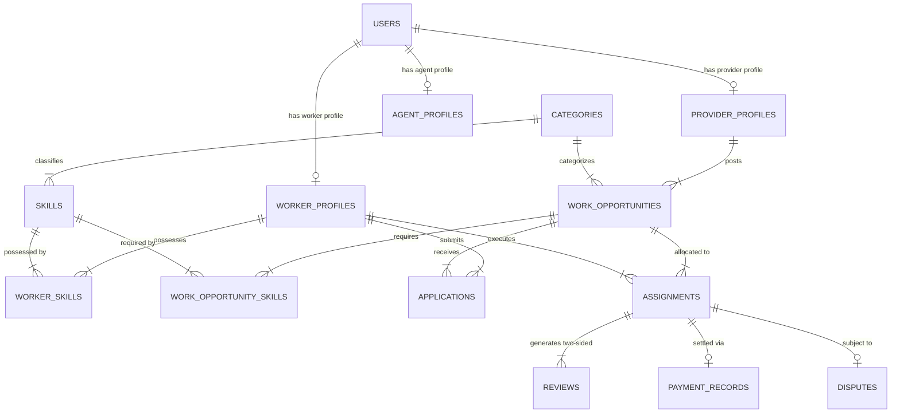
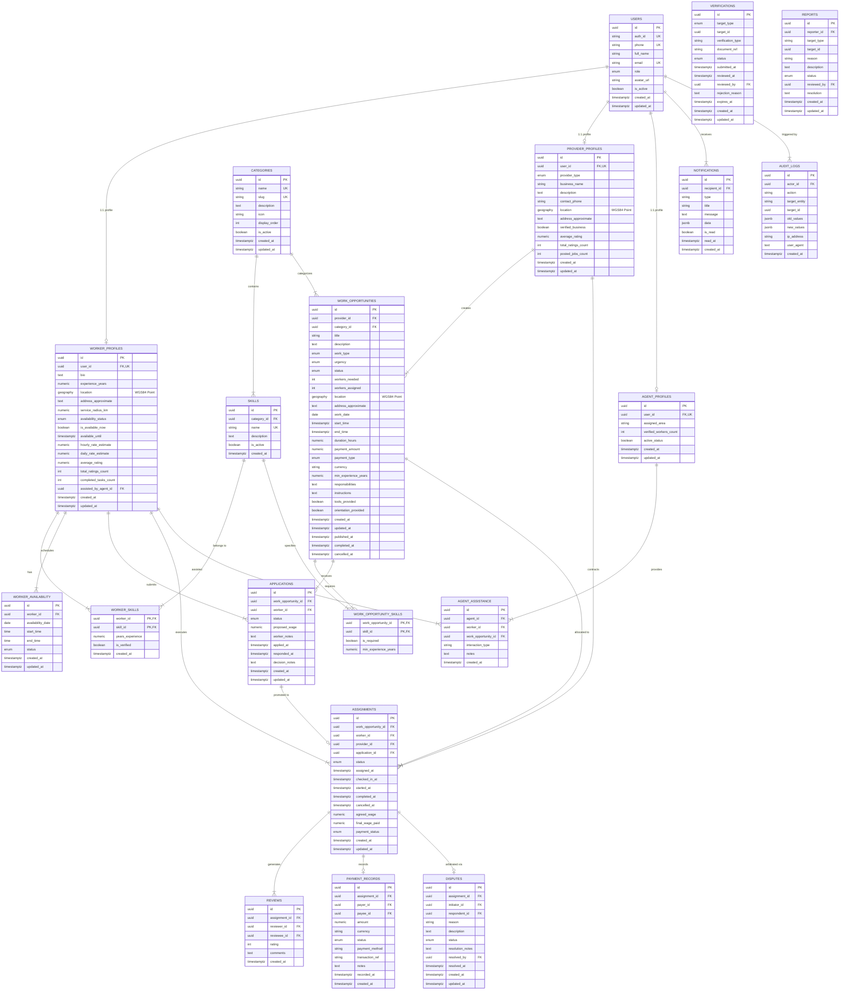

# NEARVIA Database Architecture & Relational Data Specification

> **Document Version**: 1.0.0  
> **Status**: Approved Specification (Phase 3)  
> **Project**: NEARVIA — _Work Within Reach_  
> **Core Engine**: PostgreSQL 15+ with PostGIS Geospatial Extension

---

## 1. Database Architecture Overview

The NEARVIA database is designed as a high-performance, normalized relational system backed by **PostgreSQL 15+** with the **PostGIS extension** as the single source of truth. It is engineered specifically for hyperlocal discovery (default **5 km radius**), live availability (`AVAILABLE_NOW`), short-duration work opportunities (micro-tasks, short shifts, one-day jobs), fast connection, and two-sided trust.

```
+-----------------------------------------------------------------------------+
|                          NEARVIA POSTGRESQL + POSTGIS                       |
|                                                                             |
|  +---------------------+   +-----------------------+   +-----------------+  |
|  |  Identity & Roles   |   | Hyperlocal Work Model |   | Trust & Records |  |
|  |  - users            |   | - work_opportunities  |   | - verifications |  |
|  |  - worker_profiles  |   | - applications        |   | - reviews       |  |
|  |  - provider_profiles|   | - assignments         |   | - payments      |  |
|  |  - agent_profiles   |   | - worker_availability |   | - disputes      |  |
|  +---------------------+   +-----------------------+   +-----------------+  |
|                                                                             |
|                 SPATIAL ENGINE: PostGIS GEOGRAPHY(Point, 4326)              |
|                 SPATIAL INDEX:  GIST(location) for 5 km searches            |
+-----------------------------------------------------------------------------+
```

---

## 2. Entity Relationship Diagrams (ERD)

### 2.1 Academic Simplified ERD (For Synopsis, Reports & Presentations)

This diagram illustrates the core marketplace entities and cardinalities without implementation noise.



---

### 2.2 Master Technical ERD (Complete Implementation Model)

The comprehensive technical model encompassing all 19 entities, foreign keys, constraints, and audit trails.



---

## 3. Spatial PostGIS & 5 KM Hyperlocal Strategy

### 3.1 Geodesic Geography Data Type

- Coordinates are stored as `GEOGRAPHY(Point, 4326)` representing longitude and latitude on the WGS84 ellipsoidal surface.
- PostGIS calculates true geodesic distances over the Earth's curvature in meters without requiring map projection distortions.

### 3.2 GIST Indexing

- Spatial columns on `worker_profiles`, `provider_profiles`, and `work_opportunities` are indexed using **GIST (Generalized Search Tree)**:

```sql
CREATE INDEX idx_worker_profiles_location ON worker_profiles USING GIST(location);
CREATE INDEX idx_work_opportunities_location ON work_opportunities USING GIST(location);
```

### 3.3 Core Spatial Query Mechanics

Finding active opportunities within a 5 km radius of a worker's location:

```sql
SELECT
  id, title, work_type, payment_amount, payment_type,
  ST_Distance(location, ST_SetSRID(ST_MakePoint($1, $2), 4326)::geography) AS distance_meters
FROM work_opportunities
WHERE status = 'PUBLISHED'
  AND ST_DWithin(location, ST_SetSRID(ST_MakePoint($1, $2), 4326)::geography, 5000)
ORDER BY distance_meters ASC;
```

---

## 4. Location Privacy & Centroid Fuzzing

- **Worker Privacy Guarantee**: The precise GPS coordinates of a worker's home/base are strictly confidential and NEVER returned in public API payloads.
- **Centroid Fuzzing**: Public feeds display approximate locality names and distance radius pills (e.g. `2.1 km away • Domlur Layout`).
- **Assignment Reveal**: Exact location is only shared with the provider once an active assignment is confirmed.

---

## 5. Availability Model & Time-Bounded "Available-Now"

- **`AVAILABLE_NOW` Flag**: Workers can signal live immediate readiness with a required expiration timestamp (`available_until`).
- **Expiration Invariant**: If `NOW() > available_until`, the worker's effective state automatically falls back to `OFFLINE`, preventing stale matching candidates.
- **Scheduled Slots**: `worker_availability` records allow future planning across date and time windows (`start_time` to `end_time`) with strict ordering check constraints (`chk_avail_time_order`).

---

## 6. Unified Work Opportunity Model

Rather than creating disconnected duplicate tables for Tasks, Shifts, and Jobs, NEARVIA utilizes a single normalized `work_opportunities` table differentiated by `work_type`:

- **`TASK`**: Short micro-tasks (1–2 hours), e.g. unloading a delivery truck, carrying goods.
- **`SHIFT`**: Half-day / short shifts (3–6 hours), e.g. restaurant helper, shop cashier relief.
- **`JOB`**: 1-day or multi-day short work, e.g. temporary shop assistant, skilled trade repair.

---

## 7. Application vs Assignment Lifecycle Separation

- **`applications`**: An expression of worker interest (`PENDING`, `SHORTLISTED`, `ACCEPTED`, `REJECTED`, `WITHDRAWN`, `EXPIRED`). Protected by a unique constraint preventing duplicate submissions.
- **`assignments`**: The legally binding provider allocation (`ASSIGNED`, `CONFIRMED`, `CHECKED_IN`, `IN_PROGRESS`, `COMPLETED`, `CANCELLED`, `NO_SHOW`, `REPLACED`). Supports multi-worker jobs (e.g. 5 workers needed = 5 assignment rows).

---

## 8. Two-Sided Reviews & Reputation Derivation

- Reviews are strictly constrained to completed `assignments` (`UNIQUE(assignment_id, reviewer_id)`).
- Derived metrics (`average_rating`, `completed_tasks_count`, `total_ratings_count`) are maintained through database triggers or materialized updates rather than direct user edits.

---

## 9. Payment Record Ledgers & Dispute Arbitration

- **`payment_records`**: Audit ledger tracking agreed and disbursed amounts (`NUMERIC(10, 2)` in `INR`), method, and reference ID without storing sensitive credit card details.
- **`disputes`**: Formal arbitration ticket linked to an assignment, supporting review by platform administrators (`OPEN`, `UNDER_REVIEW`, `RESOLVED`, `REJECTED`).

---

## 10. Timezone & Monetary Standards

- **Timestamps**: Stored in standard `TIMESTAMPTZ` (UTC). Rendered in IST (`Asia/Kolkata`, UTC+5:30) for Indian operational contexts.
- **Currency**: `NUMERIC(10, 2)` with currency code defaulting to `INR`. Eliminates floating-point precision errors.

---

## 11. Hyperlocal 5 KM PostGIS Spatial Query Strategy

### 11.1 Indexed Spatial Filter & Geodesic Distance

Spatial filtering is assisted directly inside PostgreSQL using PostGIS `ST_DWithin` and `ST_Distance` on `GEOGRAPHY(Point, 4326)` columns backed by GIST spatial indexes:

```sql
-- Hyperlocal 5 km Spatial Discovery Query Pattern
SELECT
  wo.id,
  wo.title,
  wo.work_type,
  wo.urgency,
  wo.work_date,
  wo.start_time,
  wo.end_time,
  wo.duration_hours,
  wo.payment_amount,
  wo.address_approximate,
  ST_Distance(wo.location, ST_SetSRID(ST_MakePoint($searchLng, $searchLat), 4326)::geography) AS distance_meters
FROM work_opportunities wo
JOIN categories c ON wo.category_id = c.id
WHERE wo.status = 'PUBLISHED'
  AND wo.work_date >= CURRENT_DATE
  AND ST_DWithin(wo.location, ST_SetSRID(ST_MakePoint($searchLng, $searchLat), 4326)::geography, 5000)
ORDER BY distance_meters ASC
LIMIT 20 OFFSET 0;
```

### 11.2 Spatial Indexing Invariant

Both `worker_profiles.location` and `work_opportunities.location` maintain GIST indexes:

```sql
CREATE INDEX IF NOT EXISTS idx_worker_profiles_location ON worker_profiles USING GIST(location);
CREATE INDEX IF NOT EXISTS idx_work_opportunities_location ON work_opportunities USING GIST(location);
```

No spatial distance calculations or unbounded filtering occur in Node.js memory.
