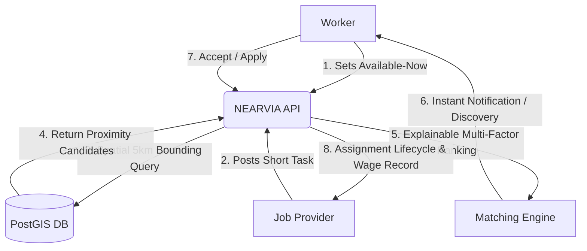

# Visual Architecture & Flow Diagrams

This directory contains system architecture diagrams, state machine flowcharts, and sequence diagrams for NEARVIA.

```mermaid
graph TD
    A[Worker] -->|1. Sets Available-Now| B(NEARVIA API)
    C[Job Provider] -->|2. Posts Short Task| B
    B -->|3. Spatial 5km Bounding Query| D[(PostGIS DB)]
    D -->|4. Return Proximity Candidates| B
    B -->|5. Explainable Multi-Factor Ranking| E[Matching Engine]
    E -->|6. Instant Notification / Discovery| A
    A -->|7. Accept / Apply| B
    B -->|8. Assignment Lifecycle & Wage Record| C
```
