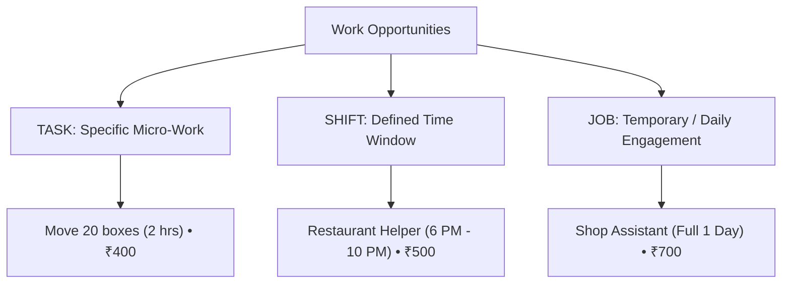

# NEARVIA Product Requirements Document (PRD)

> **Document Version**: 1.0.0  
> **Status**: Approved Blueprint (Phase 1)  
> **Project**: NEARVIA — _Work Within Reach_  
> **Category**: Hyperlocal Quick-Work Marketplace

---

## 1. Executive Summary & Vision

### 1.1 Product Mission

**NEARVIA** bridges the gap between **Permanent Employment** and **Immediate, Short-Duration, Flexible Work**.

Securing a permanent job often entails weeks of interviews, background screenings, and administrative onboarding. However, everyday expenses (rent, groceries, utilities, urgent family obligations) cannot wait. Simultaneously, local businesses, retail shops, restaurants, warehouses, contractors, event organizers, and residential households routinely encounter short-duration tasks or temporary staffing emergencies that do not warrant a permanent hiring process.

### 1.2 The Core Paradigm

NEARVIA is explicitly **NOT** a traditional full-time resume board. The central interaction paradigm is:

$$ \begin{matrix}
\text{"I NEED WORK NOW"} \\
\updownarrow \\
\mathbf{NEARVIA} \\
\updownarrow \\
\text{"I NEED SOMEONE NOW"}
\end{matrix}$$

---

## 2. Target User Personas & Roles

| User Role | Core Needs & Behaviors | Primary Success Criterion |
| :--- | :--- | :--- |
| **Worker** | Individuals seeking micro-tasks (1–2 hrs), short shifts (3–6 hrs), one-day work, daily-wage jobs, or skilled trade tasks within walking/cycling distance. | Instant discovery of nearby paying work with transparent wages, time windows, and instant application. |
| **Job Provider** | Shopkeepers, restaurant managers, warehouse operators, event coordinators, contractors, and individuals needing urgent workers. | Rapid time-to-fill with verified, nearby, skilled, and currently available workers. |
| **Agent** *(Assisted Access)* | Trusted local intermediaries who assist workers with limited digital literacy or smartphone access to onboard and connect with jobs. | Seamless assisted registration, application tracking, and verified trust attribution without bypassing platform auditability. |
| **Admin** | Platform operations team managing dispute resolution, identity verification, content moderation, safety compliance, and system metrics. | High platform trust, low dispute rates, high fill rates, and real-time operational observability. |

---

## 3. Core Product Differentiators

NEARVIA is strictly engineered around five distinct pillars:

```
[ 5 KM HYPERLOCAL RADIUS ]  +  [ AVAILABLE-NOW LIVE STATUS ]  +  [ SHORT-DURATION TASKS / SHIFTS ]
                                         +
              [ FAST CONNECTION ]  +  [ EXPLAINABLE MULTI-FACTOR MATCHING ]
```

1. **Hyperlocal by Default (~5 km)**: Focused on realistic travel time (<15–20 minutes commute). Workers cannot afford 1 hour of transit for a 2-hour shift.
2. **"Available-Now" State Machine**: Real-time worker availability signaling, allowing instant dispatch and match priority.
3. **Short-Duration First**: Specialized data models and UX for micro-tasks (1–2h), short shifts (3–6h), half-day, and one-day engagements.
4. **Fast Connection Focus**: Designed to minimize time-to-first-match and time-to-fill without false promises of guaranteed placement.
5. **Explainable Deterministic Matching**: Transparent match breakdown exposing skill compatibility, distance, availability window, and reliability ratings.
6. **Assisted Access Network**: Verified local agent model bridging the digital divide for workers without smartphones or technical literacy.
7. **Privacy-First Spatial Architecture**: Absolute protection of worker home locations through approximate neighborhood fuzzing (~200–500m) until an assignment is mutually accepted.

---

## 4. Domain Work Models & Taxonomy

NEARVIA rejects the monolithic "job" definition in favor of three distinct work models:



### 4.1 Work Taxonomy Comparison
| Dimension | Micro-Task (Task) | Short Shift (Shift) | Temporary Job (Job) |
| :--- | :--- | :--- | :--- |
| **Typical Duration** | 1 to 2 hours | 3 to 6 hours | 1 day to multiple days |
| **Urgency** | Immediate / Urgent (starts in < 1 hr) | Scheduled today / tomorrow | Scheduled in advance |
| **Payment Model** | Fixed task wage | Hourly or shift rate | Daily wage rate |
| **Primary Examples** | Unload delivery truck, assemble furniture, retail stock arranging | Restaurant helper, cashier cover, event registration assistant | Shop assistant replacement, construction daily-wage, skilled trade project |
| **Key UX Focus** | Rapid "Quick Apply" with countdown timer | Schedule alignment & location feasibility | Skill verification & employer rating |

---

## 5. Detailed Functional Requirements

### 5.1 Authentication & Profile Lifecycle
- **Phone OTP Authentication**: Managed via Supabase Auth for high deliverability and low friction on mobile.
- **Worker Profile**:
  - *Public / Matched View*: First name, initial of last name, verified skills list, average rating (1–5★), completed jobs count, approximate distance (e.g. "1.8 km away"), verification badges.
  - *Private View*: Full legal name, government ID numbers, exact phone number, exact GPS coordinates, detailed payout accounts.
  - *Post-Assignment View*: Contact phone number, in-app messaging channel, active assignment status.
- **Job Provider Profile**: Business name, organization type, verified business badge, location area, employer rating, total jobs completed.
- **Agent Profile**: Assigned operational locality, verified assisted workers roster, active status.

### 5.2 Hyperlocal Discovery & PostGIS Spatial Filtering
- Search radius default is **5 km** (configurable by worker up to a maximum strict limit of **15 km**).
- Spatial queries utilize PostGIS `GEOGRAPHY(Point, 4326)` with `GIST` indexing to ensure sub-50ms execution times.
- **Privacy Fuzzing**: Public search results and job cards render approximate neighborhood centroids rather than exact GPS coordinates. Exact location is revealed only after mutual assignment confirmation.

### 5.3 Explainable Matching Engine
Matches are calculated deterministically across five weighted dimensions:

$$\text{Total Match Score} = (0.35 \times S) + (0.25 \times D) + (0.20 \times A) + (0.10 \times T) + (0.10 \times R)$$

Where:
- $S$ = **Skill Compatibility Score** (0–100% overlap with required primary and secondary skills).
- $D$ = **Distance Proximity Score** ($100 \times \max(0, 1 - \frac{\text{Distance}}{5\text{ km}})$).
- $A$ = **Availability Score** (100 if "Available-Now" is active, 70 if scheduled slot matches, 0 if offline/busy).
- $T$ = **Time Window Compatibility** (overlap between job start/end time and worker schedule).
- $R$ = **Reputation & Reliability Score** (historical rating, completion rate, low cancellation penalty).

Every match display MUST render a human-readable `scoreBreakdown` (e.g. *"✓ Skill matched • ✓ Available now • ✓ 1.8 km away"*).

### 5.4 Job Readiness & Orientation Safeguards
To prevent assigning unqualified personnel to specialized roles, the system enforces **Job Readiness Declarations**:
- Required vs. Preferred prior experience.
- Employer-provided orientation window (e.g., *"30-minute POS briefing provided before shift"*).
- Tools and equipment specifications (e.g., *"Safety boots required; gloves provided by shop"*).
- Clear reporting supervisor and check-in instructions.

### 5.5 Two-Sided Trust, Ratings & Dispute Handling
- **Mutual Rating**: Upon assignment completion, both Worker and Provider must submit a 1–5 star rating and optional structured tags (e.g., *"Punctual"*, *"Clear Instructions"*, *"Fast Payment"*).
- **Verification Badges**:
  - `PHONE_VERIFIED`: OTP confirmed.
  - `IDENTITY_VERIFIED`: Government ID document reviewed and approved.
  - `BUSINESS_VERIFIED`: Commercial establishment or GST/license verified.
  - `SKILL_VERIFIED`: Past track record or certified trade credential.
- **Dispute Lifecycle**: Either party can raise a dispute for non-arrival, premature departure, wage disagreement, or task scope deviation. Disputed funds/records are flagged for Admin arbitration.

---

## 6. Non-Functional Requirements

### 6.1 Performance & Scalability
- Spatial query latency: **< 50ms at P95** within a 5 km bounding box under concurrent load.
- REST API response time: **< 100ms** for core feed, match scoring, and application submissions.
- Client First Contentful Paint (FCP): **< 1.2s** on 4G mobile networks.

### 6.2 Security, Compliance & Privacy
- Zero plaintext credential storage; secure JWT session validation via Supabase Auth.
- Strict Role-Based Access Control (RBAC) enforced on every API route.
- GPS coordinates sanitized before transmission in public marketplace discovery endpoints.

### 6.3 Accessibility & Responsive Ergonomics
- Strict compliance with **WCAG 2.2 AA** guidelines.
- High contrast color ratios (minimum 4.5:1 for body text, 3:1 for large headings and icons).
- Mobile-first thumb zone accessibility: primary action buttons (Quick Apply, Post Task, Toggle Available) positioned within natural one-handed reach (minimum touch target size of 48px $\times$ 48px).

### 6.4 Localization Readiness
- All user-facing strings decoupled from business logic to support multi-language translation (English, Hindi, Kannada, and regional Indian languages).

---

## 7. Success Metrics (Research & Evaluation Baseline)

For academic evaluation and platform benchmarking, NEARVIA defines primary and secondary performance metrics:

```
+-------------------------------------------------------------------------+
|                         PRIMARY PLATFORM METRICS                        |
|                                                                         |
|  1. Time-to-First-Match: Median seconds between job post and 1st match  |
|  2. Time-to-Connection: Median minutes from job post to application     |
|  3. Time-to-Fill: Median minutes from post creation to assignment      |
|  4. Hyperlocal Fill Rate: % of posted tasks filled within 5 km          |
|  5. Match Accuracy: Correlation between match score and 5-star reviews  |
+-------------------------------------------------------------------------+
|                        SECONDARY OPERATIONAL METRICS                    |
|                                                                         |
|  6. Application Acceptance Rate: % of applications accepted by provider |
|  7. Task Completion Rate: % of started assignments marked completed    |
|  8. Cancellation Rate: % of accepted assignments cancelled pre-shift    |
|  9. Average Commute Distance: Mean travel distance for matched tasks    |
|  10. Worker Retention / Repeat Work Rate: % of workers working 3+ shifts|
+-------------------------------------------------------------------------+
```
$$
