# NEARVIA Master User Flows & Interaction State Machines

> **Document Version**: 1.0.0  
> **Status**: Approved Blueprint (Phase 1)  
> **Project**: NEARVIA — _Work Within Reach_

---

## Flow 1: Worker Registration & Phone OTP Verification

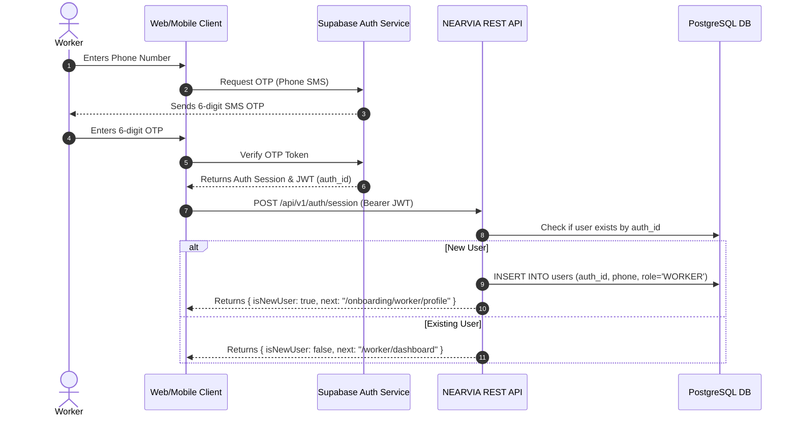

---

## Flow 2: Worker Profile, Skills & Spatial Onboarding

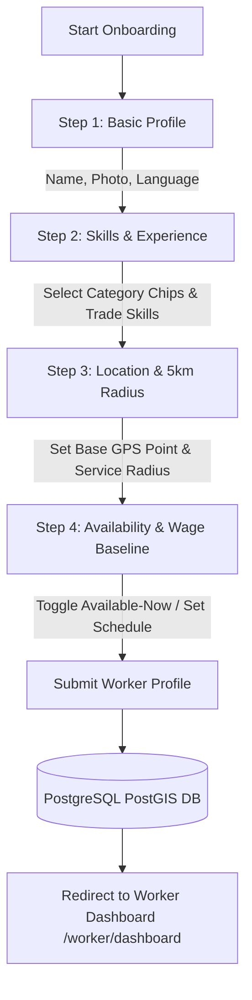

---

## Flow 3: Worker "Available-Now" Activation & Hyperlocal Discovery

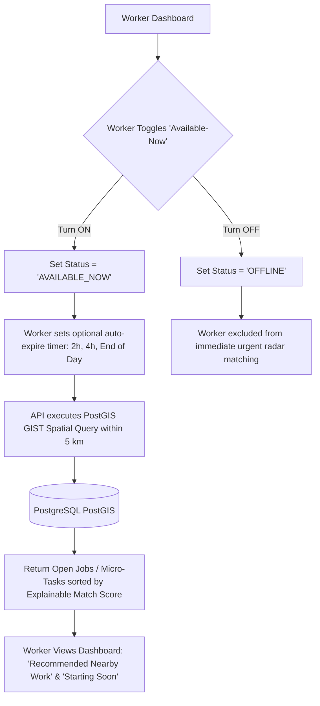

---

## Flow 4: Worker Job Discovery, Match Inspection & Quick-Apply

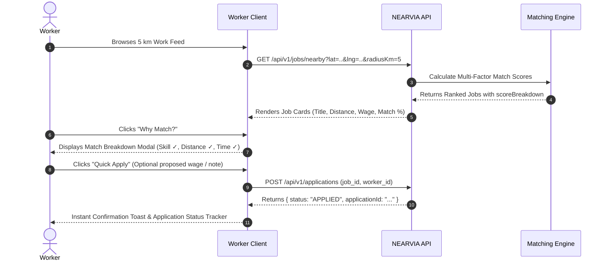

---

## Flow 5: Worker Selection & Assignment Activation

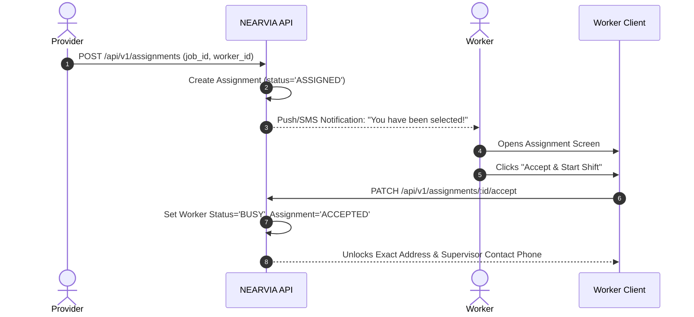

---

## Flow 6: Worker Shift Execution (Arrived $\to$ Started $\to$ Completed)

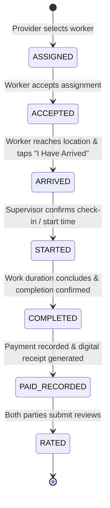

---

## Flow 7: Job Provider Requirement Creation (Task / Shift / Job Wizard)

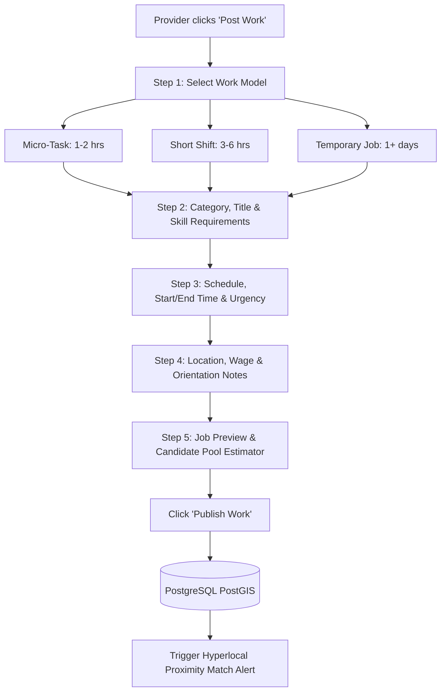

---

## Flow 8: Job Provider Candidate Discovery & Explainable Match Review

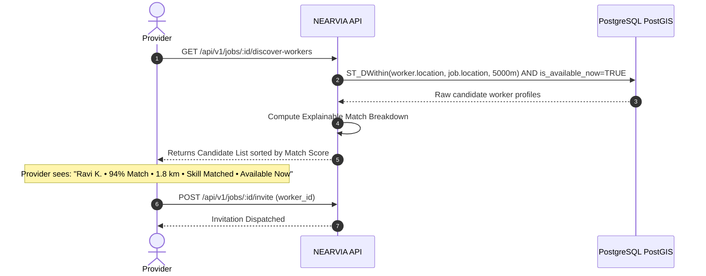

---

## Flow 9: Job Provider Worker Selection & Assignment Dispatch

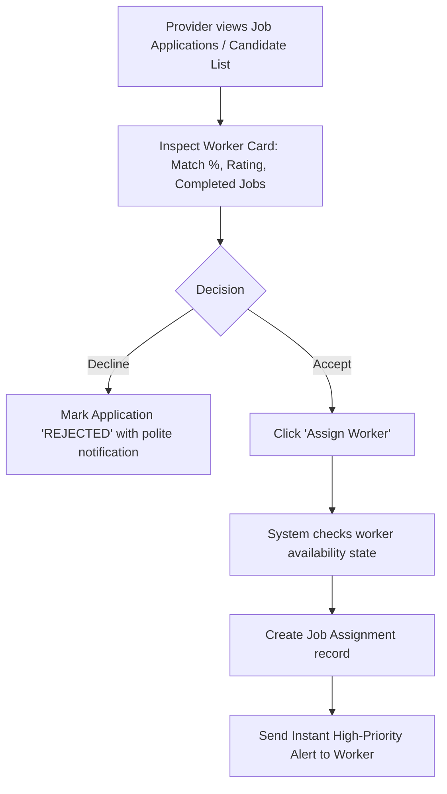

---

## Flow 10: Provider Completion Confirmation & Wage Release

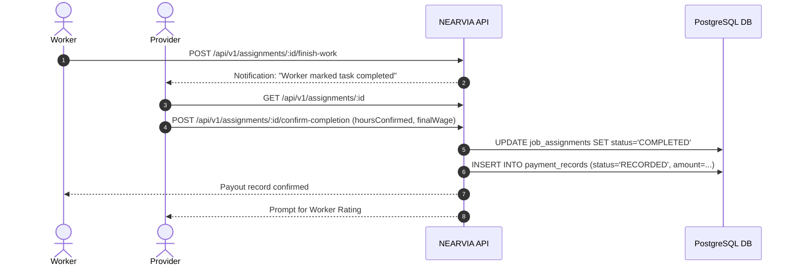

---

## Flow 11: Local Agent-Assisted Worker Onboarding & Application

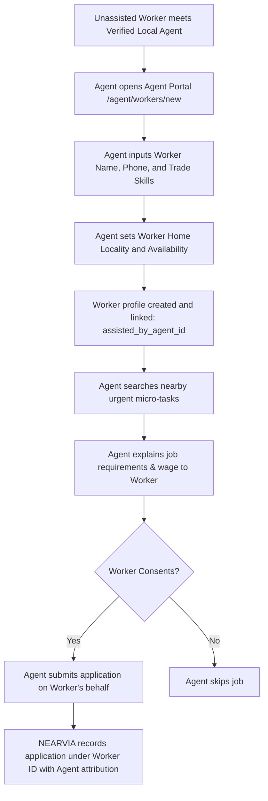

---

## Flow 12: Trust & Identity Verification Lifecycle

```mermaid
stateDiagram-v2
    [*] --> UNVERIFIED: User registers phone OTP
    UNVERIFIED --> PENDING: User uploads Gov ID / Business License
    PENDING --> VERIFIED: Admin approves KYC documentation
    PENDING --> REJECTED: Incomplete/Blurry doc; resubmission requested
    REJECTED --> PENDING: User uploads corrected document
    VERIFIED --> [*]: Trust Badge active across public profile
```

---

## Flow 13: Two-Sided Post-Work Rating & Reputation Flow

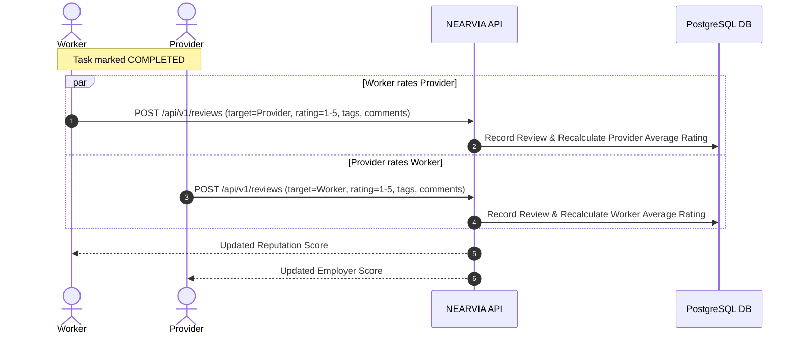

---

## Flow 14: Dispute Raising & Admin Arbitration Flow

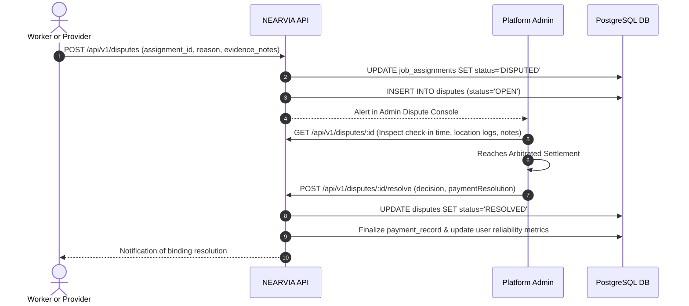

---

## Flow 15: Polished Feedback, Empty States & Error Recovery

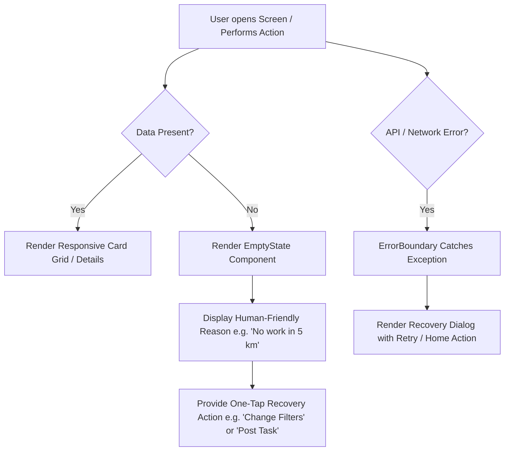

